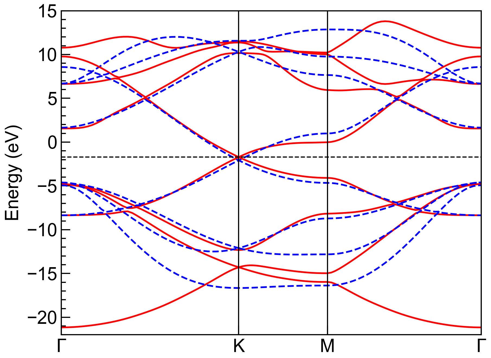
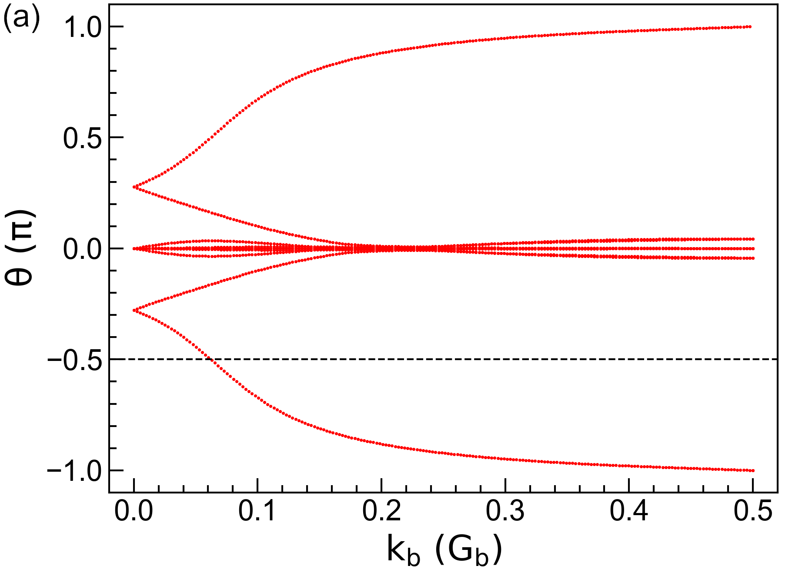
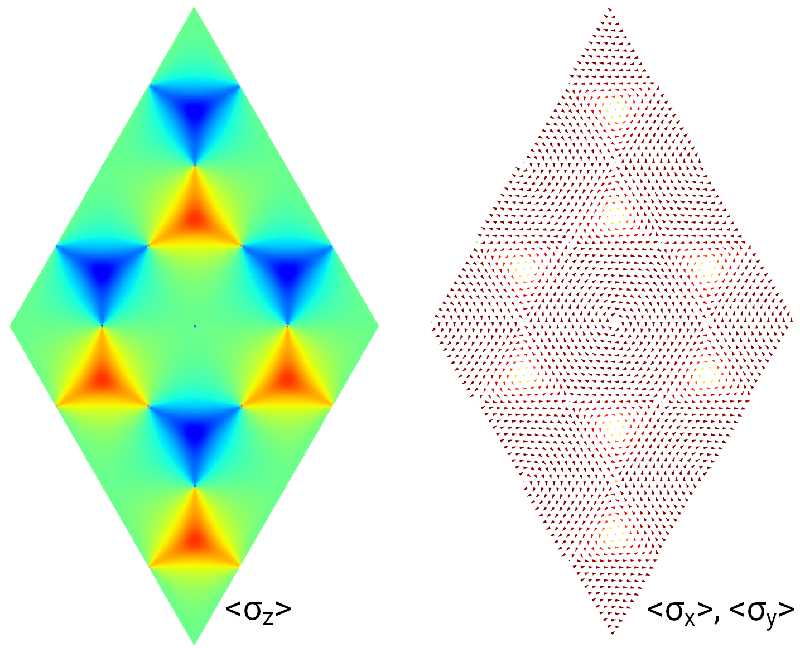

About
=====

.. _features:

Features
--------

The main features of TBPLaS include:

* Capabilities
    * Modeling
        * Models with arbitrary dimesion, shape and boundary conditions
        * Clusters, nano-tubes, slabs and crystals
        * Defects, impurities and disorders
        * Hetero-structures, quasicrystal, fractals
        * Built-in support for Slater-Koster formulation and spin-orbital coupling
        * Shipped with materials database (Graphene, phosphorene, antimonene, TMDC)
        * Interfaces to Wannier90 and LAMMPS
        * Tools for fitting on-site energies and hopping integrals
        * Support for analytical Hamiltonian
    * Fields and strains
        * Homogeneous magnetic field via Peierls substitution
        * User-defined electric field
        * Arbitary deformation with strain and/or stress
    * Exact-diagonalization
        * Band structure, density of states (DOS), wave functions, topological invariants, spin textures
        * Polarizability, dielectric function, optical (AC) conductivity
    * Tight-binding propagation method (TBPM)
        * DOS, LDOS and carrier density
        * Optical (AC) conductivity and absorption spectrum
        * Electronic (DC) conductivity and time-dependent diffusion coefficient
        * Carrier velocity, mobility, elastic mean free path, Anderson localization length 
        * Polarization function, response function, dielectric function, energy loss function
        * Plasmon dispersion, plasmon lifetime and damping rate
        * Quasi-eigenstate and real-space charge density
        * Propagation of time-dependent wave function
    * Kernel polynomial method
        * Electronic (DC) and Hall Conductivity  
    * Recursive Green's function method
        * Local density of states (LDOS)
* Efficiency
    * Cython (C-Extensions for Python) and FORTRAN for performance-critical parts
    * Hybrid parallelism based on MPI and OpenMP
    * Sparse matrices for reducing memory cost
    * Lazy-evaluation techniques to reduce unnecessary operations
    * Interfaced to Intel MKL (Math Kernel Library)
* User friendliness
    * Intuitive object-oriented user APIs (Application Programming Interface) in Python with type hints
    * Simple workflow with a lot of handy tools
    * Transparent code architecture with detailed documentation
* Security
    * Detailed checking procedures on input arguments
    * Carefully designed exception handling with precise error message
    * Top-down and bottom-up (observer pattern) techniques for keeping data consistency

.. _gallery:

Gallery
-------

Modeling
^^^^^^^^

.. figure:: images/fractal.png
    :alt: sierpinski carpet
    :align: center
    :scale: 45%

    Fractal

.. figure:: images/quasi_crystal.png
    :alt: quasi-crystal
    :align: center
    :scale: 45%

    Quasicrystal

.. figure:: images/tbg.png
    :alt: tbg
    :align: center
    :scale: 38%

    Moire's Pattern

.. figure:: images/distortion.png
    :alt: distortiong
    :align: center
    :scale: 45%

    Arbitrary Deformation

Properties
^^^^^^^^^^

    Fitting of on-site energies and hopping terms

    :math:`\mathbb{Z}_2` topological invariant

    Spin texture

.. figure:: ../tutorial/advanced/images/strain_fields/wfc.png
    :alt: wfc
    :align: center
    :scale: 20%

    Wave function propagation

Citation
--------

.. include:: ../../../CITING.rst

License
-------

TBPLaS is release under the BSD license 2.0, the complete content of which is as following:

.. include:: ../../../LICENSE.rst
