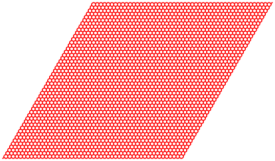
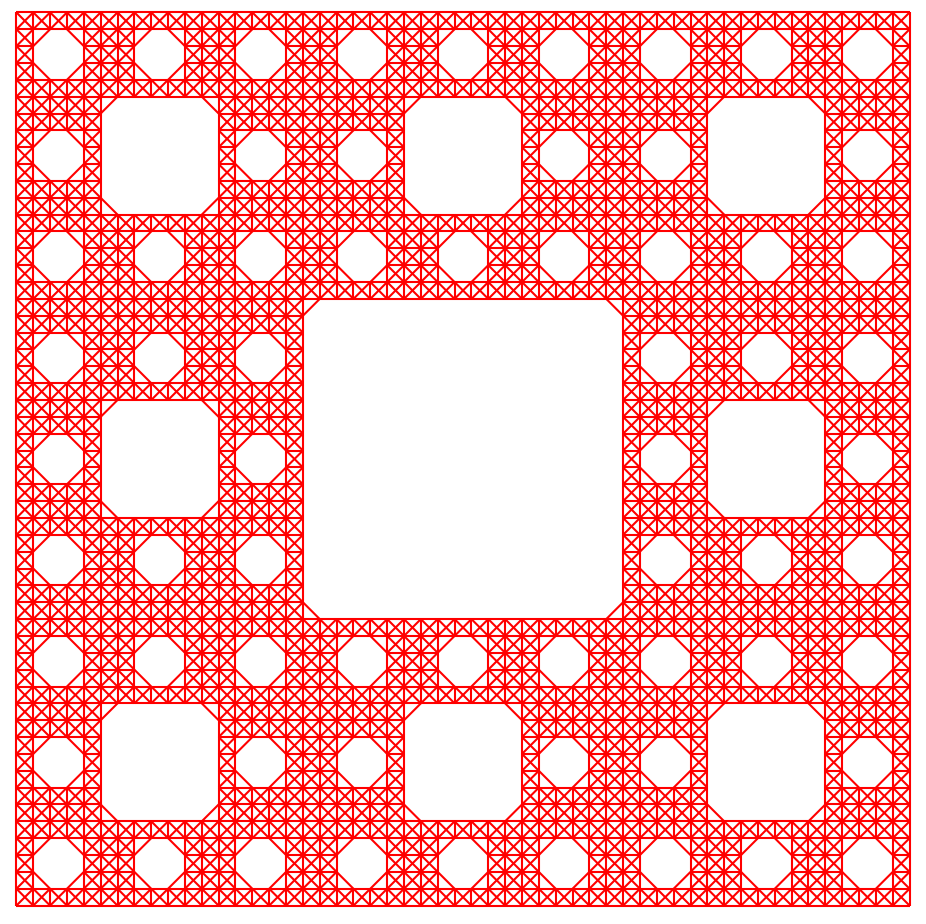
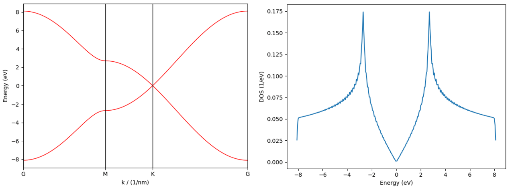
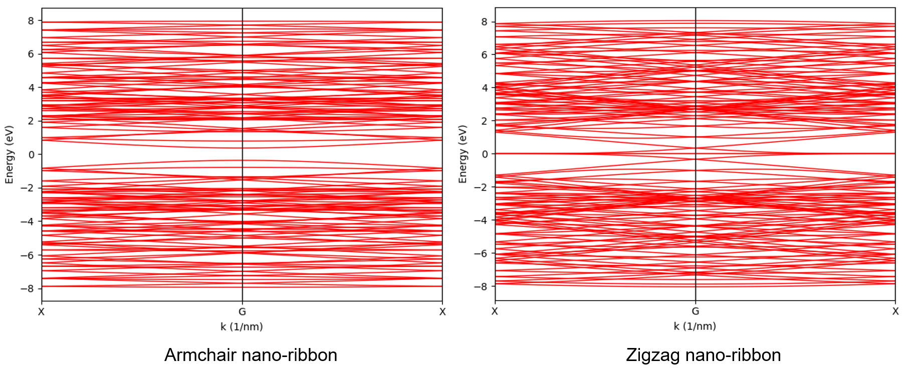
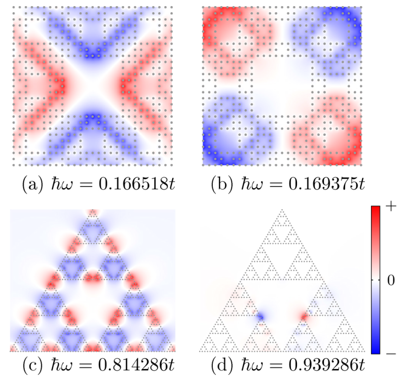
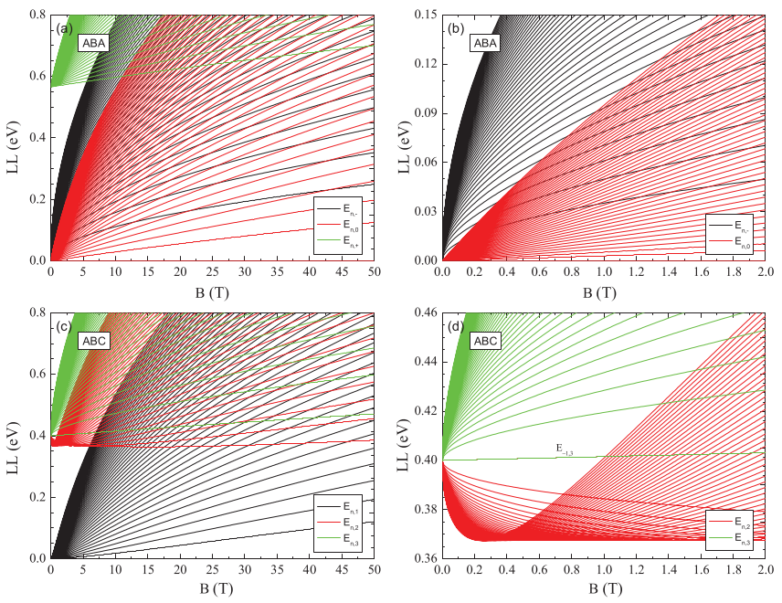
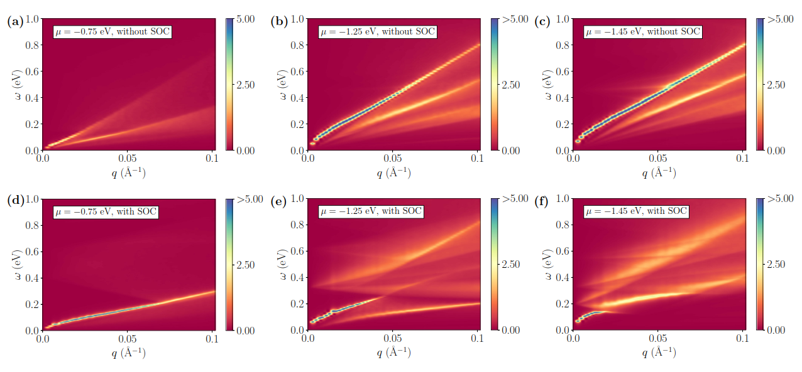
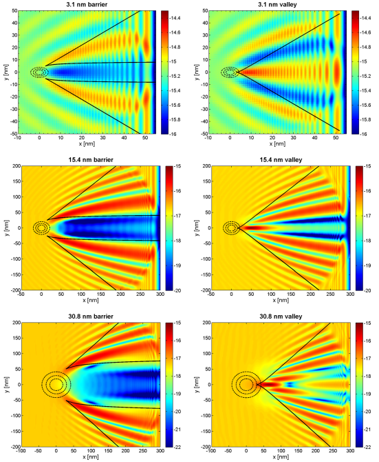

About
=====

.. _features:

Features
--------

The main features of TBPLaS include:

* Capabilities
    * Modeling
        * Models with arbitrary shape and boundary conditions
        * Impurities and disorders
        * Hetero-structures, quasicrystal, fractals
        * 2D and 3D structures
    * Exact-diagonalization
        * Band structure, density of states (DOS), wave functions, Lindhard functions
    * Tight-binding propagation method
        * DOS and local DOS
        * AC and DC conductivity
        * Polarizability and dielectric function
        * Quasi-eigenstates
    * Kernel polynomial method
        * DC and Hall Conductivity
    * Fields and strains
        * Homogeneous magnetic field via Peierls substitution
        * User-defined electric field and strain
    * Efficiency
        * FORTRAN and Cython (C-Extensions for Python) for performance-critical parts
        * Hybrid parallelism based on MPI and OpenMP
        * Sparse matrices for reducing memory cost
        * Lazy-evaluation techniques to reduce unnecessary operations
        * Interfaced to Intel MKL (Math Kernel Library)
    * Easiness
        * Intuitive user APIs (Application Programming Interface) and simple workflow
        * Built-in materials database (Graphene, phosphorene, antimonene, TMDC)
        * Interfaced to Wannier90 and LAMMPS
        * Transparent code architecture with detailed documentation
    * Security
        * Automatic detection of illegal input
        * Data inconsistency prevented via locking mechanism
        * Carefully designed exception handling with precise error message

.. _gallery:

Gallery
-------

.. rubric:: Modeling

.. figure:: images/graphene_pc.png
    :alt: primitive cell of monolayer graphene
    :align: center

    Primitive cell of monolayer graphene. Orbitals and hopping terms are shown as filled circles and
    red arrows, respectively. Dashed lines indicate primitive cell borders with lattice vectors
    highlighted as black arrows.

    Graphene sample with 50\*50 primitive cells. Cell borders and orbitals have been hided for clarity.

.. figure:: images/graphene_sc_vac.png
    :alt: graphene sample with vacanvies
    :align: center

    Graphene sample with vacancies. Dangling hopping terms indicated by blue circles are present in left panel
    and trimmed in right panel.

.. figure:: images/graphene_bump.png
    :alt: graphene sample with bump
    :align: center

    Graphene sample with deformation of Gaussian bump.

.. figure:: images/gnr.png
    :alt: graphene nano-ribbon
    :align: center

    Graphene nano-ribbon with armchair and zigzag edges.

.. figure:: images/tbg.png
    :alt: twisted bilayer graphene
    :align: center

    Top and side views of twisted bilayer graphene without and with inter-layer hopping terms.

    Sierpinski carpet generated with S=2, N=3, L=3.

.. rubric:: Properties

    Band structure and density of states of monolayer graphene primitive cell via exact-diagonalization.

    Band structures of armchair and zigzag graphene nano-ribbons via exact-diagonalization.

.. figure:: images/butterfly.png
    :alt: Hofstadter butterflies
    :align: center

    Hofstadter butterflies (density of states as function of magnetic field) for Sierpinski carpet with
    different iteration numbers.
    `Phys. Rev. B 101, 045413 (2020). <https://journals.aps.org/prb/abstract/10.1103/PhysRevB.101.045413>`_

    Spatial distribution of plasmon eigenmodes in real space.
    `Phys. Rev. B 97, 205434 (2018). <https://journals.aps.org/prb/abstract/10.1103/PhysRevB.97.205434>`_

.. figure:: images/energy_contour.png
    :alt: energy contour
    :align: center

    Constant energy contours of biased bilayer BP under different bias potential.
    `Phys. Rev. B 93, 245433 (2016). <https://journals.aps.org/prb/abstract/10.1103/PhysRevB.93.245433>`_

    Landau level spectrum of ABA- and ABC-stacked tri-layer graphene.
    `Phys. Rev. B 84, 125455 (2011). <https://journals.aps.org/prb/abstract/10.1103/PhysRevB.84.125455>`_

    Electronic energy loss function (EELS) for monolayer antimonene with different chemical potential.
    `Phys. Rev. B 98, 155411 (2018). <https://journals.aps.org/prb/abstract/10.1103/PhysRevB.98.155411>`_

.. figure:: images/quasi_eigen.png
    :alt: quasi-eigenstates
    :align: center

    Quasi-eigenstates of monolayer graphene with hydrogen impurities.
    `Phys. Rev. B 82, 115448 (2010). <https://journals.aps.org/prb/abstract/10.1103/PhysRevB.82.115448>`_

    Stable interference pattern for a wave packet incident on a Gaussian potential.
    `Phys. Rev. B 91, 045420 (2015). <https://journals.aps.org/prb/abstract/10.1103/PhysRevB.91.045420>`_

Citation
--------

.. include:: ../../../CITING.rst

License
-------

TBPLaS is release under the BSE license 2.0, the complete content of which is as following:

.. include:: ../../../LICENSE.rst
