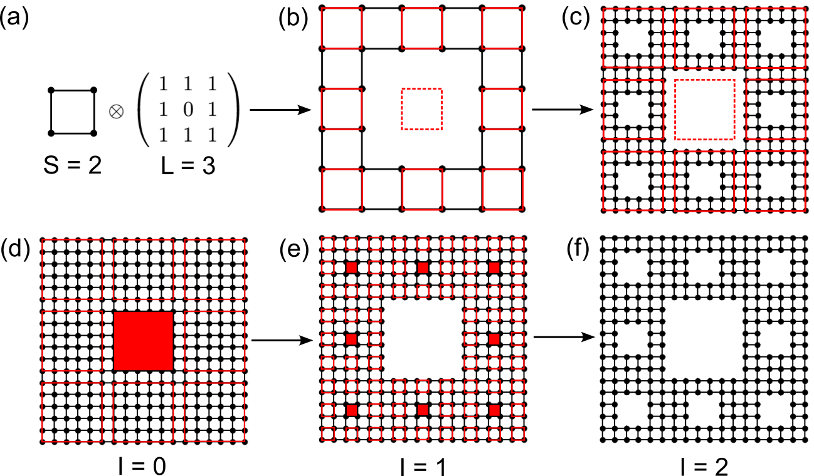
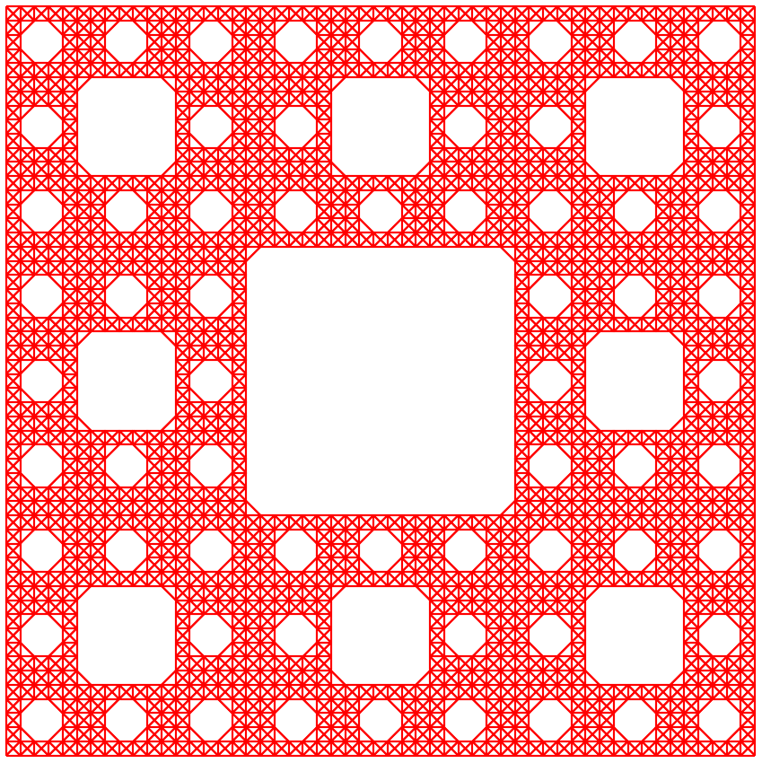

Fractal
=======

In this tutorial, we will take the Sierpiński carpet as an example and show the procedure of
constructing fractals. Generally, fractals can be constructed in two approaches, namely `bottom-up`
and `top-down`, as demonstrated in Fig. 1. The bottom-up approach builds the fractal by iteratively
replicating the fractal of low iteration number following some specific pattern. On the contrary,
the top-down approach builds a large model at first, then recursively removes unnecessary orbitals
and hopping terms following the pattern. Both approaches can be implemented with TBPLaS, while the
top-down approach is faster.

    Schematic plot of constructing Sierpiński carpet with :math:`S=2`, :math:`L=3` and :math:`I=2`
    in (a)-(c) bottom-up and (d)-(f) top-down approaches. The dashed squares in (a)-(c) and filled
    squares in (d)-(f) indicate the void areas in the fractal.

The scripts of this tutorial are located at ``examples/advanced/fractal``. We begin with importing
the necessary packages:

.. code-block:: python

    import numpy as np

    import tbplas as tb

Top-down approach
-----------------

For the top-down approach, we also need to import the ``Box`` and ``Mask`` classes from the
``mask`` module located at the same directory as the scripts:

.. code-block:: python

    from mask import Box, Mask

The ``Box`` class represents a rectangular area spanning from :math:`[i_0, j_0]` to
:math:`(i_1, j_1)`. If the box is marked as void, then the orbitals inside it will be removed.
The ``Mask`` class is a collection of boxes, which recursively partitions them into smaller boxes
and marks the central boxes as void. It offers the ``etch_prim_cell`` function to produce the
fractal by removing orbitals falling into void boxes at the :class:`PrimitiveCell` level, and the
``etch_super_cell`` at :class:`.SuperCell` level. In this tutorial, we will build the fractal at
:class:`PrimitiveCell` level. The usage of ``etch_super_cell`` can be found in the example scripts.

We define the following function to build the fractal in top-down approach:

.. code-block:: python
    :linenos:

    def top_down(prim_cell: tb.PrimitiveCell, start_width: int,
                 iteration: int, extension: int) -> tb.PrimitiveCell:
        """
        Build fractal in top-down approach.

        :param prim_cell: primitive cell of square lattice
        :param start_width: starting width of the sample
        :param iteration: iteration number of sample
        :param extension: extension of the sample width
        :return: fractal
        """
        # Create the extended cell
        final_width = start_width * extension**iteration
        extended_cell = tb.extend_prim_cell(prim_cell,
                                            dim=(final_width, final_width, 1))
        extended_cell.apply_pbc((False, False, False))

        # Create the mask
        start_box = Box(0, 0, final_width - 1, final_width - 1)
        mask = Mask(start_box, num_grid=extension, num_iter=iteration)

        # Remove orbitals
        mask.etch_prim_cell(extended_cell, final_width)
        return extended_cell

The Sierpiński carpet is characterized by 3 parameters: the starting width :math:`S`, the extension
:math:`L` which controls the pattern, and the iteration number :math:`I`, as shown in Fig. 1. We
extend the square primitive cell to the final width of the carpet in line 13-16, which is
determined as :math:`D = S \cdot L^I`. Then we create a box covering the whole extended cell and a
mask from the box in line 19-20. The bottom-left corner of the box is located at :math:`[0, 0]`,
while the top-right corner is at :math:`(D-1, D-1)`. Then we call the ``etch_prim_cell`` function
to remove the orbitals falling into void boxes of the mask in line 23. Finally, the fractal is
returned.

Bottom-up approach
------------------

We define the following function to build the fractal in bottom-up approach:

.. code-block:: python
    :linenos:

    def bottom_up(prim_cell: tb.PrimitiveCell, start_width: int,
                  iteration: int, extension: int) -> tb.PrimitiveCell:
        """
        Build fractal in bottom-up approach.

        :param prim_cell: primitive cell of square lattice
        :param start_width: starting width of the sample
        :param iteration: iteration number of sample
        :param extension: extension of the sample width
        :return: fractal
        """
        # Create the extended cell
        final_width = start_width * extension**iteration
        extended_cell = tb.extend_prim_cell(prim_cell,
                                            dim=(final_width, final_width, 1))
        extended_cell.apply_pbc((False, False, False))

        # Build 0-th order fractal
        fractal = [(ia, ib)
                   for ia in range(start_width)
                   for ib in range(start_width)]

        # Build pattern for replication
        pattern = [(ia, ib)
                   for ia in range(extension)
                   for ib in range(extension)
                   if not (1 <= ia < extension-1 and 1 <= ib < extension-1)]

        # Build n-th order fractal by replicating (n-1)-th order according to
        # pattern, which is a direct product mathematically
        for i in range(iteration):
            fractal_new = []
            width = start_width * extension**i
            for entry in pattern:
                di = width * entry[0]
                dj = width * entry[1]
                replica = [(grid[0] + di, grid[1] + dj) for grid in fractal]
                fractal_new.extend(replica)
            fractal = fractal_new

        # Get grid coordinates of vacancies
        full_sites = [(ia, ib)
                      for ia in range(final_width)
                      for ib in range(final_width)]
        vacancies = list(set(full_sites).difference(set(fractal)))
        vacancies = [(grid[0], grid[1]) for grid in vacancies]

        # Create the model
        masked_id_pc = [i[0] * final_width + i[1] for i in vacancies]
        masked_id_pc = sorted(masked_id_pc)
        extended_cell.remove_orbitals(masked_id_pc)
        return extended_cell

Similar to the top-down approach, we also need to extend the primitive cell in line 13-16. Then we
build the 0-th order of fractal and the replication pattern in line 19-27. After that, we replicate
the fractal according to the pattern iteratively to get the final fractal, which is a list of
tuples containing the grid coordinates of the reserved orbitals. Then we get the grid coordinates
of the orbitals to remove using set operations. Finally, the orbitals are removed by calling
``remove_orbitals`` method of :class:`.PrimitiveCell` and the fractal is returned.

Build the model
---------------

We demonstrate the usage of top-down and bottom-up approaches by:

.. code-block:: python
    :linenos:

    def main():
        # Create a square lattice
        lattice = np.eye(3, dtype=np.float64)
        prim_cell = tb.PrimitiveCell(lattice)
        prim_cell.add_orbital((0, 0))
        prim_cell.add_hopping((1, 0), 0, 0, 1.0)
        prim_cell.add_hopping((0, 1), 0, 0, 1.0)
        prim_cell.add_hopping((1, 1), 0, 0, 1.0)
        prim_cell.add_hopping((1, -1), 0, 0, 1.0)

        # Create fractal using top-down approach
        fractal = top_down(prim_cell, 2, 3, 3)
        fractal.plot(with_cells=False, with_orbitals=False, hop_as_arrows=False)

        # Create fractal using bottom-up approach
        fractal = bottom_up(prim_cell, 2, 3, 3)
        fractal.plot(with_cells=False, with_orbitals=False, hop_as_arrows=False)

    if __name__ == "__main__":
        main()

The output is shown in the following figure:

    Sierpiński carpet with :math:`S=2`, :math:`L=3` and :math:`I=3`.
