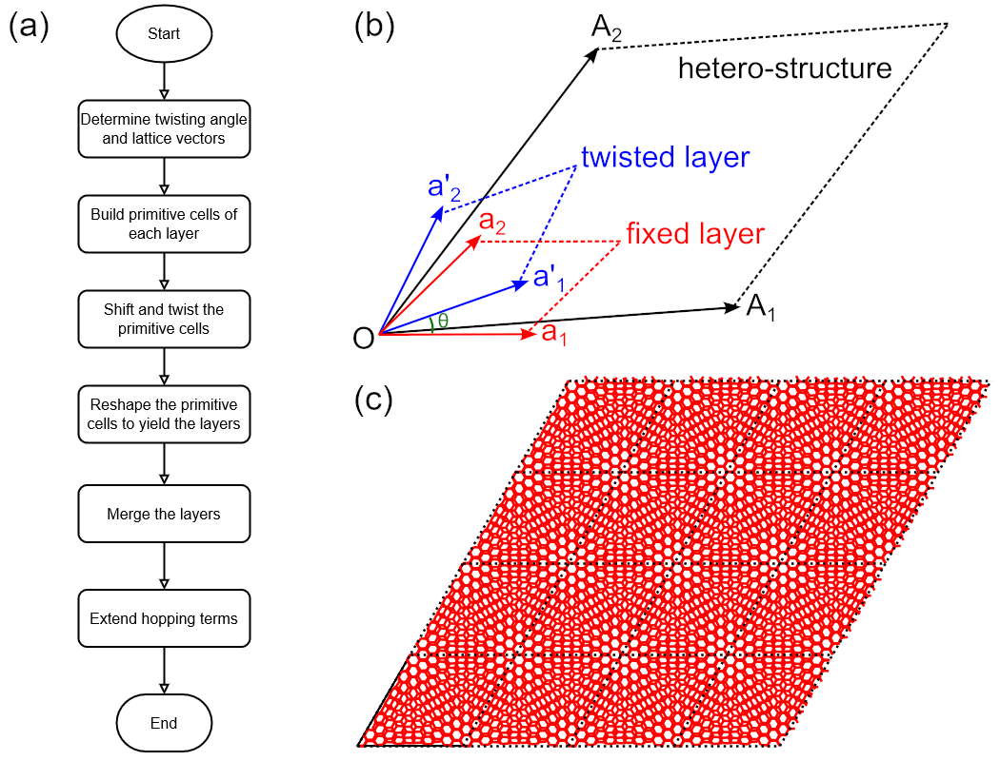

.. _hetero_model:

Build hetero-structure
======================

In this tutorial, we show how to build hetero-structure taking twisted bilayer graphene as the
example. The workflow of constructing hetero structures is shown in Fig. 1(a). First of all, we
determine the twisting angle and lattice vectors of the hetero-structure. Then we build the
primitive cells of each layer, shift the twisted layer along :math:`z`-axis by the interlayer
distance and rotate it by the twisting angle. After that, we reshape the primitive cells to the
lattice vectors of the hetero-structure to yield the layers, as depicted in Fig. 1(b). When all the
layers are ready, we merge them into one cell and add the intralayer and interlayer hopping terms
up to a given cutoff distance. For the visualization of Moiré pattern, we also need to build a
sample from the merged cell. The script can be found at ``examples/advanced/tbg.py``. Before
constructing the model, we need to import the required packages:

.. code-block:: python

    import math

    import numpy as np
    from numpy.linalg import norm

    import tbplas as tb

    (a) Workflow of constructing hetero-structure. (b) Schematic plot of lattice vectors of fixed
    (:math:`\mathbf{a}_1`, :math:`\mathbf{a}_2`) and twisted  (:math:`\mathbf{a}_1^\prime`,
    :math:`\mathbf{a}_2^\prime`) primitive cells and the hetero-structure (:math:`\mathbf{A}_1`,
    :math:`\mathbf{A}_2`), as well as the twisting angle :math:`\theta`. (c) Twisted bilayer
    graphene sample with :math:`4\times4\times1` merged cells of :math:`i=5`.

Auxiliary functions
-------------------

The twisting angle and lattice vectors are determined following the formulation in
`ref1 <https://journals.aps.org/prl/abstract/10.1103/PhysRevLett.99.256802>`_:

.. math::
    \theta_i &= \arccos \frac{3i^2+3i+1/2}{3i^2+3i+1} \\
    \mathbf{A}_1 &= i\cdot\mathbf{a}_1 + (i+1)\cdot\mathbf{a}_2 \\
    \mathbf{A}_2 &= -(i+1)\cdot\mathbf{a}_1 + (2i+1)\cdot\mathbf{a}_2

where :math:`\mathbf{a}_1` and :math:`\mathbf{a}_2` are the lattice vectors of the primitive cell
of fixed layer and :math:`i` is the index of hetero-structure. We define the following functions
accordingly:

.. code-block:: python
    :linenos:

    def calc_twist_angle(i: int) -> float:
        """
        Calculate twisting angle according to the reference.

        :param i: parameter controlling the twisting angle
        :return: twisting angle in RADIANs, NOT degrees
        """
        cos_ang = (3 * i ** 2 + 3 * i + 0.5) / (3 * i ** 2 + 3 * i + 1)
        return math.acos(cos_ang)

    def calc_hetero_lattice(i: int, prim_cell_fixed: tb.PrimitiveCell) -> np.ndarray:
        """
        Calculate Cartesian coordinates of lattice vectors of hetero-structure
        according to the reference.

        :param i: parameter controlling the twisting angle
        :param prim_cell_fixed: primitive cell of fixed layer
        :return: (3, 3) float64 array, Cartesian coordinates of hetero-structure
            lattice vectors in NANOMETER
        """
        hetero_lattice = np.array([[i, i + 1, 0],
                                   [-(i + 1), 2 * i + 1, 0],
                                   [0, 0, 1]])
        hetero_lattice = tb.frac2cart(prim_cell_fixed.lat_vec, hetero_lattice)
        return hetero_lattice

``calc_twist_angle`` returns the twisting angle in radians, while ``calc_hetero_lattice`` returns
the Cartesian coordinates of lattce vectors in nm. After merging the layers, we need to add the
interlayer hopping terms. Meanwhile, the intralayer hoppings terms should also be extended in the
same approach. We define the ``extend_hop`` function to achieve these goals:

.. code-block:: python
    :linenos:

    def extend_hop(prim_cell: tb.PrimitiveCell, max_distance: float = 0.75) -> None:
        """
        Extend the hopping terms in primitive cell up to cutoff distance.

        :param prim_cell: primitive cell to extend
        :param max_distance: cutoff distance in NM
        :return: None. Incoming primitive cell is modified
        """
        neighbors = tb.find_neighbors(prim_cell, a_max=1, b_max=1,
                                      max_distance=max_distance)
        for term in neighbors:
            i, j = term.pair
            prim_cell.add_hopping(term.rn, i, j, calc_hop(term.rij))

Here we call the ``find_neighbors`` function to get the neighboring orbital pairs up to the cutoff
distance ``max_distance``. Then the hopping terms are evaluated according to the displacement
vector ``rij`` with the ``calc_hop`` function and added to the primitive cell. The ``calc_hop``
function is defined according to the formulation in
`ref2 <https://journals.aps.org/prb/abstract/10.1103/PhysRevB.86.125413>`_:

.. code-block:: python
    :linenos:

    def calc_hop(rij: np.ndarray) -> float:
        """
        Calculate hopping parameter according to Slater-Koster relation.
        See ref. [2] for the formulae.

        :param rij: (3,) array, displacement vector between two orbitals in NM
        :return: hopping parameter in eV
        """
        a0 = 0.1418
        a1 = 0.3349
        r_c = 0.6140
        l_c = 0.0265
        gamma0 = 2.7
        gamma1 = 0.48
        decay = 22.18
        q_pi = decay * a0
        q_sigma = decay * a1
        dr = norm(rij).item()
        n = rij.item(2) / dr
        v_pp_pi = - gamma0 * math.exp(q_pi * (1 - dr / a0))
        v_pp_sigma = gamma1 * math.exp(q_sigma * (1 - dr / a1))
        fc = 1 / (1 + math.exp((dr - r_c) / l_c))
        hop = (n**2 * v_pp_sigma + (1 - n**2) * v_pp_pi) * fc
        return hop

Build the model
---------------

With all the functions ready, we proceed to build the hetero-structure. Firstly, we evaluate the
twisting angle of bilayer graphene for :math:`i=5`. Then we construct the primitive cells of the
fixed and twisted layers with the :func:`.make_graphene_diamond` function. The fixed primitive cell
is located at :math:`z=0` and does not need rotation or shifting. On the other hand, the twisted
primitive cell needs to be rotated counter-clockwise by the twisting angle and shifted towards
:math:`+z` by 0.3349 nm, which is done with the :func:`.spiral_prim_cell` function. After that, we
reshape the primitive cells to the lattice vectors of hetero-structure with the
:func:`.make_hetero_layer` function, which is a wrapper to coordinate conversion and
:func:`.reshape_prim_cell`. Then the layers are merged with :func:`merge_prim_cell` and the hopping
terms are extended with ``extend_hop`` using a cutoff distance of 0.75 nm. Finally, a sample with
:math:`4\times4\times1`` merged cells is created and plotted, with the hopping terms below 0.3 eV
hidden for clarity. The output is shown in Fig. 1(c), where the Moiré pattern can be clearly
observed.

.. code-block:: python
    :linenos:

    def main():
        # Evaluate twisting angle
        i = 5
        angle = calc_twist_angle(i)

        # Prepare primitive cells of fixed and twisted layer
        prim_cell_fixed = tb.make_graphene_diamond()
        prim_cell_twisted = tb.make_graphene_diamond()

        # Shift and rotate the twisted layer
        tb.spiral_prim_cell(prim_cell_twisted, angle=angle, shift=0.3349)

        # Reshape primitive cells to the lattice vectors of hetero-structure
        hetero_lattice = calc_hetero_lattice(i, prim_cell_fixed)
        layer_fixed = tb.make_hetero_layer(prim_cell_fixed, hetero_lattice)
        layer_twisted = tb.make_hetero_layer(prim_cell_twisted, hetero_lattice)

        # Merge layers
        merged_cell = tb.merge_prim_cell(layer_fixed, layer_twisted)

        # Extend hopping terms
        extend_hop(merged_cell, max_distance=0.75)

        # Visualize Moire pattern
        sample = tb.Sample(tb.SuperCell(merged_cell, dim=(4, 4, 1), pbc=(True, True, False)))
        sample.plot(with_orbitals=False, hop_as_arrows=False, hop_eng_cutoff=0.3)

    if __name__ == "__main__":
        main()
