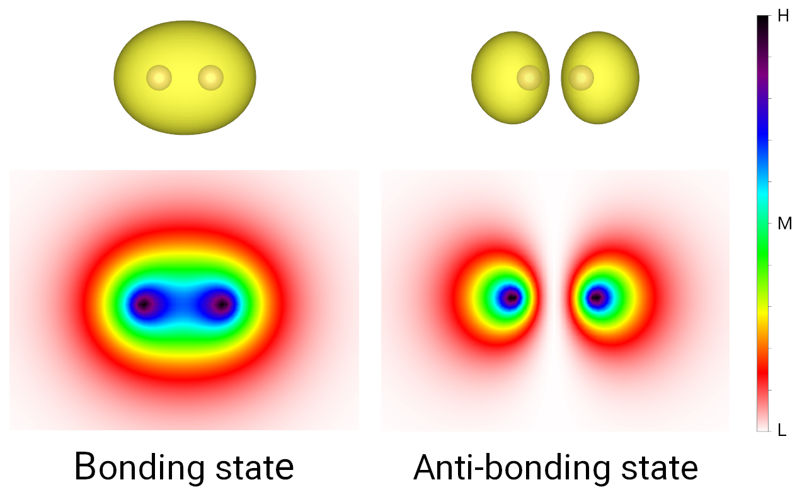
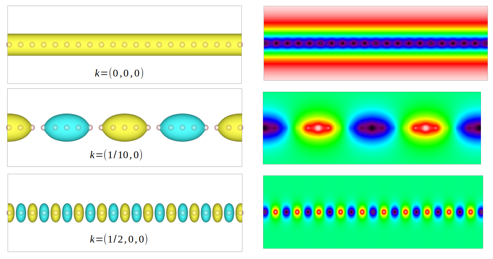
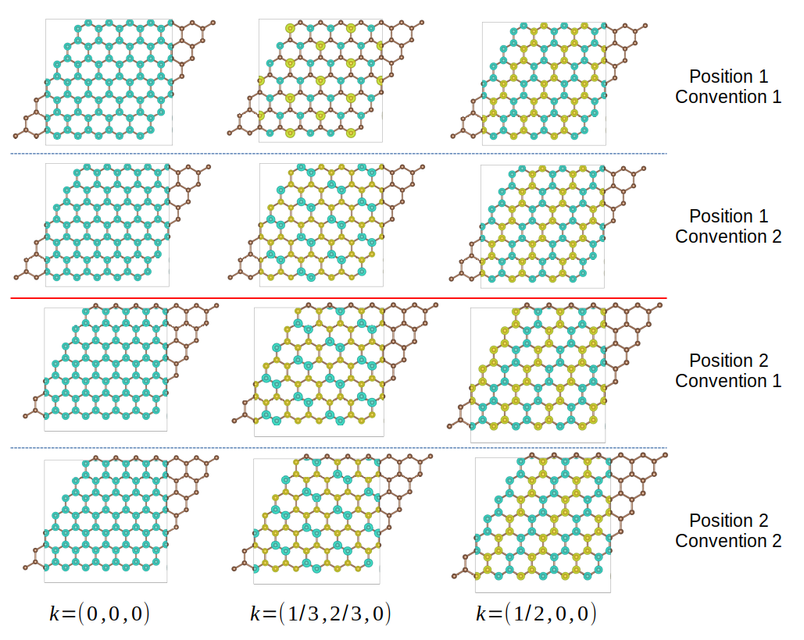

Plot 3D wavefunction
====================

In this tutorial, we show how to plot the three-dimensional wavefunction and save it to Gaussaian
cube format. Cube is a common file format for representing volumic data in real space, and can be
visualized by a lot of tools like `XCrySDen <http://www.xcrysden.org/>`_,
`VESTA <http://jp-minerals.org/vesta/en/>`_ and `Avogadro <https://avogadro.cc/>`_.
The :class:`.Visualizer` class offers a :func:`plot_wfc3d` function to plot the wavefunction
in cube format. We demonstrate its usage by visualizing the bonding and anti-bonding states of
hydrogen molecule, then the influence of k-point on the Bloch states of a hydrogen atom chain.
Finally, we turn to the more realistic graphene model and visualize its wavefunctions of different
Hamiltonian convention. To begin with, we import the necessary packages

.. code-block:: python
    :emphasize-lines: 0

    import tbplas as tb
    import numpy as np

H2 molecule
-----------

The bonding and anti-bonding states of a hydrogen molecule can be visualized as

.. code-block:: python
    :linenos:

    """Plot the bonding and anti-boding states of H2 molecule."""
    # 1nm * 1nm * 1nm cubic cell
    lattice = np.eye(3, dtype=np.float64)
    prim_cell = tb.PrimitiveCell(lattice, unit=tb.NM)
    h_bond = 0.074  # H-H bond length in nm
    prim_cell.add_orbital((0.5-0.5*h_bond, 0.5, 0.5))
    prim_cell.add_orbital((0.5+0.5*h_bond, 0.5, 0.5))
    prim_cell.add_hopping((0, 0, 0), 0, 1, -1.0)
    qn = np.array([(1, 1, 0, 0) for _ in range(prim_cell.num_orb)])

    # Calculate wave function
    k_points = np.array([[0.0, 0.0, 0.0]])
    solver = tb.DiagSolver(prim_cell)
    bands, states = solver.calc_states(k_points, convention=1)

    # Define plotting range
    # Cube volume: [0.25, 0.75] * [0.25, 0.75] * [0.25, 0.75] in nm
    cube_origin = np.array([0.25, 0.25, 0.25])
    cube_size = np.array([0.5, 0.5, 0.5])
    rn_max = np.array([0, 0, 0])

    # Plot wave function
    vis = tb.Visualizer()
    vis.plot_wfc3d(prim_cell, wfc=states[0, 0], quantum_numbers=qn,
                   convention=1, k_point=k_points[0], rn_max=rn_max,
                   cube_name="h2.bond.cube", cube_origin=cube_origin,
                   cube_size=cube_size, kind="abs2")
    vis.plot_wfc3d(prim_cell, wfc=states[0, 1], quantum_numbers=qn,
                   convention=1, k_point=k_points[0], rn_max=rn_max,
                   cube_name="h2.anti-bond.cube", cube_origin=cube_origin,
                   cube_size=cube_size, kind="abs2")

We define a :math:`1nm \times 1nm \times 1nm` cubic cell to hold the molecule
in line 3-4. In line 5-7 we add the two hydrogen atoms near the center of the cell. Then in line 8
we add the hopping term, which should be negative since it originates from  the attractive Coulomb
interaction between the electron and the nucleus. In line 9 we define the quantum number of the two
:math:`1s` states, where the first 1 indicate the nuclear charge :math:`Z`. The following 1 and 0
stand for the principle and angular quantum numbers :math:`n` and :math:`l`. The last number 0 is
the modified magnetic number :math:`\overline{m}` indicating the kind of real spherical harmonics.
The possible combinations of :math:`l` and :math:`\overline{m}` are

* (0, 0): :math:`s`
* (1, -1): :math:`p_y`
* (1, 0): :math:`p_z`
* (1, 1): :math:`p_x`
* (2, -2): :math:`d_{xy}`
* (2, -1): :math:`d_{yz}`
* (2, 0): :math:`d_{z^2}`
* (2, 1): :math:`d_{xz}`
* (2, 2): :math:`d_{x^2-y^2}`
* (3, -3): :math:`f_{y(3x^2-y^2)}`
* (3, -2): :math:`f_{xyz}`
* (3, -1): :math:`f_{yz^2}`
* (3, 0): :math:`f_{z^3}`
* (3, 1): :math:`f_{xz^2}`
* (3, 2): :math:`f_{z(x^2-y^2)}`
* (3, 3): :math:`f_{x(x^2-3y^2)}`

Then in 12-14 we calculate the wave functions for the :math:`\Gamma` point since the hydrogen
molecule is non-periodic. In line 18-19 we define the cube volume, which is located at
:math:`(0.25, 0.25, 0.25)` and spans :math:`0.5 \times 0.5 \times 0.5` (all units in nm). In
line 20 we define the range of :math:`R` in the evaluation of Bloch basis

.. math::

    \chi_{\mathbf{k}}^i = \sum_{\mathbf{R}} \mathrm{e}^{\mathrm{i}\mathbf{k}\cdot(\mathbf{R}+\tau_i)}\phi_{\mathbf{R}}^i

in convention 1 and

.. math::

    \chi_{\mathbf{k}}^i = \sum_{\mathbf{R}} \mathrm{e}^{\mathrm{i}\mathbf{k}\cdot\mathbf{R}}\phi_{\mathbf{R}}^i

in convention 2. Since out model is non-periodic, we restrict :math:`R` to the :math:`(0, 0, 0)`
cell. In line 23-28 we plot the wavefunctions to cube files. The ``convention`` argument controls
the convention of Bloch basis, which should be consistent with the argument when calling
:func:`.calc_states`. The ``kind`` argument defines which part of the wavefunction to plot,
which should be either "real", "imag" or "abs2". In our case we plot the squared norm of the
wavefunction. The output is shown in the figure below, where the bonding and anti-boding states
show significant charge accumulation and deleption in the internuclear area, respectively.

    Bonding and anti-boding states of hydrogen molecule.

Hydrogen chain
--------------

The Bloch states in one-dimensional hydrogen chain can be visualized as

.. code-block:: python
    :linenos:

    """Plot the wave function of a hydrogen chain."""
    # 0.074nm * 0.074nm * 0.074nm cubic cell
    lattice = 0.074 * np.eye(3, dtype=np.float64)
    prim_cell = tb.PrimitiveCell(lattice, unit=tb.NM)
    prim_cell.add_orbital((0.0, 0.0, 0.0))
    prim_cell.add_hopping((1, 0, 0), 0, 0, -1.0)
    qn = np.array([(1, 1, 0, 0) for _ in range(prim_cell.num_orb)])

    # Calculate wave function
    k_points = np.array([[0.0, 0.0, 0.0]])
    solver = tb.DiagSolver(prim_cell)
    bands, states = solver.calc_states(k_points, convention=1)

    # Define plotting range
    # Cube volume: [-0.75, 0.75] * [-0.25, 0.25] * [-0.25, 0.25] in nm
    cube_origin = np.array([-0.75, -0.25, -0.25])
    cube_size = np.array([1.5, 0.5, 0.5])
    rn_max = np.array([15, 0, 0])

    # Plot wave function
    vis = tb.Visualizer()
    vis.plot_wfc3d(prim_cell, wfc=states[0, 0], quantum_numbers=qn,
                   convention=1, k_point=k_points[0], rn_max=rn_max,
                   cube_origin=cube_origin, cube_size=cube_size, kind="real")

Much of the code is similar to that of hydrogen molecule. We build a cubic cell with length of
0.074nm (bond length of hydrogen molecule), and add one atom at :math:`(0, 0, 0)`. There is one
hopping term from the :math:`(0, 0, 0)` cell to the neighbouring :math:`(1, 0, 0)` cell. Since our
model is periodic this time, we set ``rn_max`` to ``(15, 0, 0)`` in line 18, which covers
neighbouring cells from :math:`(-15, 0, 0)` to :math:`(15, 0, 0)`. The wavefunctions for different
k-points are shown as below. Since the k-point controls the wave vector in real space, we can see
a larger k leads to smaller wave lengths

    Wavefunctions of hydrogen chain for different k-points.

Graphene
--------

Finally, we visualize the wavefunctions of monolayer graphene to see how the atomic positions and
convention of Hamiltonian affect the spatial distribution of wavefunction.

.. code-block:: python
    :linenos:

    """Plot the wave function of monolayer graphene."""
    vectors = tb.gen_lattice_vectors(a=0.246, b=0.246, gamma=60)
    prim_cell = tb.PrimitiveCell(vectors, unit=tb.NM)
    prim_cell.add_orbital((0.0, 0.0), label="C_pz")
    prim_cell.add_orbital((1/3., 1/3.), label="C_pz")
    prim_cell.add_hopping((0, 0), 0, 1, -2.7)
    prim_cell.add_hopping((1, 0), 1, 0, -2.7)
    prim_cell.add_hopping((0, 1), 1, 0, -2.7)
    qn = np.array([(6, 2, 1, 0) for _ in range(prim_cell.num_orb)])

    # Calculate wave function
    k_points = np.array([[0.0, 0.0, 0.0]])
    solver = tb.DiagSolver(prim_cell)
    bands, states = solver.calc_states(k_points, convention=1)

    # Define plotting range
    # Cube volume: [-0.75, 0.75] * [-0.75, 0.75] * [-0.25, 0.25] in nm
    cube_origin = np.array([-0.75, -0.75, -0.25])
    cube_size = np.array([1.5, 1.5, 0.5])
    rn_max = np.array([3, 3, 0])

    # Plot wave function
    vis = tb.Visualizer()
    vis.plot_wfc3d(prim_cell, wfc=states[0, 0], quantum_numbers=qn,
                   convention=1, k_point=k_points[0], rn_max=rn_max,
                   cube_origin=cube_origin, cube_size=cube_size, kind="real")

We consider two different set of atomic positions, :math:`(0, 0, 0)` and
:math:`(\frac{1}{3}, \frac{1}{3}, 0)`, or :math:`(\frac{1}{3}, \frac{1}{3}, 0)` and
:math:`(\frac{2}{3}, \frac{2}{3}, 0)`. The k-points are :math:`\Gamma (0, 0, 0)`,
:math:`K (\frac{1}{3}, \frac{2}{3}, 0)` and :math:`M (\frac{1}{2}, 0, 0)`. The output are shown
below. We can see the wavefunction at :math:`\Gamma` point is irrelavant on atomic positions and
Hamiltonian convention, since the phase vector is always 1. For other k-points, the wavefunction
does not change on atomic positions for convention 2, since the phase factor involves only the cell
index :math:`R`. For convention 1, either changing the atomic positions or the convention will
change the wave function.

    Wavefunctions of hydrogen chain for different k-points.