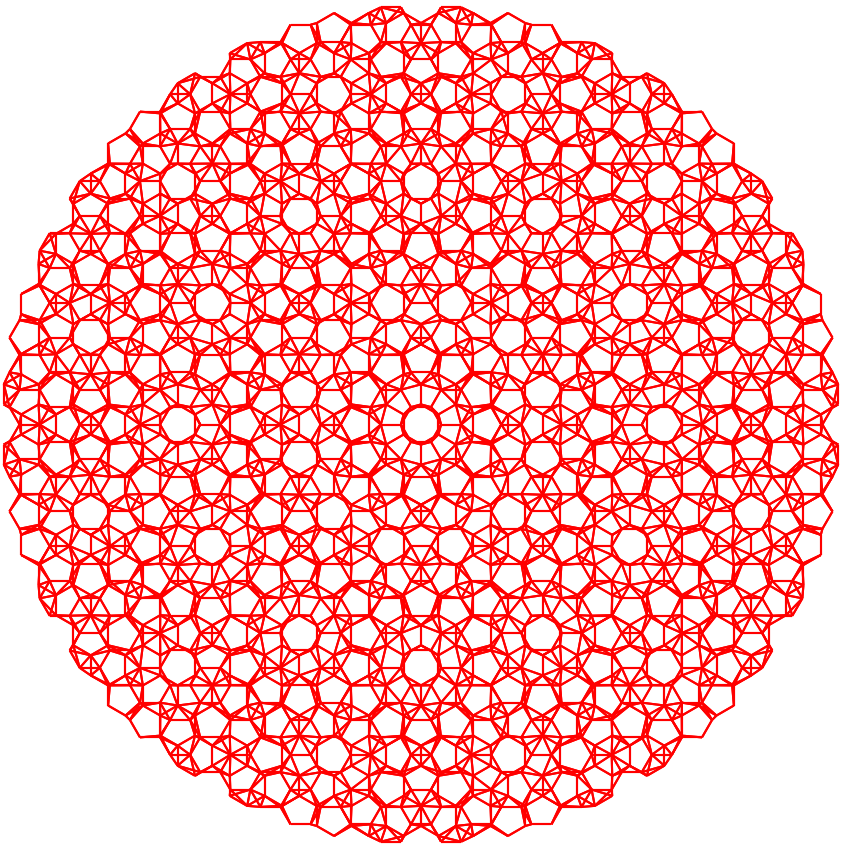

Quasi-crystal
=============

In this tutorial, we show how to construct the quasi-crystal, in which we also need to shift
twist, reshape and merge the cells. Taking bilayer graphene quasicrystal as an example, a
quasicrystal with 12-fold symmtery is formed by twisting one layer by :math:`30^\circ` with respect
to the center of :math:`\mathbf{c} = \frac{2}{3}\mathbf{a}_1 + \frac{2}{3}\mathbf{a}_2`, where
:math:`\mathbf{a}_1` and :math:`\mathbf{a}_2` are the lattice vectors of the primitive cell of
fixed layer. The script can be found at ``examples/advanced/quasi_crystal.py``. We begin with
importing the packages and defining the geometric parameters:

.. code-block:: python

    import math

    import numpy as np
    from numpy.linalg import norm

    import tbplas as tb

    angle = 30 / 180 * math.pi
    center = (2./3, 2./3, 0)
    radius = 3.0
    shift = 0.3349
    dim = (33, 33, 1)

Here ``angle`` is the twisting angle and ``center`` is the fractional coordinate of twisting
center. The radius of the quasicrystal is controlled by ``radius``, while ``shift`` specifies the
interlayer distance. We need a large cell to hold the quasicrystal, whose dimension is given in
``dim``. After introducing the parameters, we firstly get the Cartesian coordinate of the twisting
center by:

.. code-block:: python

    # Get the Cartesian coordinate of twisting center
    center = np.array([dim[0]//2, dim[1]//2, 0]) + center
    center = np.matmul(center, prim_cell.lat_vec)

Since we have extended the primitive cell by :math:`33\times33\times1` times, and we want the
quasicrystal to be located in the center of the cell, we need to convert the coordinate of twisting
center in line 2-3. Then we build the fixed and twisted layers by:

.. code-block:: python

    # Build fixed and twisted layers
    prim_cell = tb.make_graphene_diamond()
    layer_fixed = tb.extend_prim_cell(prim_cell, dim=dim)
    layer_twisted = tb.extend_prim_cell(prim_cell, dim=dim)

and shift and twist the twisted layer with respect to the center:

.. code-block:: python

    # Twist and shift twisted layer
    tb.spiral_prim_cell(layer_twisted, angle=angle, center=center, shift=shift)

The twisting operation is done by the :func:`.spiral_prim_cell` function, where the Cartesian
coordinate of the center is given in the ``center`` argument. Then we remove unnecessary orbitals to
produce a round quasicrystal with finite radius. This is done by calling the ``cutoff_pc`` function:

.. code-block:: python

    # Remove unnecessary orbitals
    cutoff_pc(layer_fixed, center=center, radius=radius)
    cutoff_pc(layer_twisted, center=center, radius=radius)

which is defined as:

.. code-block:: python

    def cutoff_pc(prim_cell: tb.PrimitiveCell, center: np.ndarray,
                  radius: float = 3.0) -> None:
        """
        Cutoff primitive cell up to given radius with respect to given center.

        :param prim_cell: supercell to cut
        :param center: Cartesian coordinate of center in nm
        :param radius: cutoff radius in nm
        :return: None. The incoming supercell is modified.
        """
        idx_remove = []
        orb_pos = prim_cell.orb_pos_nm
        for i, pos in enumerate(orb_pos):
            if norm(pos[:2] - center[:2]) > radius:
                idx_remove.append(i)
        prim_cell.remove_orbitals(idx_remove)
        prim_cell.trim()

where we loop over orbital positions to collect the indices of unnecessary orbitals, then call the
``remove_orbitals`` and ``trim`` functions. Before merging the fixed and twisted layers, we need to
reset the lattice vectors and origin of twisted layer to that of fixed layer by calling the
``reset_lattice`` function:

.. code-block:: python

    # Reset the lattice of twisted layer
    layer_twisted.reset_lattice(layer_fixed.lat_vec, layer_fixed.origin,
                                unit=tb.NM, fix_orb=True)

After that, we can merge them safely:

.. code-block:: python

    # Merge layers
    final_cell = tb.merge_prim_cell(layer_fixed, layer_twisted)

Finally, we extend the hoppings and visualize the quasicrystal:

.. code-block:: python

    # Extend and visualize the model
    extend_hop(final_cell)
    final_cell.plot(with_cells=False, with_orbitals=False, hop_as_arrows=False, hop_eng_cutoff=0.3)

where the ``extend_hop`` function is defined in :ref:`hetero_model`. The output is shown in
following figure:

    Plot of the quasicrystal formed from the incommensurate :math:`30^\circ` twisted bilayer
    graphene with a radius of 3 nm.
