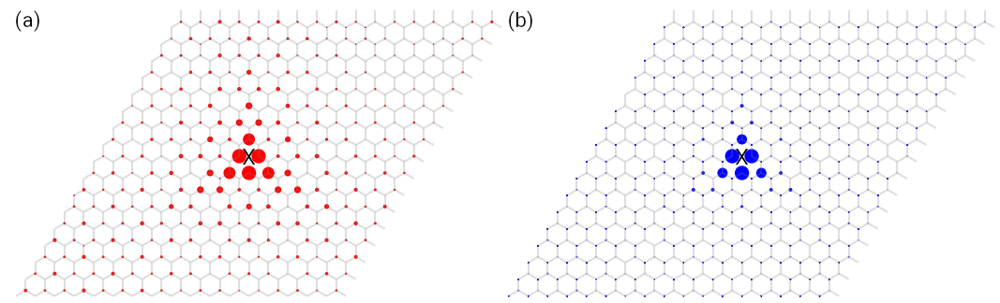

Quasi-eigenstates
=================

The quasi-eigenstates are defined as

.. math::

    |\Psi(E) \rangle &=\frac{1}{2\pi} \int_{-\infty}^{\infty} \mathrm{e}^{\mathrm{i}Et} |\psi(t) \rangle \mathrm{d}t \nonumber \\
	&=\frac{1}{2\pi}\sum_i a_i \int_{-\infty}^{\infty} \mathrm{e}^{\mathrm{i}(E-E_i)t} |\phi_i \rangle \mathrm{d}t \nonumber \\
	&=\sum_i a_i \delta(E-E_i)|\phi_i \rangle

If the energy :math:`E` equals to an eigenvalue :math:`E_i`, then the quasi-eigenstate is the exact
eigenstate corresonding to :math:`E_i`, or a superposition of degenerate eigenstates if :math:`E_i`
is degenerate. In this tutorial, we will show how to calculate the quasi-eigenstates and compare them
with the exact eigenstates. The script can be found at ``examples/advanced/quasi_eigen.py``. We begin
with importing the necessary packages:

.. code-block:: python

    import numpy as np
    import tbplas as tb

Exact eigenstates
-----------------

We define the following function to calculate the exact eigenstates:

.. code-block:: python
    :linenos:

    def wfc_diag(sample: tb.Sample) -> None:
        """
        Calculate wave function using exact diagonalization.

        :param sample: graphene sample
        :return: None
        """
        k_points = np.array([[0.0, 0.0, 0.0]])
        solver = tb.DiagSolver(model=sample)
        bands, states = solver.calc_states(k_points)

        i_b = sample.num_orb // 2
        wfc = np.abs(states[0, i_b])**2
        wfc /= wfc.max()
        vis = tb.Visualizer()
        vis.plot_wfc(sample, wfc, scatter=True, site_size=wfc*100, site_color="r",
                     with_model=True, model_style={"alpha": 0.25, "color": "gray"})
        print(bands[0, i_b])

In line 8 we define the k-points on which the eigenstates will be calculated, where we consider the
:math:`\Gamma` point. In line 9 we define a :class:`.DiagSolver` object and call its ``calc_states``
method in line 10 to get the eigenvalues and eigenstates, as returned in ``bands`` and ``states``. After
that, we extract the eigenstate at the Fermi level and normalize it in line 12-14. To visualize the
eigenstate, we create a visualizer from the :class:`.Visualizer` class and call its ``plot_wfc`` method.
Note that we must use scatter plot by setting the ``scatter`` argument to true. The eigenstate should be
passed as the ``site_size`` argument, i.e., sizes of scatters will indicate the projection of eigenstate
on the sites. We also need to show the model alongside the eigenstate through the ``with_model`` argument
and define its plotting style with the ``model_style`` argument. Finally, we print the eigenvalue
corresonding to the eigenstate, which will be utilized to calcualte the quasi-eigenstate then.

The ``wfc_diag`` function should be called by:

.. code-block:: python
    :linenos:

    def main():
        # Build a graphene sample with a single vacancy
        prim_cell = tb.make_graphene_diamond()
        super_cell = tb.SuperCell(prim_cell, dim=(17, 17, 1),
                                pbc=(True, True, False))
        super_cell.add_vacancies([(8, 8, 0, 0)])
        sample = tb.Sample(super_cell)

        # Calcuate and Visualize the eigenstate
        wfc_diag(sample)

    if __name__ == "__main__":
        main()

where we create a :math:`17\times17\times1` graphene sample with a vacancy in the center in line 2-7. The output
is shown in Fig. 1(b), where the eigenstate is localized around the vacancy and shows a 3-fold rotational symmtery.

    Spatial distribution of (a) exact eigenstate and (b) quasi-eigenstate of graphene sample with a vacancy in the
    center. The ``X`` marks indicate the position of the vacancy.

Quasi-eigenstates
-----------------

The quasi-eigenstate is evaluated and plotted in a similar approach:

.. code-block:: python
    :linenos:

    def wfc_tbpm(sample: tb.Sample) -> None:
        """
        Calculate wave function using TBPM.

        :param sample: graphene sample
        :return: None
        """
        sample.rescale_ham()
        config = tb.Config()
        config.generic['nr_random_samples'] = 1
        config.generic['nr_time_steps'] = 1024
        config.quasi_eigenstates['energies'] = [0.0]

        solver = tb.Solver(sample, config)
        qs = solver.calc_quasi_eigenstates()
        wfc = np.abs(qs[0])**2
        wfc /= wfc.max()
        vis = tb.Visualizer()
        vis.plot_wfc(sample, wfc, scatter=True, site_size=wfc*100, site_color="b",
                     with_model=True, model_style={"alpha": 0.25, "color": "gray"})

Evaluating quasi-eigenstates is a kind of TBPM calculation, so it follows the common procedure of
TBPM. We firstly rescale the Hamiltonian in line 8, then create a ``config`` and a ``solver`` in
line 9-14. Specially, the energy from the output of previous section should be specified in
``config.quasi_eigenstates['energies']``. Then we call the ``calc_quasi_eigenstates`` method of
``solver`` to get the eigenstates, normalize it, and visualize it in line 15-20.

We call ``wfc_tbom`` by:

.. code-block:: python

    wfc_diag(sample)

The output is shown in Fig. 1(b), which is also localized around the vacancy and shows a 3-fold
rotational symmtery, much similar to the exact eigenstate in Fig. 1(a).
