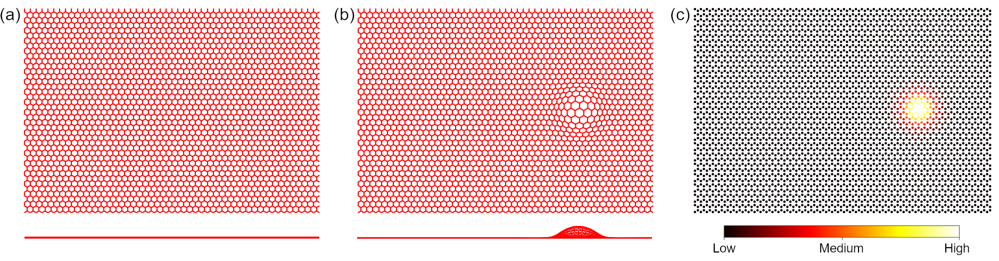
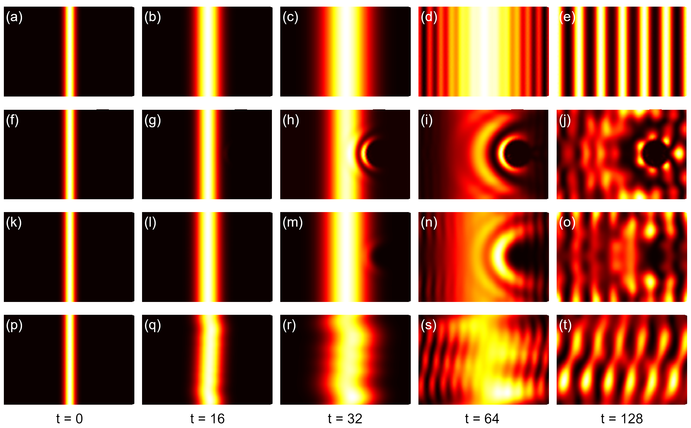

Strain and external fields
==========================

In this tutorial, we introduce the common procedure of applying strain and external fields on the
model. It is difficult to design common `out-of-the-box` user APIs that offer such functionalities
since they are strongly case-dependent. Generally, the user should implement these perturbations by
modifying model attributes such as orbital positions, on-site energies and hopping integrals. For
the primitive cell, it is straightforward to achieve this goal with the ``set_orbital`` and
``add_hopping`` methods. The :class:`.Sample` class, on the contrary, does not offer such methods.
Instead, the user should work with the attributes directly. In the :class:`.Sample` class, orbital
positions and on-site energies are stored in the ``orb_pos`` and ``orb_eng`` attributes. Hopping
terms are represented with 3 attributes: ``hop_i`` and ``hop_j`` for orbital indices, and ``hop_v``
for hopping integrals. There is also an auxiliary attribute ``dr`` which holds the hopping vectors.
All the attributes are NumPy arrays. The on-site energies and hopping terms can be modified
directly, while the orbital positions should be changed via a modifier function. The hopping
vectors are updated from the orbital positions and hopping terms automatically, thus no need of
explicit modification.

As the example, we will investigate the propagation of wave function in a graphene sample. The
script can be found at ``examples/sample/tbpm/wfc_prop.py``. We begin with defining the functions
for adding strain and external fields, then calculate and plot the time-dependent wave function to
check their effects on the propagation. The essential packages of this tutorial can be imported
with:

.. code-block:: python

    import math
    from typing import Callable

    import numpy as np
    from numpy.linalg import norm

    import tbplas as tb

Functions for strain
--------------------

Strain will introduce deformation into the model, changing both orbital positions and hopping
integrals. It is a rule that orbital positions should not be modified directly, but through a
modifier function. We consider a Gaussian bump deformation, and define the following function
to generate the modifier:

.. code-block:: python
    :linenos:

    def make_deform(center: np.ndarray, sigma: float = 0.5,
                    extent: tuple = (1.0, 1.0),
                    scale: tuple = (0.5, 0.5)) -> Callable:
        """
        Generate deformation function as orb_pos_modifier.

        :param center: Cartesian coordinate of deformation center in nm
        :param sigma: broadening parameter
        :param extent: extent of deformation along xOy and z directions
        :param scale: scaling factor for deformation along xOy and z directions
        :return: deformation function
        """
        def _deform(orb_pos):
            x, y, z = orb_pos[:, 0], orb_pos[:, 1], orb_pos[:, 2]
            dx = (x - center[0]) * extent[0]
            dy = (y - center[1]) * extent[1]
            amp = np.exp(-(dx**2 + dy**2) / (2 * sigma**2))
            x += dx * amp * scale[0]
            y += dy * amp * scale[0]
            z += amp * scale[1]
        return _deform

Here ``center``, ``sigma`` and ``extent`` control the location, width and extent of the bump. For
example, if ``extent`` is set to :math:`(1.0, 0.0)`, the bump will become one-dimensional which
varies along :math:`x`-direction while remains constant along :math:`y`-direction. ``scale``
specifies the scaling factors for in-plane and out-of-plane displacements. The ``make_deform``
function returns another function as the modifier, which updates the orbital positions `in place`
according to the following expression:

.. math::

    \mathbf r_i &\rightarrow \mathbf r_i + \Delta_i \\
    \Delta_i^{\parallel} &= A_i \cdot (\mathbf r_i^{\parallel} - \mathbf c_0^{\parallel}) \cdot s^{\parallel} \\
    \Delta_i^{\perp} &= A_i \cdot s^{\perp} \\
    A_i &= \exp \left[-\frac{1}{2\sigma^2}\sum_{j=1}^{2} (\mathbf r_i^j - \mathbf c_0^j)^2 \cdot \eta^j \right]

where :math:`\mathbf{r}_i` is the position of :math:`i`-th orbital, :math:`\Delta_i` is the
displacement, :math:`s` is the scaling factor, :math:`\parallel` and :math:`\perp` are the in-plane
and out-of-plane components. The location, width and extent of the bump are denoted as
:math:`\mathbf{c}_0`, :math:`\sigma` and :math:`\eta`, respectively.

In addition to the orbital position modifier, we also need to update hopping integrals

.. code-block:: python
    :linenos:

    def update_hop(sample: tb.Sample) -> None:
        """
        Update hopping terms in presence of deformation.

        :param sample: Sample to modify
        :return: None.
        """
        sample.init_hop()
        sample.init_dr()
        for i, rij in enumerate(sample.dr):
            sample.hop_v[i] = calc_hop(rij)

As we will make use of the hopping terms and vectors, we should call the ``init_hop`` and
``init_dr`` methods to initialize the attributes. Similar rule holds for the on-site
energies and orbital positions. Then we loop over the hopping terms to update the integrals in
``hop_v`` according to the vectors in ``dr`` with the ``calc_hop`` function, which is defined as:

.. code-block:: python
    :linenos:

    def calc_hop(rij: np.ndarray) -> float:
        """
        Calculate hopping parameter according to Slater-Koster relation.

        :param rij: (3,) array, displacement vector between two orbitals in NM
        :return: hopping parameter in eV
        """
        a0 = 0.1418
        a1 = 0.3349
        r_c = 0.6140
        l_c = 0.0265
        gamma0 = 2.7
        gamma1 = 0.48
        decay = 22.18
        q_pi = decay * a0
        q_sigma = decay * a1
        dr = norm(rij).item()
        n = rij.item(2) / dr
        v_pp_pi = - gamma0 * math.exp(q_pi * (1 - dr / a0))
        v_pp_sigma = gamma1 * math.exp(q_sigma * (1 - dr / a1))
        fc = 1 / (1 + math.exp((dr - r_c) / l_c))
        hop = (n**2 * v_pp_sigma + (1 - n**2) * v_pp_pi) * fc
        return hop

Functions for external fields
-----------------------------

The effects of external electric field can be modeled by adding position-dependent potential to the
on-site energies. We consider a Gaussian-type scattering potential described by

.. math::

    V_i = V_0 \cdot A_i

and define the following function to add the potential to the sample

.. code-block:: python
    :linenos:

    def add_efield(sample: tb.Sample, center: np.ndarray, sigma: float = 0.5,
                   extent: tuple = (1.0, 1.0), v_pot: float = 1.0) -> None:
        """
        Add electric field to sample.

        :param sample: sample to add the field
        :param center: Cartesian coordinate of the center in nm
        :param sigma: broadening parameter
        :param extent: extent of electric field along xOy and z directions
        :param v_pot: electric field intensity in eV
        :return: None.
        """
        sample.init_orb_pos()
        sample.init_orb_eng()
        orb_pos = sample.orb_pos
        orb_eng = sample.orb_eng
        for i, pos in enumerate(orb_pos):
            dx = (pos.item(0) - center[0]) * extent[0]
            dy = (pos.item(1) - center[1]) * extent[1]
            orb_eng[i] += v_pot * math.exp(-(dx**2 + dy**2) / (2 * sigma**2))

The arguments ``center``, ``sigma`` and ``extent`` are similar to that of the ``make_deform``
function, while ``v_pot`` specifies :math:`V_0`. Similar to ``update_hop``, we need to call
``init_orb_pos`` and ``init_orb_eng`` to initialize orbital positions and on-site energies before
accessing them. Then the position-dependent scattering potential is added to the on-site energies.

The effects of magnetic field can be modeled with Peierls substitution. For homogeneous magnetic
field perpendicular to the :math:`xOy`-plane along :math:`-z` direction,  the :class:`.Sample`
class offers an API ``set_magnetic_field``, which follows the Landau gauge of vector potential
:math:`\mathbf{A} = (By, 0, 0)` and updates the hopping terms as

.. math::

    t_{ij} \rightarrow t_{ij} \cdot \exp \left[\mathrm i\frac{eB}{2\hbar c} \cdot (\mathbf r_j^x - \mathbf r_i^x) \cdot (\mathbf r_j^y + \mathbf r_i^y) \right]

where :math:`B` is the intensity of magnetic field, :math:`\mathbf{r}_i` and :math:`\mathbf{r}_j`
are the positions of :math:`i`-th and :math:`j`-th orbitals, respectively.

Initial wave functions
----------------------

The initial wave function we consider here as an example for the propagation is a Gaussian
wave-packet, which is defined by

.. code-block:: python
    :linenos:

    def init_wfc_gaussian(sample: tb.Sample, center: np.ndarray, sigma: float = 0.5,
                          extent: tuple = (1.0, 1.0)) -> np.ndarray:
        """
        Generate Gaussian wave packet as initial wave function.

        :param sample: sample for which the wave function shall be generated
        :param center: Cartesian coordinate of the wave packet center in nm
        :param sigma: broadening parameter
        :param extent: extent of wave packet along xOy and z directions
        :return: initial wave function
        """
        sample.init_orb_pos()
        orb_pos = sample.orb_pos
        wfc = np.zeros(orb_pos.shape[0], dtype=np.complex128)
        for i, pos in enumerate(orb_pos):
            dx = (pos.item(0) - center[0]) * extent[0]
            dy = (pos.item(1) - center[1]) * extent[1]
            wfc[i] = math.exp(-(dx**2 + dy**2) / (2 * sigma**2))
        wfc /= np.linalg.norm(wfc)
        return wfc

Note that the wave function should be a complex vector whose length must be equal to the number of
orbitals. Also, it should be normalized before being returned.

Propagation of wave function
----------------------------

We consider a rectangular graphene sample with :math:`50\times20\times1` primitive cells, as shown
in Fig. 1(a). We begin with defining some geometric parameters:

.. code-block:: python
    :linenos:

    prim_cell = tb.make_graphene_rect()
    dim = (50, 20, 1)
    pbc = (True, True, False)
    x_max = prim_cell.lat_vec[0, 0] * dim[0]
    y_max = prim_cell.lat_vec[1, 1] * dim[1]
    wfc_center = (x_max * 0.5, y_max * 0.5)
    deform_center = (x_max * 0.75, y_max * 0.5)

Here ``dim`` and ``pbc`` define the dimension and boundary condition. ``x_max`` and ``y_max`` are
the lengths of the sample along :math:`x` and :math:`y` directions. The initial wave function will
be a Gaussian wave-packet located at the center of the sample given by ``wfc_center``.
The deformation and scattering potential will be located at the center of right half of the sample,
as specified by ``deform_center`` and shown in Fig. 1(b)-(c).

    Top and side views of (a) pristine graphene sample and (b) sample with deformation.
    (c) Plot of on-site energies of graphene sample with scattering potential.

We firstly investigate the propagation of a one-dimensional Gaussian wave-packet in pristine
sample, which is given by

.. code-block:: python
    :linenos:

    # Prepare the sample and inital wave function
    sample = tb.Sample(tb.SuperCell(prim_cell, dim, pbc))
    psi0 = init_wfc_gaussian(sample, center=wfc_center, extent=(1.0, 0.0))

    # Propagate the wave function
    config = tb.Config()
    config.generic["nr_time_steps"] = 128
    time_log = np.array([0, 16, 32, 64, 128])
    sample.rescale_ham()
    solver = tb.Solver(sample, config)
    psi_t = solver.calc_psi_t(psi0, time_log)

    # Visualize the time-dependent wave function
    vis = tb.Visualizer()
    for i in range(len(time_log)):
        vis.plot_wfc(sample, np.abs(psi_t[i])**2, cmap="hot", scatter=False)

As the propagation is performed with the ``calc_psi_t`` function of ``Solver`` class, it follows
the common procedure of TBPM calculation. We propagate the wave function by 128 steps, and save the
snapshots in ``psi_t`` at the time steps specified in ``time_log``. The snapshots are then
visualized by the ``plot_wfc`` function of ``Visualizer`` class, as shown in Fig. 2(a)-(e), where
the wave-packet diffuses freely, hits the boundary and forms interference pattern.

We then add the bump deformation to the sample, by assigning the modifier function to the supercell
and calling ``update_hop`` to update the hopping terms

.. code-block:: python

    deform = make_deform(center=deform_center)
    sample = tb.Sample(tb.SuperCell(prim_cell, dim, pbc, orb_pos_modifier=deform))
    update_hop(sample)

The propagation of wave-packet in deformed graphene sample is shown in Fig. 2(f)-(j). Obviously,
the wave function gets scattered by the bump. Although similar interference pattern is formed, the
propagation in the right part of the sample is significantly hindered, due to the increased
inter-atomic distances and reduced hopping integrals at the bump.

Similar phenomena are observed when the scattering potential is added to the sample by

.. code-block:: python

    add_efield(sample, center=deform_center)

The time-dependent wave function is shown in Fig. 2(k)-(o). Due to the higher on-site energies, the
probability of emergence of electron is suppressed near the scattering center.

As for the effects of magnetic field, it is well known that Landau levels will emerge in the DOS.
The analytical solution to Schrodinger's equation for free electron in homogeneous magnetic field
with :math:`\mathbf{A}=(By, 0, 0)` shows that the wave function will propagate freely along
:math:`x` and :math:`z`-directions while oscillates along :math:`y`-direction. To simulate this
process, we apply the magnetic field to the sample by

.. code-block:: python

    sample.set_magnetic_field(50)

The snapshots of time-dependent wave function are shown in Fig. 2(p)-(t). The interference pattern
is similar to the case without magnetic field, as the wave function propagates freely along
:math:`x` direction. However, due to the oscillation along :math:`y`-direction, the interference
pattern gets distorted during the propagation. These phenomena agree well with the analytical
results.

    (a)-(e) Propagation of one-dimensional Gaussian wave-packet in pristine graphene sample.
    (f)-(j) Propagation in graphene sample with deformation, (k)-(o) with scattering potential and
    (p)-(t) with magnetic field of 50 Tesla.