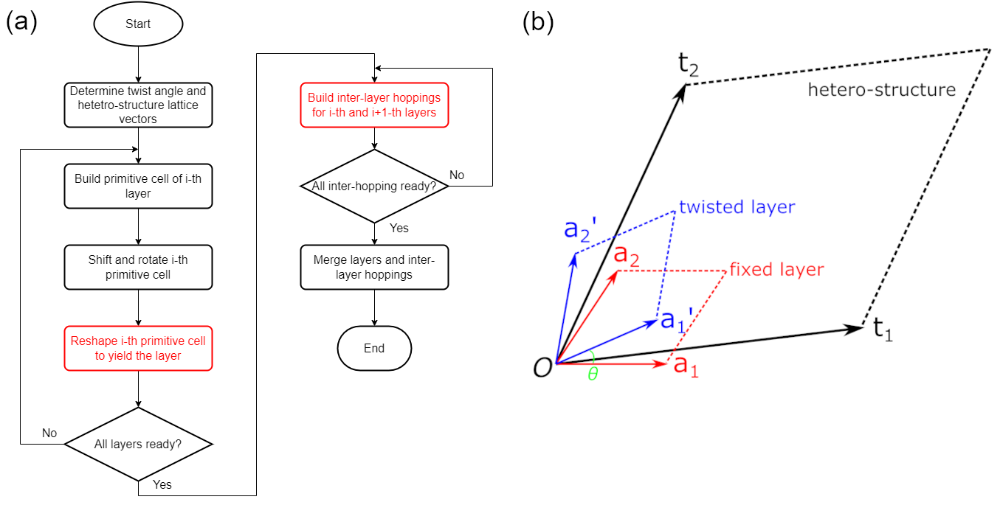
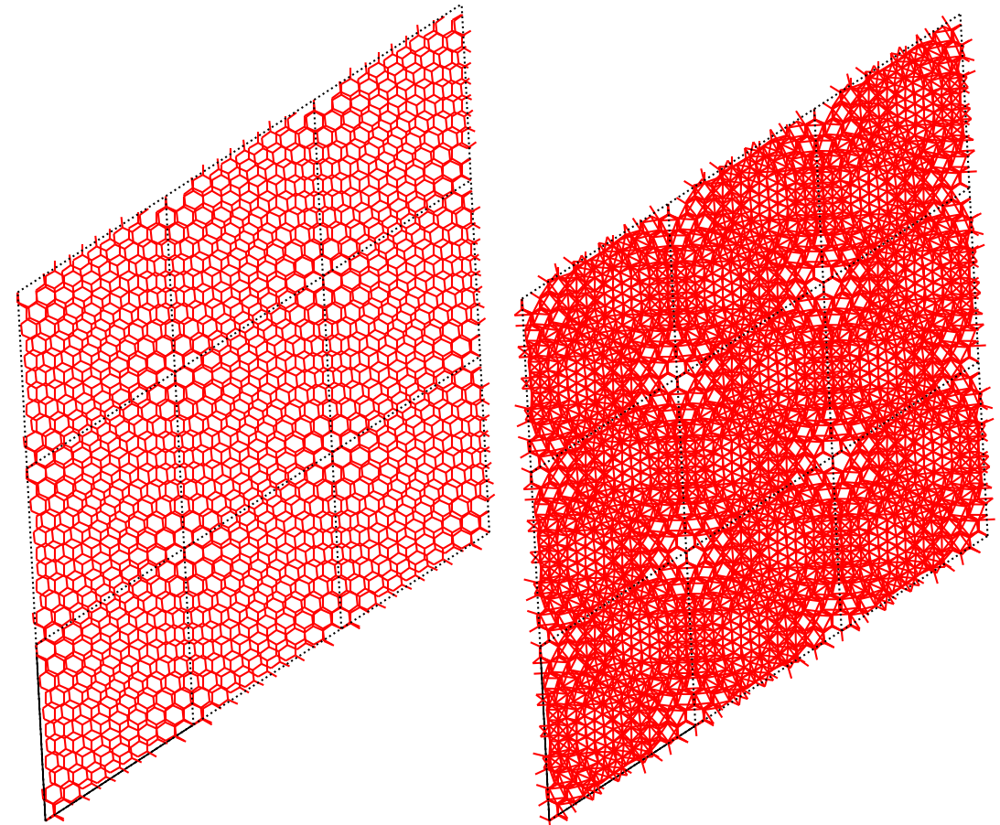

.. _hetero_model:

Build hetero-structure
======================

In this tutorial we show how to construct a hetero-structure using twisted bilayer graphene as the
example. The packages required by this tutorial can be imported by:

.. code-block:: python

    import math
    import numpy as np
    from scipy.spatial import KDTree
    import tbplas as tb

Overview of workflow
--------------------

Setting up a hetero-structure is not an easy task. And there are many possible approaches. Our
approach is demonstrated in panel (a) of the figure below. To begin with, we need to know the
commensurate rotation angle :math:`\theta` and the coordinates of lattice vectors of the
hetero-structure, typically from the literature. Then we build the primitive cell of the 1st layer,
which we may call *fixed layer* since it is neither rotated or shifted along :math:`c`-axis. Next,
we reshape the primitive cell to the lattice vectors of the hetero-structure to yield one layer,
as shown in panel (b) of the figure. Following the same approach, we can build the 2nd layer, which
we call *twisted layer* since it is rotated by :math:`\theta` and shifted before being reshaped. By
repeating these operations, we can prepare all the layers within the hetero-structure. Then we build
inter-layer hopping terms. Finally, we merge all the layers and inter-layer hopping terms and get the
hetero-structure. Of all the oprations, reshaping the primitive cell and building inter-layer hopping
terms are the most difficult. We will depict them in more details then.

    (a) Workflow of constructing a hetero-structure and (b) relation of lattice vectors of fixed
    (:math:`a_1`, :math:`a_2`) and twisted (:math:`a_1\prime`, :math:`a_2\prime`) primitive cells
    and the hetero-structure (:math:`t_1`, :math:`t_2`), as well as the rotation angle :math:`\theta`.

Rotation angle and lattice vectors
----------------------------------

We follow the formulation in
`Phys. Rev. Lett. 99, 256802 <https://journals.aps.org/prl/abstract/10.1103/PhysRevLett.99.256802>`_,
where the rotation angle is defined as
:math:`\cos(\theta_i) = \frac{3i^2+3i+1/2}{3i^2+3i+1}, i = 0, 1, 2 ...`
and lattice vectors take the following form:

* :math:`t_1 = i a_1 + (i+1) a_2`
* :math:`t_2 = -(i+1) a_1 + (2i+1) a_2`

So we define the following functions for evaluating the angle and lattice vectors:

.. code-block:: python

    def calc_twist_angle(i):
        """
        Calculate twisting angle.

        :param int i: parameter controlling the twisting angle
        :return: twisting angle in RADIANs, NOT degrees
        :rtype: float
        """
        cos_ang = (3 * i ** 2 + 3 * i + 0.5) / (3 * i ** 2 + 3 * i + 1)
        return math.acos(cos_ang)

    def calc_hetero_lattice(i, prim_cell_fixed: tb.PrimitiveCell):
        """
        Calculate Cartesian coordinates of lattice vectors of hetero-structure.

        :param int i: parameter controlling the twisting angle
        :param PrimitiveCell prim_cell_fixed: primitive cell of fixed layer
        :return: Cartesian coordinates of hetero-structure lattice vectors in NANOMETER
        :rtype: numpy float64 array with shape of (3, 3)
        """
        hetero_lattice = np.array([[i, i + 1, 0],
                                [-(i + 1), 2 * i + 1, 0],
                                [0, 0, 1]])
        hetero_lattice = tb.frac2cart(prim_cell_fixed.lat_vec, hetero_lattice)
        return hetero_lattice

Assuming that :math:`i=5`, the rotation angle and lattice vectors are thus:

.. code-block:: python

    i = 5
    angle = calc_twist_angle(i)

Prepare layers
--------------

To build a twist bilayer graphene we build the twisted primitive cells for each layer first. The
*fixed* cell which is fixed at z=0 and not rotated can be imported from the material repository
directly:

.. code-block:: python

    prim_cell_fixed = tb.make_graphene_diamond()

On the contrary, the *twisted* cell must be rotated counter-clockwise by the twisting angle and
shifted towards +z by 0.3349 nanometers, which can be one by calling the function :func:`.spiral_prim_cell`:

.. code-block:: python

    prim_cell_twisted = tb.make_graphene_diamond()
    tb.spiral_prim_cell(prim_cell_twisted, angle=angle, shift=0.3349)

The Cartesian coordinates of lattice vectors of hetero-structure can be evaluated as:

.. code-block:: python

    hetero_lattice = calc_hetero_lattice(i, prim_cell_fixed)

With all the primitive cells and lattice vectors ready, we build the *fixed* and *twisted* layers
by reshaping corresponding cells to the lattice vectors of hetero-structure. We offer a function
:func:`.make_hetero_layer` for simplifying this task, which calls :func:`.reshape_prim_cell` itself:

.. code-block:: python

    layer_fixed = tb.make_hetero_layer(prim_cell_fixed, hetero_lattice)
    layer_twisted = tb.make_hetero_layer(prim_cell_twisted, hetero_lattice)

Now all layers have been sucessfully prepared. We can have a look at them by merging them into a
large primitive cell by calling the :func:`.merge_prim_cell` function:

.. code-block:: python

    merged_cell = tb.merge_prim_cell(layer_fixed, layer_twisted)

and make a sample from the merge cell:

.. code-block:: python

    sample = tb.Sample(tb.SuperCell(merged_cell, dim=(3, 3, 1),
                                    pbc=(True, True, False)))
    sample.plot(with_orbitals=False, hop_as_arrows=False)

The output is shown in the left panel of the figure, from which we can see the periodic Moire pattern:

    Twisted bilayer graphene without (left) and with (right) inter-layer hopping terms.

Add inter-layer hoppings
------------------------

.. _inter_hop:

Now we come to the most difficult part: adding inter-layer hopping terms. This task is strongly
system-dependent and the example we show here is just for demonstration purpose. Since the hopping
terms are position-dependent, we need to get the Cartesian coordiantes of orbials of each layer
first:

.. code-block:: python

    layer_fixed.sync_array()
    pos_fixed = layer_fixed.orb_pos_nm
    layer_twisted.sync_array()
    pos_twisted = layer_twisted.orb_pos_nm

Then we loop over neighbouring cells to collect inter-layer hopping terms. We only need to take the
hopping terms from :math:`(0, 0, 0)` cell of *fixed* layer to any cell of *twisted* layer. The
conjugate terms are handled automatically. The hopping terms are stored in an instance of
:class:`.PCInterHopping` class. We utilize ``KDTree`` from ``scipy`` to detect interlayer neighbours
up to the cutoff distance of 0.75 nm. The hopping terms are determined via Slater-Koster relation,
according to Phys. Rev. B 86, 125413 (2012). We define the following function:

.. code-block:: python

    def calc_hop(rij: np.ndarray):
        """
        Calculate hopping parameter according to Slater-Koster relation.
        See Phys. Rev. B 86, 125413 (2012) for the formulae.

        :param rij: (3,) array
            dispacement vector between two orbitals in NM
        :return: hop: float
            hopping parameter
        """
        a0 = 0.1418
        a1 = 0.3349
        r_c = 0.6140
        l_c = 0.0265
        gamma0 = 2.7
        gamma1 = 0.48
        decay_coeff = 22.18
        q_pi = decay_coeff * a0
        q_sigma = decay_coeff * a1
        dr = norm(rij).item()
        n = rij.item(2) / dr
        V_pppi = - gamma0 * math.exp(q_pi * (1 - dr / a0))
        V_ppsigma = gamma1 * math.exp(q_sigma * (1 - dr / a1))
        fc = 1 / (1 + math.exp((dr - r_c) / l_c))
        hop = (n**2 * V_ppsigma + (1 - n**2) * V_pppi) * fc
        return hop

and add the hopping terms by:

.. code-block:: python

    inter_hop = tb.PCInterHopping(layer_fixed, layer_twisted)
    tree_fixed = cKDTree(pos_fixed)
    for ia in range(-1, 2):
        for ib in range(-1, 2):
            rn = (ia, ib, 0)
            # Get Cartesian coordinates of orbitals Rn cell of twisted layer
            pos_rn = pos_twisted + np.matmul(rn, layer_twisted.lat_vec)

            # Get the distance matrix between fixed and twisted layers
            tree_rn = cKDTree(pos_rn)
            dist_matrix = tree_fixed.sparse_distance_matrix(tree_rn,
                                                            max_distance=0.40)

            # Add terms to inter_hop
            for index in dist_matrix.keys():
                rij = pos_rn[index[1]] - pos_fixed[index[0]]
                inter_hop.add_hopping(rn, index[0], index[1], calc_hop(rij))

Finally, we can merge all layers and inter-layer hopping terms to produce a hetero-structure:

.. code-block:: python

    merged_cell = tb.merge_prim_cell(layer_fixed, layer_twisted, inter_hop)
    sample = tb.Sample(tb.SuperCell(merged_cell, dim=(3, 3, 1),
                                    pbc=(True, True, False)))
    sample.plot(with_orbitals=False, hop_as_arrows=False)

The output is shown in the right panel of the figure.

Extend intra-hopping terms
--------------------------

The primitive cells from which we build the fixed and twisted layers are in the nearest-neighbours
approximation, i.e. hopping terms are cutoff up to the length of C-C bond, 0.1418 nm. However, the
inter-layer hopping terms have a cutoff distance of 0.40 nm. This will bring inconsistence into the
model. So, we need to extend the intra-hopping terms in the fixed and twisted layers. We fine such
function as:

.. code-block:: python

    def extend_intra_hop(layer: tb.PrimitiveCell, max_distance):
        """
        Extend the hopping terms within given layer to cutoff distance.

        :param layer: tb.PrimitiveCell
            layer to extend
        :param max_distance: cutoff distance in NM
        :return: None. Incoming layer is modified
        """
        layer.sync_array()
        pos_r0 = layer.orb_pos_nm
        tree_r0 = KDTree(pos_r0)
        neighbors = [(ia, ib, 0) for ia in range(-1, 2) for ib in range(-1, 2)]
        for rn in neighbors:
            pos_rn = pos_r0 + np.matmul(rn, layer.lat_vec)
            tree_rn = KDTree(pos_rn)
            dist_matrix = tree_r0.sparse_distance_matrix(tree_rn,
                                                         max_distance=max_distance)
            for index, distance in dist_matrix.items():
                if distance > 0.0:
                    rij = pos_rn[index[1]] - pos_r0[index[0]]
                    layer.add_hopping(rn, index[0], index[1], calc_hop(rij))

which is much similar to the code for adding inter-layer hopping terms. We call it after making each
layer:

.. code-block:: python

    layer_fixed = tb.make_hetero_layer(prim_cell_fixed, hetero_lattice)
    extend_intra_hop(layer_fixed, max_distance=0.40)
    layer_twisted = tb.make_hetero_layer(prim_cell_twisted, hetero_lattice)
    extend_intra_hop(layer_twisted, max_distance=0.40)

Other parts of :ref:`inter_hop` does change. The resulting hetero-structure has too many hopping terms
and will not shown here.
