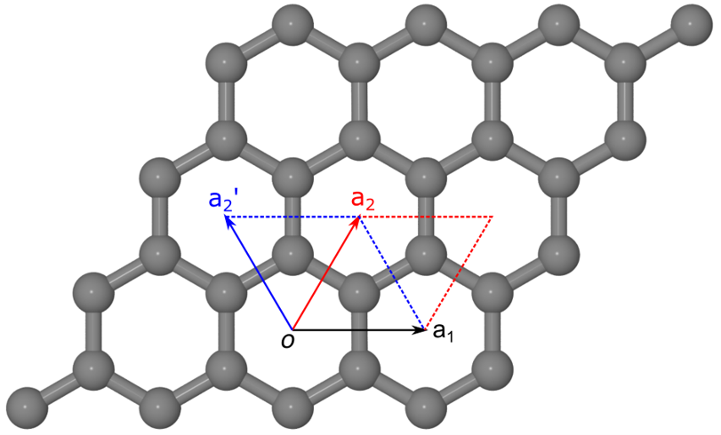
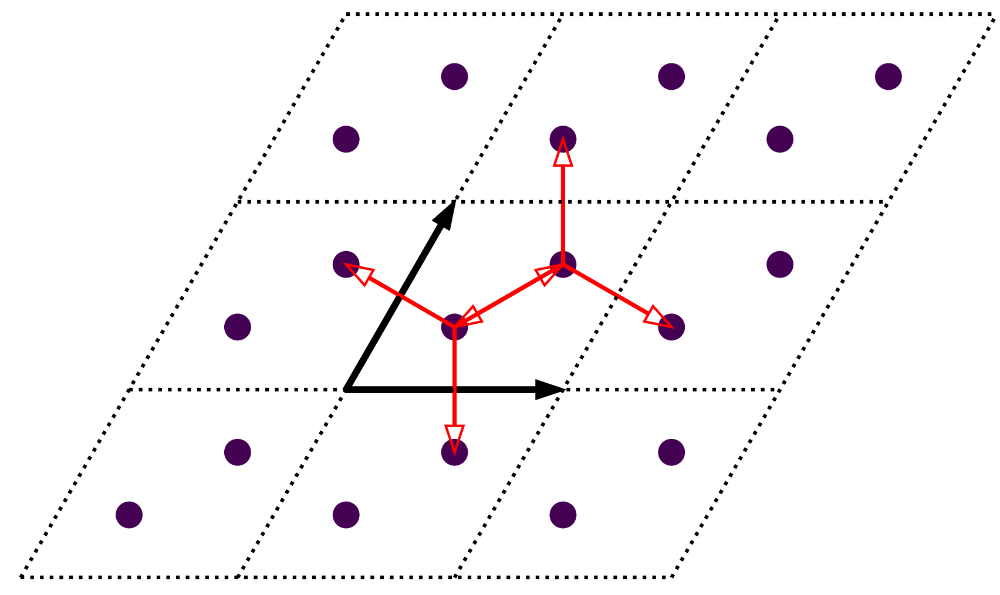
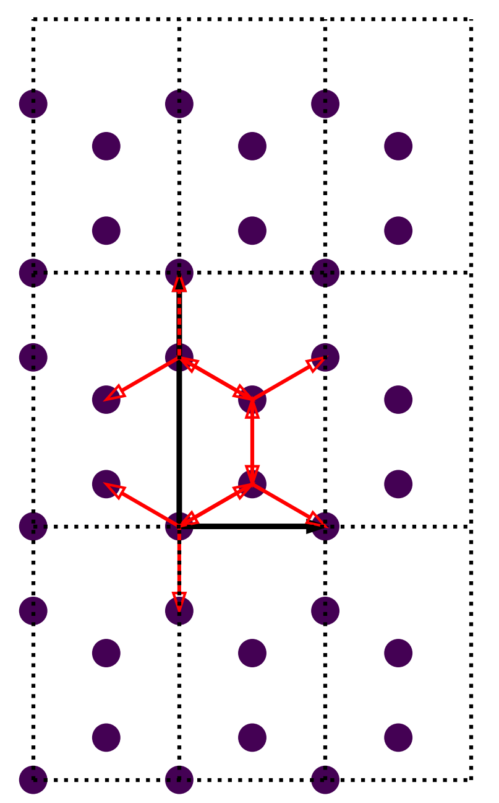

Setting up primitive cell
=========================

In this tutorial we show how to set up a primitive cell from the :class:`.PrimitiveCell` class taking
monolayer graphene as the example. We will discuss the geometric properties of graphene first, then
set up the model step-by-step.

Geometric properties
--------------------

Monolayer graphene has a hexagonal lattice, with lattice paprameters :math:`a=b=2.46 \overset{\circ}{\mathrm {A}}`
and :math:`\alpha=\beta=90^\circ`. The angle between lattice vectors :math:`a_1` and :math:`a_2`, namely :math:`\gamma`,
can be either :math:`60^\circ` or :math:`120^\circ`, depending on the choice of lattice vectors, as shown in the figure:

    Crystalline structure of monolayer graphene. Grey spheres indicate the carbon atoms. :math:`(a_1, a_2)` and
    :math:`(a_1, a_2\prime)` are two equivalent sets of lattice vectors, with the angle :math:`\gamma` being either
    :math:`60^\circ` or :math:`120^\circ`. The corresponding primitive cells are indicated with red and blue diamonds,
    respectively.

Each primitive cell of monolayer graphene has two carbon atoms located at
 
* :math:`\tau_1 = \frac{1}{3}a_1 + \frac{1}{3}a_2`
* :math:`\tau_2 = \frac{2}{3}a_1 + \frac{2}{3}a_2`

if :math:`\gamma=60^\circ` and

* :math:`\tau_1 = \frac{2}{3}a_1 + \frac{1}{3}a_2`
* :math:`\tau_2 = \frac{1}{3}a_1 + \frac{2}{3}a_2`

if :math:`\gamma=120^\circ`. We call the coordinates of :math:`(\frac{1}{3}, \frac{1}{3}) (\frac{2}{3}, \frac{2}{3})`
and :math:`(\frac{2}{3}, \frac{1}{3}) (\frac{1}{3}, \frac{2}{3})` as `fractional` coordinates. If you are familiar with
density functional theory programs, e.g. ``VASP`` and ``Quantum ESPRESSO``, you will immediately see that they are the `direct`
or `crystal` coordinates. The advantage of fractional coordinates is that they are compact and independent of the orientation
of lattice vectors. The :class:`.PrimitiveCell` class of ``TBPLaS`` uses fractional coordinates internally, jet there are 
utilities to convert them from/to Cartesian coordinates.

Create empty cell
-----------------

First of all, we need to import all necessary packages:

.. code-block:: python

    import math
    import numpy as np
    import tbplas as tb

To create an empty primitive cell we need the coordinates of lattice vectors. We choose :math:`\gamma=60^\circ`.
Since all cells are implemented as 3-dimensional within ``TBPLaS``, we need to specify an arbitrary lattice constant `c`,
which is taken as :math:`10\overset{\circ}{\mathrm {A}}`. The lattice vectors can be generated by:

.. code-block:: python

    vectors = tb.gen_lattice_vectors(a=2.46, b=2.46, c=10.0, gamma=60)

or alternatively, you can input the coordinates manually:

.. code-block:: python

    a = 2.46
    c = 10.0
    a_half = a * 0.5
    sqrt3 = math.sqrt(3)

    vectors = np.array([
        [a, 0, 0,],
        [a_half, sqrt3*a_half, 0],
        [0, 0, c]
    ])

Note that the orientation of the lattice vectors is quite arbitrary, and we have :math:`a_1` parallel to :math:`x`-axis just for
convenience. We can also make :math:`a_1` and :math:`a_2` to be symmetric about :math:`x`-axis.

.. code-block:: python

    vectors = np.array([
        [sqrt3*a_half, -a_half, 0],
        [sqrt3*a_half, a_half, 0],
        [0, 0, c]
    ])

or symmetric about :math:`y`-axis:

.. code-block:: python

    vectors = np.array([
        [a_half, sqrt3*a_half, 0],
        [-a_half, sqrt3*a_half, 0],
        [0, 0, c]
    ])

When the lattice vectors are ready, we can create an empty primitive cell by:

.. code-block:: python

    cell = tb.PrimitiveCell(vectors)

Add orbitals
------------

Since we choose :math:`\gamma=60^\circ`, the two carbon atoms are then located :math:`(\frac{1}{3}, \frac{1}{3})`
and :math:`(\frac{2}{3}, \frac{2}{3})`. In the simplest 2-band model of graphene, each carbon atom carries 1 :math:`p_z`
orbital. We can add the orbitals by:,

.. code-block:: python

    cell.add_orbital([1./3, 1./3], energy=0.0, label="pz")
    cell.add_orbital([2./3, 2./3], energy=0.0, label="pz")

The fractional coordinate along c-axis is assumed to 0 is not given. We can also make the orbitals to be located at
:math:`z=0.5\times10\overset{\circ}{\mathrm {A}} = 5\overset{\circ}{\mathrm {A}}` with:

.. code-block:: python

    cell.add_orbital([1./3, 1./3, 0.5], energy=0.0, label="pz")
    cell.add_orbital([2./3, 2./3, 0.5], energy=0.0, label="pz")

The parameter ``energy`` gives the on-site energy of the orbital, which is assumed to be 0 eV if not given. In absence
of strain or external fields the two orbitals have the same on-site energy. The parameter ``label`` is a tag to label
the orbital.

In addition to fractional coordinates, the orbitals can also be added using Cartesian coordiantes with

.. code-block:: python

    # NOTE: a_1 should be parallel to x-axis
    cell.add_orbital_cart([1.23, 0.71014083], unit=tb.ANG, energy=0.0, label="pz")
    cell.add_orbital_cart([2.46, 1.42028166], unit=tb.ANG, energy=0.0, label="pz")

Here we use the parameter ``unit`` to specify the unit of the Cartesian coordinates. Note that :class:`.PrimitiveCell`
class always uses fractional coordinates internally.

Add hopping terms
-----------------

With the orbitals ready, we can add the hopping terms. The hopping terms for primitive cell with :math:`\gamma=60^\circ`
is shown in the figure below:

.. figure:: images/prim_cell/graph_hop.png
    :align: center

    Schematic plot of hopping terms of graphene. Primitive cells are indicated with dashed diamonds and numbered in blue
    text. Thick black arrows indicate the lattice vectors. Orbitals and hopping terms are shown as filled circles and red
    arrows, respectively.

From the figure we can see there are 6 hopping terms between :math:`(0, 0)` and neighbouring cells in the nearest
approximation:

* :math:`(0, 0) \rightarrow (0, 0), i=0, j=1`
* :math:`(0, 0) \rightarrow (0, 0), i=1, j=0`
* :math:`(0, 0) \rightarrow (1, 0), i=1, j=0`
* :math:`(0, 0) \rightarrow (-1, 0), i=0, j=1`
* :math:`(0, 0) \rightarrow (0, 1), i=1, j=0`
* :math:`(0, 0) \rightarrow (0, -1), i=0, j=1`
  
Using the conjugate relation :math:`\langle i, 0 | \hat{H} | j, R\rangle = \langle j, 0 | \hat{H} | i, -R\rangle^*`
they can be reduced to:

* :math:`(0, 0) \rightarrow (0, 0), i=0, j=1`
* :math:`(0, 0) \rightarrow (1, 0), i=1, j=0`
* :math:`(0, 0) \rightarrow (0, 1), i=1, j=0`

``TBPLaS`` utilities the conjugate relation, so we need only to provide the reduced hopping terms. We do this by:

.. code-block:: python

    cell.add_hopping(rn=[0, 0], orb_i=0, orb_j=1, energy=-2.7)
    cell.add_hopping(rn=[1, 0], orb_i=1, orb_j=0, energy=-2.7)
    cell.add_hopping(rn=[0, 1], orb_i=1, orb_j=0, energy=-2.7)

The parameter ``rn`` specifies the index of neighbouring cell, while ``orb_i`` and ``orb_j`` give the indices of orbitals
of the hopping term. ``energy`` is the hopping integral, which should be a complex number in general cases. The 3rd
component of ``rn`` is assumed to be 0 if not provided. We can also specify it explicitly as:

.. code-block:: python

    cell.add_hopping(rn=[0, 0, 0], orb_i=0, orb_j=1, energy=-2.7)
    cell.add_hopping(rn=[1, 0, 0], orb_i=1, orb_j=0, energy=-2.7)
    cell.add_hopping(rn=[0, 1, 0], orb_i=1, orb_j=0, energy=-2.7)

Since monolayer graphene is two-dimensional, the 3rd component of ``rn`` is of cource 0. In general cases it should
be non-zero.

Dump the model
--------------

Now we have successfully created the model. We can have a look at it by calling the ``plot`` method:

and print the orbitals and hopping terms by calling the ``print`` method. The output should look like:

.. code-block:: text

    Orbitals:
        0.33333   0.33333   0.00000 0.0
        0.66667   0.66667   0.00000 0.0
    Hopping terms:
        (0, 0, 0, 0, 1) -2.7
        (1, 0, 0, 1, 0) -2.7
        (0, 1, 0, 1, 0) -2.7

Exercise
--------

Try to make the rectangular cell or monolayer graphene:

