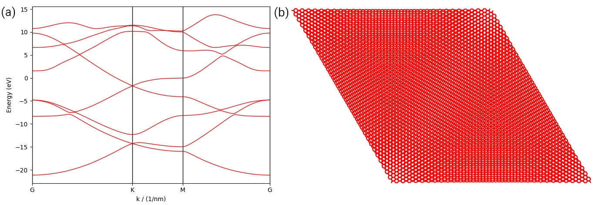

.. _interfaces:

Interfaces
==========

In this tutorial, we shown how to use the interfaces to build the primitive cell from the output of
Wannier90 and LAMMPS. The scripts can be found at ``examples/interface``. We begin with importing
the necessary packages:

.. code-block:: python

    import numpy as np
    import matplotlib.pyplot as plt
    from scipy.spatial import KDTree
    from ase import io

    import tbplas as tb

For LAMMPS, we need the ``ase`` library to read in the structure, and the ``KDTree`` class from the
``scipy`` library to search and add hopping terms. So they must be installed before starting this
tutorial. For Wannier90, no other libraries are required.

Wannier90
---------

The :func:`.wan2pc` function can read in the output of Wannier90, namely ``seedname_centres.xyz``,
``seedname_hr.dat``, ``seedname.win`` and ``seedname_wsvec.dat``, where ``seedname`` is the shared
prefix of the files, ``centres.xyz`` contains the positions of the Wannier functions, ``hr.dat``
contains the on-site energies and hopping terms, ``win`` is the input file of Wannier90, and
``wsvec.dat`` contains information the Wigner-Seitz cell. Only the ``seedname`` is required as input.
We demonstrate the usage of this function by constructing the 8-orbital primitive cell of graphene
and evaluating its band structure:

.. code-block:: python
    :linenos:

    cell = tb.wan2pc("graphene")
    k_points = np.array([
        [0.0, 0.0, 0.0],
        [1./3, 1./3, 0.0],
        [1./2, 0.0, 0.0],
        [0.0, 0.0, 0.0],
    ])
    k_label = ["G", "K", "M", "G"]
    k_path, k_idx = tb.gen_kpath(k_points, [40, 40, 40])
    k_len, bands = cell.calc_bands(k_path)

    num_bands = bands.shape[1]
    for i in range(num_bands):
        plt.plot(k_len, bands[:, i], color="r", linewidth=1.0)
    for idx in k_idx:
        plt.axvline(k_len[idx], color="k", linewidth=1.0)
    plt.xlim((0, np.amax(k_len)))
    plt.xticks(k_len[k_idx], k_label)
    plt.xlabel("k / (1/nm)")
    plt.ylabel("Energy (eV)")
    plt.tight_layout()
    plt.show()

The output is shown in the left panel, where the Dirac cone at :math:`\mathbf{K}`-point is
perfectly reproduced.

    (a) Band structure of monolayer graphene imported from the output of Wannier90. (b) Plot of
    a large bilayer graphene primitive cell imported from the output of LAMMPS. 

LAMMPS
------

Unlike Wannier90, the output of LAMMPS contains only the atomic positions. So we must add the
orbitals and hopping terms manually. We show this by constructing a large bilayer graphene
primitive cell:

.. code-block:: python
    :linenos:

    # Read the last image of lammps dump
    atoms = io.read("struct.atom", format="lammps-dump-text", index=-1)

    # Get cell lattice vectors in Angstroms
    lattice_vectors = atoms.cell

    # Create the cell
    prim_cell = tb.PrimitiveCell(lat_vec=atoms.cell, unit=tb.ANG)

    # Add orbitals
    for atom in atoms:
        prim_cell.add_orbital(atom.scaled_position)

    # Get Cartesian Coordinates of all orbitals
    orb_pos_ang = prim_cell.orb_pos_ang

    # Detect nearest neighbours using KDTree
    kd_tree = KDTree(orb_pos_ang)
    pairs = kd_tree.query_pairs(r=1.45)

    # Add hopping terms
    for pair in pairs:
        prim_cell.add_hopping((0, 0, 0), pair[0], pair[1], energy=-2.7)

    # Plot the cell
    prim_cell.plot(with_cells=False, with_orbitals=False, hop_as_arrows=False)

In line 2 we read in the structure with the ``read`` function of ``ase.io`` module. Then we extract
the lattice vectors from the ``cell`` attribute of ase ``Atoms`` class and create the primitive cell
in line 5-8. After that, we loop over the atoms in the structure and add one :math:`p_z` orbital for
each atom. The fractional coordinate of the orbital can be extracted from the ``scaled_position``
attribute of ase ``Atom`` class. Then we get the Cartesian coordinates of the orbitals from the
``orb_pos_ang`` attribute and create a ``kd_tree`` from the ``KDTree`` class. The orbital pairs with
hopping distances of 1.45 :math:`\overset{\circ}{\mathrm {A}}` (length of C-C bond) are obtained
with the ``query_pairs`` method. Then we add the hopping terms according to the orbital pairs and
plot the cell. Note that for simplicity, we consider only the hopping terms within the (0, 0, 0)-th
primitive cell. The output is shown in the right panel of the figure.
