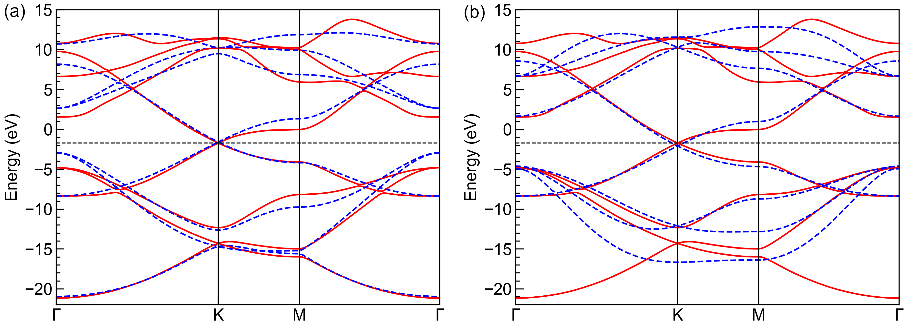

Parameters fitting
==================

In this tutorial, we show how to fit the on-site energies and hopping terms by reducing the 8-band
graphene primitive cell imported from the output of Wannier90 in :ref:`interfaces`. We achieve this
by truncating the hopping terms to the second nearest neighbor, and refitting the on-site energies
and Slater-Koster parameters to minimize the residual between the reference and fitted band data,
i.e.

.. math::

    \min_{\mathbf{x}} \sum_{i,\mathbf{k}}\omega_i\left|\bar{E}_{i,\mathbf{k}} - E_{i,\mathbf{k}}(\mathbf{x})\right|^2

where :math:`\mathbf{x}` are the fitting parameters, :math:`\omega` are the fitting weights,
:math:`\bar{E}` and :math:`E` are the reference and fitted band data from the original and reduced
cells, :math:`i` and :math:`\mathbf{k}`` are band and :math:`\mathbf{k}`-point indices,
respectively. The corresponding script can be found at ``examples/interface/wannier90/graphene/fit.py``.
We begin with importing the necessary packages:

.. code-block:: python

    import numpy as np
    import matplotlib.pyplot as plt

    import tbplas as tb

Auxialiary functions and classes
--------------------------------

We define the following functions to build the primitive cell from the Slater-Koster paramaters.
Most of them are similar to the functions in :ref:`sk`:

.. code-block:: python
    :linenos:

    def calc_hop(sk: tb.SK, rij: np.ndarray, distance: float,
                 label_i: str, label_j: str, sk_params: np.ndarray) -> complex:
        """
        Calculate hopping integral based on Slater-Koster formulation.

        :param sk: SK instance
        :param rij: displacement vector from orbital i to j in nm
        :param distance: norm of rij
        :param label_i: label of orbital i
        :param label_j: label of orbital j
        :param sk_params: array containing SK parameters
        :return: hopping integral in eV
        """
        # 1st and 2nd hopping distances in nm
        d1 = 0.1419170044439990
        d2 = 0.2458074906840380
        if abs(distance - d1) < 1.0e-5:
            v_sss, v_sps, v_pps, v_ppp = sk_params[2:6]
        elif abs(distance - d2) < 1.0e-5:
            v_sss, v_sps, v_pps, v_ppp = sk_params[6:10]
        else:
            raise ValueError(f"Too large distance {distance}")
        return sk.eval(r=rij, label_i=label_i, label_j=label_j,
                       v_sss=v_sss, v_sps=v_sps,
                       v_pps=v_pps, v_ppp=v_ppp)

    def make_cell(sk_params: np.ndarray) -> tb.PrimitiveCell:
        """
        Make primitive cell from Slater-Koster parameters.

        :param sk_params: (10,) float64 array containing Slater-Koster parameters
        :return: created primitive cell
        """
        # Lattice constants and orbital info.
        lat_vec = np.array([
            [2.458075766398899, 0.000000000000000, 0.000000000000000],
            [-1.229037883199450, 2.128755065595607, 0.000000000000000],
            [0.000000000000000, 0.000000000000000, 15.000014072326660],
        ])
        orb_pos = np.array([
            [0.000000000, 0.000000000, 0.000000000],
            [0.666666667, 0.333333333, 0.000000000],
        ])
        orb_label = ("s", "px", "py", "pz")

        # Create the cell and add orbitals
        e_s, e_p = sk_params[0], sk_params[1]
        cell = tb.PrimitiveCell(lat_vec, unit=tb.ANG)
        for pos in orb_pos:
            for label in orb_label:
                if label == "s":
                    cell.add_orbital(pos, energy=e_s, label=label)
                else:
                    cell.add_orbital(pos, energy=e_p, label=label)

        # Add Hopping terms
        neighbors = tb.find_neighbors(cell, a_max=5, b_max=5,
                                      max_distance=0.25)
        sk = tb.SK()
        for term in neighbors:
            i, j = term.pair
            label_i = cell.get_orbital(i).label
            label_j = cell.get_orbital(j).label
            hop = calc_hop(sk, term.rij, term.distance, label_i, label_j,
                           sk_params)
            cell.add_hopping(term.rn, i, j, hop)
        return cell

The fitting tool :class:`.ParamFit` is an abstract class. The users should derive their own fitting
class from it, and implement the ``calc_bands_ref`` and ``calc_bands_fit`` methods, which return
the reference and fitted band data, respectively. We define a ``MyFit`` class as

.. code-block:: python
    :linenos:

    class MyFit(tb.ParamFit):
        def calc_bands_ref(self) -> np.ndarray:
            """
            Get reference band data for fitting.

            :return: band structure on self._k_points
            """
            cell = tb.wan2pc("graphene")
            k_len, bands = cell.calc_bands(self._k_points)
            return bands

        def calc_bands_fit(self, sk_params: np.ndarray) -> np.ndarray:
            """
            Get band data of the model from given parameters.

            :param sk_params: array containing SK parameters
            :return: band structure on self._k_points
            """
            cell = make_cell(sk_params)
            k_len, bands = cell.calc_bands(self._k_points, echo_details=False)
            return bands

In ``calc_bands_ref``, we import the primitive cell with the Wannier90 interface :func:`.wan2pc`,
then calculate and return the band data. The ``calc_bands_fit`` function does a similar job, with
the only difference that the primitive cell is constructed from Slater-Koster parameters with the
``make_cell`` function we have just created.

Fitting the paramaters
----------------------

The application of ``MyFit`` class is as following:

.. code-block:: python
    :linenos:

    def main():
        # Fit the sk parameters
        # Reference:
        # https://journals.aps.org/prb/abstract/10.1103/PhysRevB.82.245412
        k_points = tb.gen_kmesh((120, 120, 1))
        weights = np.array([1.0, 1.0, 1.0, 1.0, 1.0, 1.0, 1.0, 1.0])
        fit = MyFit(k_points, weights)
        sk0 = np.array([-8.370, 0.0,
                        -5.729, 5.618, 6.050, -3.070,
                        0.102, -0.171, -0.377, 0.070])
        sk1 = fit.fit(sk0)
        print("SK parameters after fitting:")
        print(sk1[:2])
        print(sk1[2:6])
        print(sk1[6:10])

        # Plot fitted band structure
        k_points = np.array([
            [0.0, 0.0, 0.0],
            [1./3, 1./3, 0.0],
            [1./2, 0.0, 0.0],
            [0.0, 0.0, 0.0],
        ])
        k_path, k_idx = tb.gen_kpath(k_points, [40, 40, 40])
        cell_ref = tb.wan2pc("graphene")
        cell_fit = make_cell(sk1)
        k_len, bands_ref = cell_ref.calc_bands(k_path)
        k_len, bands_fit = cell_fit.calc_bands(k_path)
        num_bands = bands_ref.shape[1]
        for i in range(num_bands):
            plt.plot(k_len, bands_ref[:, i], color="red", linewidth=1.0)
            plt.plot(k_len, bands_fit[:, i], color="blue", linewidth=1.0)
        plt.show()

    if __name__ == "__main__":
        main()

To create a ``MyFit`` instance, we need to specify the :math:`\mathbf{k}`-points and fitting
weights, as shown in line 5-6. For the :math:`\mathbf{k}`-points, we are going to use a
:math:`\mathbf{k}`-grid of :math:`120\times120\times1`. The length of weights should be equal to
the number of orbitals of the primitive cell, which is 8 in our case. We assume all the bands to
have the same weights, and set them to 1. Then we create the ``MyFit`` instance, define the initial
guess of parameters from the `reference <https://journals.aps.org/prb/abstract/10.1103/PhysRevB.82.245412>`_,
and get the fitted results with the ``fit`` function. The output should look like

.. code-block:: text

    SK parameters after fitting:
    [-3.63102899 -1.08477167]
    [-5.27742318  5.87219052  4.61650991 -2.75652966]
    [-0.24734558  0.17599166  0.14798703  0.16545428]

The first two numbers are the on-site energies for :math:`s` and :math:`p` orbitals, while the
following numbers are the Slater-Koster paramets :math:`V_{ss\sigma}`, :math:`V_{sp\sigma}`,
:math:`V_{pp\sigma}` and :math:`V_{pp\pi}`` at first and second nearest hopping distances,
respectively. We can also plot and compare the band structures from the reference and fitted
primitive cells, as shown the left panel of the figure. It is clear that the fitted band structure
agrees well with the reference data near the Fermi level (-1.7 eV) and at deep (-20 eV) or high
energies (10 eV). However, the derivation from reference data of intermediate bands
(-5 eV and 5 eV) is non-negligible. To improve this, we lower the weights of band 1-2 and 7-8 by

.. code-block:: python

    weights = np.array([0.1, 0.1, 1.0, 1.0, 1.0, 1.0, 0.1, 0.1])

and refitting the parameters. The results are shown in the right panel of the figure, where the
fitted and reference band structures agree well from -5 to 5 eV.

    Band structures from reference (solid red lines) and fitted (dashed blue lines) primitive cells
    with (a) equal weights for all bands and (b) lower weights for bands 1-2 and 7-8. The
    horizontal dashed black lines indicate the Fermi level.
