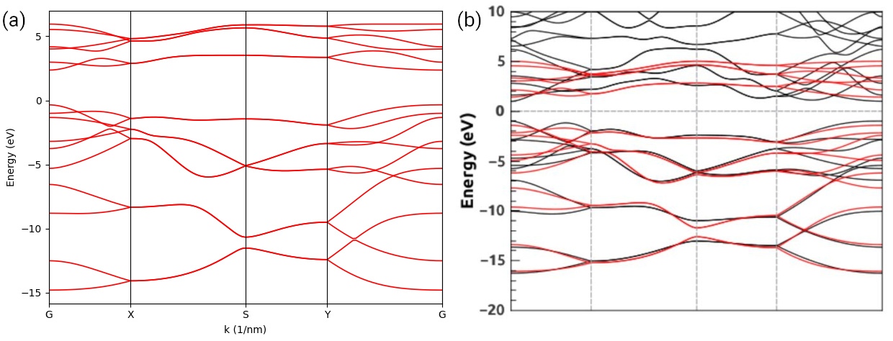

.. _sk:

Slater-Koster formulation
=========================

In this tutorial, we show how to evaluate the hopping integrals utilizing the Slater-Koster
formulation as implemented in the :class:`.SK` class taking black phosphorus as the example.
The corresponding script can be found at ``examples/prim_cell/sk_soc.py``. To begin with, we
import the necessary packages:

.. code-block:: python

    from math import exp

    import numpy as np
    from numpy.linalg import norm

    import tbplas as tb

Create cell and add orbitals
----------------------------

The primitive cell of black phosphorus without hopping terms can be created with:

.. code-block:: python
    :linenos:

    # Lattice vectors
    vectors = np.array([
        [4.623311297, 0.000000000, 0.000000000],
        [0.000000000, 3.299154095, 0.000000000],
        [0.000000000, 0.000000000, 20.478000000],
    ])

    # Orbital coordinates
    coord_p = np.array([
        [0.839001067, 0.250000000, 0.448627136],
        [0.339001577, 0.750000000, 0.551372864],
        [0.660998423, 0.250000000, 0.551372864],
        [0.160998933, 0.750000000, 0.448627136],
    ])
    orbital_coord = [row for row in coord_p for _ in range(4)]

    # Orbital labels
    orbital_label = ("s", "px", "py", "pz") * 4

    # Orbital energies
    orbital_energy = {"s": -8.80, "px": 0.0, "py": 0.0, "pz": 0.0}

    # Create primitive cell and add orbitals
    cell = tb.PrimitiveCell(lat_vec=vectors, unit=tb.ANG)
    for i, label in enumerate(orbital_label):
        coord = orbital_coord[i]
        energy = orbital_energy[label]
        cell.add_orbital(coord, energy=energy, label=label)

Here we firstly define the Cartesian coordinates of lattice vectors and orbitals in line 2-14.
The primitive cell of black phosphorus has four atoms, each carring one :math:`3s` and three
:math:`3p` states. So we need to replicate the orbital coordinates at line 15. Then we define the
orbital labels and on-site energies taking from the
`reference <https://www.sciencedirect.com/science/article/pii/S0927025617306705>`_ in line 18-21.
Note that the :class:`.SK` class will utilize the orbital labels to evaluate the hopping integral,
so they must be correctly spelled. After that, we create the primitive cell from the lattice
vectors, and add the orbitals with predefined energies and labels with a loop in line 24-28.

Find and add hopping terms
--------------------------

We then preceed to find and add the hopping terms within given cutoff distance utilizing the
Slater-Koster formulation. This is achieved by:

.. code-block:: python
    :linenos:

    # Get hopping terms in the nearest approximation
    neighbors = tb.find_neighbors(cell, a_max=2, b_max=2, max_distance=1.0)

    # Add hopping terms
    sk = tb.SK()
    for term in neighbors:
        i, j = term.pair
        label_i = cell.get_orbital(i).label
        label_j = cell.get_orbital(j).label
        hop = calc_hop_bp(sk, term.rij, label_i, label_j)
        cell.add_hopping(term.rn, i, j, hop)

Here we call the :func:`.find_neighbors` function to search for orbital pairs within 1.0 nm. The
searching range is defined by ``a_max`` and ``b_max``, i.e., :math:`[-2, 2]\otimes[-2, 2]\otimes[0, 0]`
in our case, while the cutoff distance is given by ``max_distance``. The returned value ``neighbors`` is
a list of named tuples, where the ``pair`` attribute stands for the orbital indices, ``rn`` is the cell
index, ``rij`` is the displacement vector and ``distance`` is the norm of ``rij``. Then we create an
:class:`.SK` instance, and do a loop to add the hopping terms in line 6-11. The ``calc_hop_bp`` function
for evaluating the hopping integral is defined as:

.. code-block:: python
    :linenos:

    def calc_hop_bp(sk: tb.SK, rij: np.ndarray, label_i: str,
                    label_j: str) -> complex:
        """
        Evaluate the hopping integral <i,0|H|j,r> for single layer black phosphorus.

        Reference:
        https://www.sciencedirect.com/science/article/pii/S0927025617306705

        :param sk: SK instance
        :param rij: displacement vector from orbital i to j in nm
        :param label_i: label of orbital i
        :param label_j: label of orbital j
        :return: hopping integral in eV
        """
        r = norm(rij)
        r0 = 0.2224
        v_sss = -1.59 * exp(-(r - r0) / 0.033)
        v_sps = 2.39 * exp(-(r - r0) / 0.053)
        v_pps = 4.03 * exp(-(r - r0) / 0.058)
        v_ppp = -1.14 * exp(-(r - r0) / 0.053)
        return sk.eval(r=rij, label_i=label_i, label_j=label_j,
                       v_sss=v_sss, v_sps=v_sps,
                       v_pps=v_pps, v_ppp=v_ppp)

Here we firstly evaluate the Slater-Koster parameters :math:`V_{ss\sigma}`, :math:`V_{sp\sigma}`,
:math:`V_{pp\sigma}` and :math:`V_{pp\pi}` in line 17-20. Then we call the ``eval`` method of
:class:`.SK` instance ``sk`` to get the hopping integral, taking the displacement vector ``rij``,
orbital labels ``label_i`` and ``label_j``, and the Slater-Koster parameters as the arguments.

Check the results
-----------------

We check the primitive cell we have just created by calculating its band structure:

.. code-block:: python
    :linenos:

    # Test band structure
    k_points = np.array([
        [0.0, 0.0, 0.0],
        [0.5, 0.0, 0.0],
        [0.5, 0.5, 0.0],
        [0.0, 0.5, 0.0],
        [0.0, 0.0, 0.0]
    ])
    k_label = ["G", "X", "S", "Y", "G"]
    k_path, k_idx = tb.gen_kpath(k_points, [40, 40, 40, 40])
    k_len, bands = cell.calc_bands(k_path)
    tb.Visualizer().plot_bands(k_len, bands, k_idx, k_label)

The results are shown in the left panel, consistent with the band structure in the right panel taken
from the reference.

    Band structure of black phosphorus (a) created using Slater-Koster formulation and (b) taken from the
    reference.
