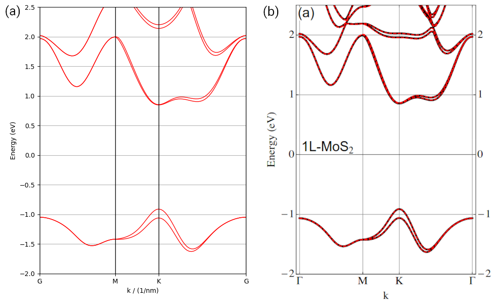

.. _soc:

Spin-orbital coupling
=====================

In this tutorial, we show how to introduce spin-orbital coupling (SOC) into the primitive cell
taking :math:`\mathrm{MoS_2}` as the example. We will consider the intra-atom SOC in the form of
:math:`H^{soc} = \lambda \mathbf{L}\cdot\mathbf{S}`. For this type of SOC, TBPLaS offers an
:class:`.SOC` class for evaluating the matrix elements of :math:`\mathbf{L}\cdot\mathbf{S}` in the
direct product basis :math:`|l\rangle\otimes|s\rangle`. We prefer this basis set because it does
not involve the evaluation of Clebsch-Gordan coefficents. The corresponding script can be found at
``examples/prim_cell/sk_soc.py``. Other types of SOC, e.g., Kane-Mele inter-atom SOC or Rashba SOC,
can be found at ``examples/prim_cell/z2/graphene.py``. In principle, all types of SOC can be
implemented with doubling the orbitals and add hopping terms between the `spin-polarized` orbitals.
We begin with importing the necessary packages:

.. code-block:: python
    
    import numpy as np
    import matplotlib.pyplot as plt

    import tbplas as tb
    import tbplas.builder.exceptions as exc

Create cell without SOC
-----------------------

Similar to the case of :ref:`sk`, we build the primitive cell without SOC as

.. code-block:: python
    :linenos:

    # Lattice vectors
    vectors = np.array([
        [3.1600000, 0.000000000, 0.000000000],
        [-1.579999, 2.736640276, 0.000000000],
        [0.000000000, 0.000000000, 3.1720000000],
    ])

    # Orbital coordinates
    coord_mo = [0.666670000, 0.333330000, 0.5]
    coord_s1 = [0.000000000, -0.000000000, 0.0]
    coord_s2 = [0.000000000, -0.000000000, 1]
    orbital_coord = [coord_mo for _ in range(5)]
    orbital_coord.extend([coord_s1 for _ in range(3)])
    orbital_coord.extend([coord_s2 for _ in range(3)])
    orbital_coord = np.array(orbital_coord)

    # Orbital labels
    mo_orbitals = ("Mo:dz2", "Mo:dzx", "Mo:dyz", "Mo:dx2-y2", "Mo:dxy")
    s1_orbitals = ("S1:px", "S1:py", "S1:pz")
    s2_orbitals = ("S2:px", "S2:py", "S2:pz")
    orbital_label = mo_orbitals + s1_orbitals + s2_orbitals

    # Orbital energies
    orbital_energy = {"dz2": -1.512, "dzx": 0.419, "dyz": 0.419,
                      "dx2-y2": -3.025, "dxy": -3.025,
                      "px": -1.276, "py": -1.276, "pz": -8.236}

    # Create the primitive cell and add orbitals
    cell = tb.PrimitiveCell(lat_vec=vectors, unit=tb.ANG)
    for i, label in enumerate(orbital_label):
        coord = orbital_coord[i]
        energy = orbital_energy[label.split(":")[1]]
        cell.add_orbital(coord, energy=energy, label=label)

    # Get hopping terms in the nearest approximation
    neighbors = tb.find_neighbors(cell, a_max=2, b_max=2, max_distance=0.32)

    # Add hopping terms
    sk = tb.SK()
    for term in neighbors:
        i, j = term.pair
        label_i = cell.get_orbital(i).label
        label_j = cell.get_orbital(j).label
        hop = calc_hop_mos2(sk, term.rij, label_i, label_j)
        cell.add_hopping(term.rn, i, j, hop)

where we also need to define the lattice vectors, orbital positions, labels and energies. The
on-site energies are taken from the
`reference <https://iopscience.iop.org/article/10.1088/2053-1583/1/3/034003/meta>`_. It should
be noted that we must add the atom label to the orbital label in line 18-20, in order to distinguish
the orbitals located on the same atom when adding SOC. Then we create the cell, add orbitals and
hopping terms in line 29-45. The ``calc_hop_mos2`` function is defined as:

.. code-block:: python
    :linenos:

    def calc_hop_mos2(sk: tb.SK, rij: np.ndarray, label_i: str,
                      label_j: str) -> complex:
        """
        Evaluate the hopping integral <i,0|H|j,r> for single layer MoS2.

        Reference:
        [1] https://www.mdpi.com/2076-3417/6/10/284
        [2] https://journals.aps.org/prb/abstract/10.1103/PhysRevB.88.075409
        [3] https://iopscience.iop.org/article/10.1088/2053-1583/1/3/034003/meta
        Note ref. 2 and ref. 3 share the same set of parameters.

        :param sk: SK instance
        :param rij: displacement vector from orbital i to j in nm
        :param label_i: label of orbital i
        :param label_j: label of orbital j
        :return: hopping integral in eV
        """
        # Parameters from ref. 3
        v_pps, v_ppp = 0.696, 0.278
        v_pds, v_pdp = -2.619, -1.396
        v_dds, v_ddp, v_ddd = -0.933, -0.478, -0.442

        lm_i = label_i.split(":")[1]
        lm_j = label_j.split(":")[1]

        return sk.eval(r=rij, label_i=lm_i, label_j=lm_j,
                       v_pps=v_pps, v_ppp=v_ppp,
                       v_pds=v_pds, v_pdp=v_pdp,
                       v_dds=v_dds, v_ddp=v_ddp, v_ddd=v_ddd)

which shares much in common with the ``calc_hop_bp`` function in :ref:`sk`.

Add SOC
-------

We fine the following function for adding SOC:

.. code-block:: python
    :linenos:

    def add_soc_mos2(cell: tb.PrimitiveCell) -> tb.PrimitiveCell:
        """
        Add spin-orbital coupling to the primitive cell.

        :param cell: primitive cell to modify
        :return: primitive cell with soc
        """
        # Double the orbitals and hopping terms
        cell = tb.merge_prim_cell(cell, cell)

        # Add spin notations to the orbitals
        num_orb_half = cell.num_orb // 2
        num_orb_total = cell.num_orb
        for i in range(num_orb_half):
            label = cell.get_orbital(i).label
            cell.set_orbital(i, label=f"{label}:up")
        for i in range(num_orb_half, num_orb_total):
            label = cell.get_orbital(i).label
            cell.set_orbital(i, label=f"{label}:down")

        # Add SOC terms
        # Parameters from ref. 3
        soc_lambda = {"Mo": 0.075, "S1": 0.052, "S2": 0.052}
        soc = tb.SOC()
        for i in range(num_orb_total):
            label_i = cell.get_orbital(i).label.split(":")
            atom_i, lm_i, spin_i = label_i

            # Since the diagonal terms of l_dot_s is exactly zero in the basis of
            # real atomic orbitals (s, px, py, pz, ...), and the conjugate terms
            # are handled automatically in PrimitiveCell class, we need to consider
            # the upper triangular terms only.
            for j in range(i+1, num_orb_total):
                label_j = cell.get_orbital(j).label.split(":")
                atom_j, lm_j, spin_j = label_j

                if atom_j == atom_i:
                    soc_intensity = soc.eval(label_i=lm_i, spin_i=spin_i,
                                             label_j=lm_j, spin_j=spin_j)
                    soc_intensity *= soc_lambda[atom_j]
                    if abs(soc_intensity) >= 1.0e-15:
                        # CAUTION: if the lower triangular terms are also included
                        # in the loop, SOC coupling terms will be double counted
                        # and the results will be wrong!
                        try:
                            energy = cell.get_hopping((0, 0, 0), i, j)
                        except exc.PCHopNotFoundError:
                            energy = 0.0
                        energy += soc_intensity
                        cell.add_hopping((0, 0, 0), i, j, soc_intensity)
        return cell
    
In this function, we firstly double the orbitals and hopping terms in the primitive cell using the
:func:`.merge_prim_cell` function in line 9, in order to yield the direct product basis
:math:`|l\rangle\otimes|s\rangle`. Then we add spin notations, namely ``up`` and ``down``, to the
orbital labels in line 12-19. After that, we define the SOC intensity :math:`\lambda` for Mo and S,
taking data from the `reference <https://iopscience.iop.org/article/10.1088/2053-1583/1/3/034003/meta>`_.
Then we create an instance from the :class:`.SOC` class, and loop over the upper-triangular orbital
paris to add SOC. Note that the SOC terms are added for orbital pairs located on the same atom by
checking their atom labels in line 37. The matrix element of :math:`\mathbf{L}\cdot\mathbf{S}` in
the direct product basis :math:`|l\rangle\otimes|s\rangle` is evaluated with the ``eval`` function
of :class:`.SOC` class in line 38-39, taking the orbital and spin notations as input. If the
corresonding hopping term already exists, then SOC will be added to it. Otherwise, a new hopping
term will be created, as shown in line 45-50. Finally, the new cell with SOC is returned.

Check the results
-----------------

We check the primitive cell we have just created by calculating its band structure:

.. code-block:: python
    :linenos:

    # Add soc
    cell = add_soc_mos2(cell)

    # Evaluate band structure
    k_points = np.array([
        [0.0, 0.0, 0.0],
        [1. / 2, 0.0, 0.0],
        [1. / 3, 1. / 3, 0.0],
        [0.0, 0.0, 0.0],
    ])
    k_label = ["G", "M", "K", "G"]
    k_path, k_idx = tb.gen_kpath(k_points, [40, 40, 40])
    k_len, bands = cell.calc_bands(k_path)

    # Plot band structure
    num_bands = bands.shape[1]
    for i in range(num_bands):
        plt.plot(k_len, bands[:, i], color="r", linewidth=1.0)
    for idx in k_idx:
        plt.axvline(k_len[idx], color='k', linewidth=1.0)
    plt.xlim((0, np.amax(k_len)))
    plt.ylim((-2, 2.5))
    plt.xticks(k_len[k_idx], k_label)
    plt.xlabel("k / (1/nm)")
    plt.ylabel("Energy (eV)")
    ax = plt.gca()
    ax.set_aspect(9)
    plt.grid()
    plt.tight_layout()
    plt.show()

The results are shown in the left panel, consistent with the band structure in the right panel taken
from the reference, where the splitting of VBM at :math:`\mathbf{K}`-point is perfectly reproduced.

    Band structure of MoS2 (a) created in this tutorial and (b) taken from the reference.
