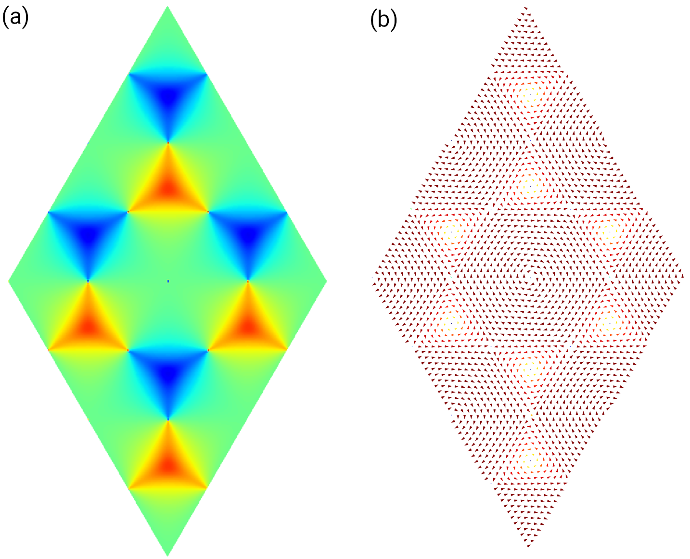

Spin texture
============

In this tutorial, we demonstrate the usage of :class:`.SpinTexture` class by calculating the spin
texture of graphene with Rashba and Kane-Mele spin-orbital coupling. The spin texture is defined
as the the expectation of Pauli operator :math:`\sigma_i`, which can be considered as a function of
band index :math:`n` and :math:`\mathbf{k}`-point

.. math::

    s_i(n, \mathbf{k}) = \langle \psi_{n,\mathbf{k}} | \sigma_i | \psi_{n,\mathbf{k}} \rangle

where :math:`i \in {x, y, z}` are components of the Pauli operator. The spin texture can be evaluated
for given band index :math:`n` or fixed energy, while in this tutorial we will focus on the former
case. The script is located at ``examples/prim_cell/spin_texture/spin_texture.py``. As in other tutorials,
we begin with importing the ``tbplas`` package:

.. code-block:: python

    import tbplas as tb

Evaluation of spin texture
--------------------------

We evaluation of spin texture in the following manner:

.. code-block:: python
    :linenos:

    # Import the model and define some parameters
    cell = tb.make_graphene_soc(is_qsh=True)
    ib = 2
    spin_major = False

    # Evaluate expectation of sigma_z
    k_grid = 2 * tb.gen_kmesh((240, 240, 1)) - 1
    spin_texture = tb.SpinTexture(cell, k_grid, spin_major)
    k_cart = spin_texture.k_cart
    sz = spin_texture.eval("z")
    vis = tb.Visualizer()
    vis.plot_scalar(x=k_cart[:, 0], y=k_cart[:, 1], z=sz[:, ib],
                    num_grid=(480, 480), cmap="jet")

    # Evaluate expectation of sigma_x and sigma_y
    k_grid = 2 * tb.gen_kmesh((48, 48, 1)) - 1
    spin_texture.k_grid = k_grid
    k_cart = spin_texture.k_cart
    sx = spin_texture.eval("x")
    sy = spin_texture.eval("y")
    vis.plot_vector(x=k_cart[:, 0], y=k_cart[:, 1], u=sx[:, ib], v=sy[:, ib],
                    cmap="jet")

In line 2 we import the graphene model with Rashba and Kane-Mele SOC with the :func:`.make_graphene_soc`
function. In line 3-4 we define the band index and whether the orbitals are sorted in spin-major order,
which will be discussed in more details in the next section. To plot the expectation of :math:`\sigma_i`
as function of :math:`\mathbf k`-point, we need to generate a uniform meshgrid in the Brillouin zone. As
the :func:`.gen_kmesh` function generates k-grid on :math:`[0, 1]`, so we need to multiply the result by
a factor of 2, then extract 1 from it such that the k-grid will be on :math:`[-1, 1]` which is enough to
cover the first Brillouin zone. Then we create a :class:`.SpinTexture` object in line 8. In line 9-10 we
get the  Cartesian coordinates of k-grid and the expectation of :math:`\sigma_z`, and visualize it in line
11-13 as colormap using the ``plot_scalar`` method. The argument ``ib`` specifies the band index :math:`n`
to plot. The result is shown in Fig. 1(a).

The evaluation of :math:`\sigma_x` and :math:`\sigma_y` is similar. In line 16-17 we assign a more sparse
k-grid to the :class:`.SpinTexture` object since we are going to plot the expectation as vector field. In
18-20 we get the Cartesian coordinates of k-grid and the expectation of :math:`\sigma_x` and :math:`\sigma_y`,
and plot them as vector field in line 21-22. The output is shown in Fig. 1(b).

    Plot of expectation of (a) :math:`\sigma_z` and (b) :math:`\sigma_x` and :math:`\sigma_y`.

Orbital order
-------------

The order of spin-polarized orbitals determines how the spin-up and spin-down components are extracted from the
eigenstates. There are two popular orders: spin-major and orbital-major. For example, there are two :math:`p_z`
orbitals in the two-band model of monolayer graphene in the spin-unpolarized case, which can be denoted as
:math:`\{\phi_1, \phi_2\}`. When spin has been taken into consideration, the orbitals become
:math:`\{\phi_1^{\uparrow}, \phi_2^{\uparrow}, \phi_1^{\downarrow}, \phi_2^{\downarrow}\}`. In spin-major order
they are sorted as :math:`[\phi_1^{\uparrow}, \phi_2^{\uparrow}, \phi_1^{\downarrow}, \phi_2^{\downarrow}]`,
while in orbital-major order they are sorted as
:math:`[\phi_1^{\uparrow}, \phi_1^{\downarrow}, \phi_2^{\uparrow}, \phi_2^{\downarrow}]`. The ``split_spin``
method of :class:`.SpinTexture` class extracts the spin-up and spin-down components as following:

.. code-block:: python
    :linenos:

    def split_spin(self, state: np.ndarray) -> Tuple[np.ndarray, np.ndarray]:
        """
        Split spin-up and spin-down components for wave function at given
        k-point and band.

        Two kinds of orbital orders are implemented:
        spin major: psi_{0+}, psi_{1+}, psi_{0-}, psi_{1-}
        orbital major: psi_{0+}, psi_{0-}, psi_{1+}, psi_{1-}

        If the orbitals are sorted in neither spin nor orbital major,
        derive a new class from SpinTexture and overwrite this method.

        :param state: (num_orb,) complex128 array
            wave function at given k-point and band
        :return: (u, d)
            u: (num_orb//2,) complex128 array
            d: (num_orb//2,) complex128 array
            spin-up and spin-down components of the wave function
        """
        num_orb = self.num_orb // 2
        if self._spin_major:
            u, d = state[:num_orb], state[num_orb:]
        else:
            u, d = state[0::2], state[1::2]
        return u, d

If the spin-polarized orbitals follow other user-defined orders, then the users should derive their
own class from :class:`.SpinTexture` and overload the ``split_spin`` method.
