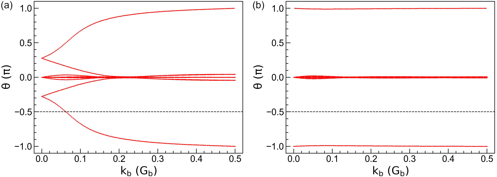

Z2 topological invariant
========================

In this tutorial, we demonstrate the usage of :class:`.Z2` class by calculating the :math:`\mathbb{Z}_2`
topological invariant of `bilayer bismuth <https://journals.aps.org/prl/abstract/10.1103/PhysRevLett.97.236805>`_.
The corresponding script is located at ``examples/prim_cell/z2/bismuth.py``. We begin with importing
the necessary packages:

.. code-block:: python

    from math import sqrt, pi

    import numpy as np
    from numpy.linalg import norm

    import tbplas as tb
    import tbplas.builder.exceptions as exc

Auxialiary functions
--------------------

We define the following functions to build bilayer bismuth with SOC:

.. code-block:: python
    :linenos:

    def calc_hop(sk: tb.SK, rij: np.ndarray, label_i: str, label_j: str) -> complex:
        """
        Evaluate the hopping integral <i,0|H|j,r>.

        References:
        [1] https://journals.aps.org/prb/abstract/10.1103/PhysRevB.84.075119
        [2] https://journals.aps.org/prb/abstract/10.1103/PhysRevB.52.1566
        [3] https://journals.aps.org/prl/abstract/10.1103/PhysRevLett.97.236805

        :param sk: SK instance
        :param rij: displacement vector from orbital i to j in nm
        :param label_i: label of orbital i
        :param label_j: label of orbital j
        :return: hopping integral in eV
        """
        # Range-dependent slater-Koster parameters from ref. 2
        dict1 = {"v_sss": -0.608, "v_sps": 1.320, "v_pps": 1.854, "v_ppp": -0.600}
        dict2 = {"v_sss": -0.384, "v_sps": 0.433, "v_pps": 1.396, "v_ppp": -0.344}
        dict3 = {"v_sss": 0.0, "v_sps": 0.0, "v_pps": 0.156, "v_ppp": 0.0}
        r_norm = norm(rij)
        if abs(r_norm - 0.30628728) < 1.0e-5:
            data = dict1
        elif abs(r_norm - 0.35116131) < 1.0e-5:
            data = dict2
        else:
            data = dict3
        lm_i = label_i.split(":")[1]
        lm_j = label_j.split(":")[1]
        return sk.eval(r=rij, label_i=lm_i, label_j=lm_j,
                       v_sss=data["v_sss"], v_sps=data["v_sps"],
                       v_pps=data["v_pps"], v_ppp=data["v_ppp"])

    def make_cell() -> tb.PrimitiveCell:
        """
        Make bilayer bismuth primitive cell without SOC.

        :return: bilayer bismuth primitive cell
        """
        # Lattice constants from ref. 2
        a = 4.5332
        c = 11.7967
        mu = 0.2341

        # Lattice vectors of bulk from ref. 2
        a1 = np.array([-0.5*a, -sqrt(3)/6*a, c/3])
        a2 = np.array([0.5*a, -sqrt(3)/6*a, c/3])
        a3 = np.array([0, sqrt(3)/3*a, c/3])

        # Lattice vectors and atomic positions of bilayer from ref. 2 & 3
        a1_2d = a2 - a1
        a2_2d = a3 - a1
        a3_2d = np.array([0, 0, c])
        lat_vec = np.array([a1_2d, a2_2d, a3_2d])
        atom_position = np.array([[0, 0, 0], [1/3, 1/3, 2*mu-1/3]])

        # Create cell and add orbitals with energies from ref. 2
        cell = tb.PrimitiveCell(lat_vec, unit=tb.ANG)
        atom_label = ("Bi1", "Bi2")
        e_s, e_p = -10.906, -0.486
        orbital_energy = {"s": e_s, "px": e_p, "py": e_p, "pz": e_p}
        for i, pos in enumerate(atom_position):
            for orbital, energy in orbital_energy.items():
                label = f"{atom_label[i]}:{orbital}"
                cell.add_orbital(pos, label=label, energy=energy)

        # Add hopping terms
        neighbors = tb.find_neighbors(cell, a_max=5, b_max=5, max_distance=0.454)
        sk = tb.SK()
        for term in neighbors:
            i, j = term.pair
            label_i = cell.get_orbital(i).label
            label_j = cell.get_orbital(j).label
            hop = calc_hop(sk, term.rij, label_i, label_j)
            cell.add_hopping(term.rn, i, j, hop)
        return cell

    def add_soc(cell: tb.PrimitiveCell) -> tb.PrimitiveCell:
        """
        Add spin-orbital coupling to the primitive cell.

        :param cell: primitive cell to modify
        :return: primitive cell with soc
        """
        # Double the orbitals and hopping terms
        cell = tb.merge_prim_cell(cell, cell)

        # Add spin notations to the orbitals
        num_orb_half = cell.num_orb // 2
        num_orb_total = cell.num_orb
        for i in range(num_orb_half):
            label = cell.get_orbital(i).label
            cell.set_orbital(i, label=f"{label}:up")
        for i in range(num_orb_half, num_orb_total):
            label = cell.get_orbital(i).label
            cell.set_orbital(i, label=f"{label}:down")

        # Add SOC terms
        soc_lambda = 1.5  # ref. 2
        soc = tb.SOC()
        for i in range(num_orb_total):
            label_i = cell.get_orbital(i).label.split(":")
            atom_i, lm_i, spin_i = label_i

            for j in range(i+1, num_orb_total):
                label_j = cell.get_orbital(j).label.split(":")
                atom_j, lm_j, spin_j = label_j

                if atom_j == atom_i:
                    soc_intensity = soc.eval(label_i=lm_i, spin_i=spin_i,
                                             label_j=lm_j, spin_j=spin_j)
                    soc_intensity *= soc_lambda
                    if abs(soc_intensity) >= 1.0e-15:
                        try:
                            energy = cell.get_hopping((0, 0, 0), i, j)
                        except exc.PCHopNotFoundError:
                            energy = 0.0
                        energy += soc_intensity
                        cell.add_hopping((0, 0, 0), i, j, soc_intensity)
        return cell

Most of them are similar to that of :ref:`sk` and :ref:`soc`.

Evaluation of Z2
----------------

With all the auxiliary functions ready, we now proceed to calculate the :math:`\mathbb{Z}_2`
invariant number of bilayer bismuth as

.. code-block:: python
    :linenos:

    def main():
        # Create cell and add soc
        cell = make_cell()
        cell = add_soc(cell)

        # Evaluate Z2
        ka_array = np.linspace(-0.5, 0.5, 200)
        kb_array = np.linspace(0.0, 0.5, 200)
        kc = 0.0
        z2 = tb.Z2(cell, num_occ=10)
        kb_array, phases = z2.calc_phases(ka_array, kb_array, kc)

        # Plot phases
        vis = tb.Visualizer()
        vis.plot_phases(kb_array, phases / pi)

    if __name__ == "__main__":
        main()

To calculate :math:`\mathbb{Z}_2`` we need to sample :math:`\mathbf{k}_a` from
:math:`-\frac{1}{2}\mathbf{G}_a` to :math:`\frac{1}{2}\mathbf{G}_a`, and
:math:`\mathbf{k}_b` from :math:`\mathbf{0}` to :math:`\frac{1}{2}\mathbf{G}_b`. Then we create
a :class:`.Z2` instance and its ``calc_phases`` function to get the topological phases
:math:`\theta_m^D`. Bilayer bismuth has two Bi atoms, each carrying two :math:`6s` and three
:math:`6p` electrons, totally 10 electrons per primitive cell. So the number of occupied bands is
thus 10, as specified by the ``num_occ`` argument. After that, we plot :math:`\theta_m^D` as the
function of :math:`\mathbf{k}_b` in the left panel of the figure. It is clear that the crossing
number of phases against the reference line is 1, indicating that bilayer bismuth is a topological
insulator. We then decrease the SOC intensity :math:`\lambda`` to 0.15 eV and re-calculate the
phases. The results are shown in the right panel of the figure, where the crossing number is 0,
indicating that bilayer bismuth becomes a normal insulator under weak SOC, similar to the case of
`bilayer Sb <https://journals.aps.org/prb/abstract/10.1103/PhysRevB.84.075119>`_.

    Topological phases :math:`\theta_m^D` of bilayer bismuth under SOC intensity of (a)
    :math:`\lambda` = 1.5 eV and (b) :math:`\lambda` = 0.15 eV. The horizontal dashed lines
    indicates the reference lines with which the crossing number is determined.