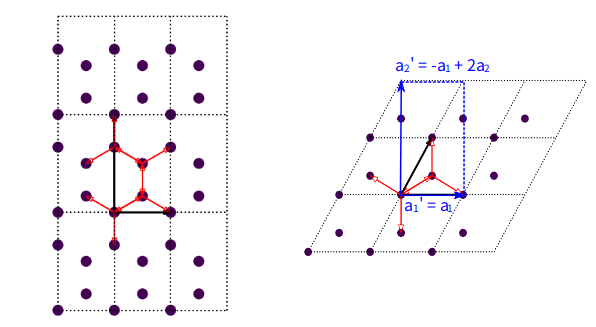
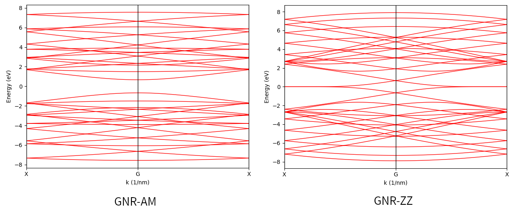
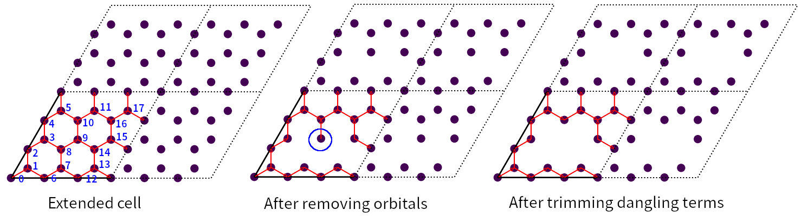
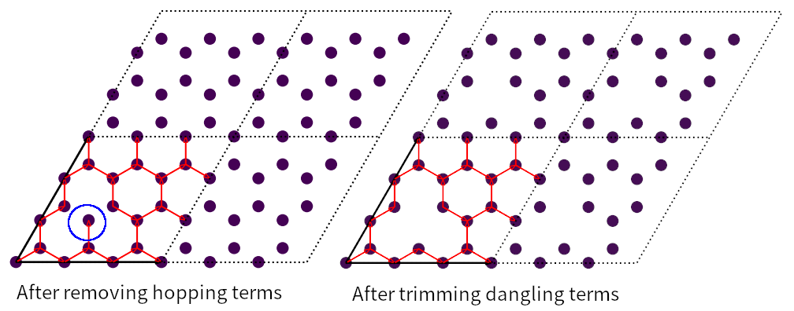

.. _complex_prim:

Build complex primitive cells
=============================

In this tutorial we demonstrate how to construct complex primitive cells using the python-based modeling
tools. As aforementioned in :ref:`workflow`, two sets of modeling tools are provied: Python-based and
Cython-based. Python-based tools are designed for models of moderate size, and all work at the primitive
cell level. Here are the summary of the Python-based tools:

* reshape_prim_cell
* extend_prim_cell
* apply_pbc
* remove_orbital
* remove_hopping
* trim_prim_cell
* spiral_prim_cell
* make_hetero_layer
* merge_prim_cell

:func:`.reshape_prim_cell` reshapes the primitive cell to new lattice vectors. :func:`.extend_prim_cell`
replicates the primitive cell along :math:`a`, :math:`b`, and :math:`c`` directions. :func:`.apply_pbc`
makes a periodic primitive cell non-periodic by removing hopping terms to neighbouring cells along given
directions. We will show the usage of these functions by constructing graphene nano-ribbon with armchair
and zigzag edges from the primitive cell.

:func:`remove_orbital` and :func:`remove_hopping` are all methods of the :class:`PrimitiveCell` class, and
remove an orbital or hopping term from the primitive cell, respectively. Dangling orbitals and hopping terms
may remain in the cell after the removal, and can be trimmed with the :func:`.trim_prim_cell` function. We
will show the usage of these functions by constructing a large graphene cell with vacancies.

:func:`.spiral_prim_cell`, :func:`.make_hetero_layer` and :func:`.merge_prim_cell` are functions specially
designed for building twisted hetero-structures. Their usage will be discussed in a separate tutorial.

.. _gnr:

Construct graphene nano-ribbon
------------------------------

.. rubric:: Make rectangular cell

To make graphene nano-ribbons we need the rectangular primitive cell. We can built it from scratch as:

.. code-block:: python

    import math
    import tbplas as tb

    # Generate lattice vectors
    sqrt3 = math.sqrt(3)
    a = 2.46
    cc_bond = sqrt3 / 3 * a
    vectors = tb.gen_lattice_vectors(sqrt3 * cc_bond, 3 * cc_bond)

    # Create cell and add orbitals
    rect_cell = tb.PrimitiveCell(vectors)
    rect_cell.add_orbital((0, 0))
    rect_cell.add_orbital((0, 2 / 3.))
    rect_cell.add_orbital((1 / 2., 1 / 6.))
    rect_cell.add_orbital((1 / 2., 1 / 2.))

    # Add hopping terms
    rect_cell.add_hopping([0, 0], 0, 2, -2.7)
    rect_cell.add_hopping([0, 0], 2, 3, -2.7)
    rect_cell.add_hopping([0, 0], 3, 1, -2.7)
    rect_cell.add_hopping([0, 1], 1, 0, -2.7)
    rect_cell.add_hopping([1, 0], 3, 1, -2.7)
    rect_cell.add_hopping([1, 0], 2, 0, -2.7)

    # Plot the cell
    rect_cell.plot()

But the function :func:`.reshape_prim_cell` offers a more convenient approach. In the figure we show the relation
of the lattices of rectangular cell to diamond-shaped cell:

    Rectangular and diamond-shaped primitive cells of monolayer graphene. The rectangular cell is indicated with blue
    rectangle, with lattice vectors  (:math:`a_1\prime` and :math:`a_2\prime`) shown as solid arrows.

It is clear that:

* :math:`a_1\prime = a_1`
* :math:`a_2\prime = -a_1 + 2a_2`
* :math:`a_3\prime = a_3`

The last relation is explicitly shown in the figure, but required by TBPLaS since all primitive cells are implemented
as three-dimensional internally. From the relation we can construct the rectangular cell as:

.. code-block:: python

    import numpy as np
    import tbplas as tb

    # Import diamond-shaped primitive cell from materials repository
    cell = tb.make_graphene_diamond()

    # Define conversion matrix of lattice vectors
    lat_sc = np.array([[1, 0, 0], [-1, 2, 0], [0, 0, 1]])

    # Reshape the primitive cell
    rect_cell = tb.reshape_prim_cell(cell, lat_sc)

    # Plot the cell
    rect_cell.plot()

Here ``cell`` is the diamond-shaped primitive cell. ``lat_sc`` is the conversion matrix of lattice vectors. By changing
the conversion matrix we can reshape the primitive cell to different shapes, which is particular useful for constructing
twisted hetero-structures. We will show it in a separate tutorial.

.. rubric:: Extend rectangular cell

To produce a graphene nano-ribbon with desired width we need to extend the rectangular cell. We do this by calling the
:func:`.extend_prim_cell` function:

.. code-block:: python

    gnr = tb.extend_prim_cell(cell, dim=(3, 3, 1))
    gnr.plot()

Here we extend the rectangular cell along :math:`a` and :math:`b` directions by 3 times through the ``dim`` parameter.
The output is shown as below:

.. figure:: images/prim_complex/gnr.png
    :align: center

    Extend rectangular primitive cell and graphene nano-ribbon with armchair edges (GNR-AM) or zigag edges (GNR-ZZ).

.. rubric:: Impose non-periodic boundary condition

The extend rectangular cell is periodic along :math:`a` and :math:`b` directions, i.e., it is two-dimensional. But
graphene nano-ribbons are one-dimensional. We can impose non-periodic boundary conditions along specific
direction by calling the :func:`.apply_pbc` function:

.. code-block:: python

    tb.apply_pbc(gnr, pbc=(False, True, False))
    gnr.plot(with_conj=False)

Here we enforce the cell to be periodic only along :math:`b` direction, yielding a nano-ribbon with armchair edges,
as shown in the middle panel of the figure shown above. We can also enforce the cell to be periodic along :math:`a`
direction to make a nano-ribbon with zigzag edges:

.. code-block:: python

    gnr = tb.extend_prim_cell(cell, dim=(3, 3, 1))
    tb.apply_pbc(gnr, pbc=(True, False, False))
    gnr.plot(with_conj=False)

Note that :func:`.apply_pbc` does not return a new primitive cell as other functions. Instead, the original primitive
cell is modified. So we need to extend the rectangular cell again before calling :func:`.apply_pbc`.

Finally we can evaluate the band structure of armchair-edged nano-ribbon with:

.. code-block:: python

    k_points = np.array([
        [0.0, -0.5, 0.0],
        [0.0, 0.0, 0.0],
        [0.0, 0.5, 0.0],
    ])
    k_label = ["X", "G", "X"]
    k_path, k_idx = tb.gen_kpath(k_points, [40, 40])
    k_len, bands = gnr.calc_bands(k_path)
    vis = tb.Visualizer()
    vis.plot_band(k_len, bands, k_idx, k_label)

For zigzag-edged nano-ribbon, replace ``k_points`` with:

.. code-block:: python

    k_points = np.array([
        [-0.5, 0.0, 0.0],
        [0.0, 0.0, 0.0],
        [0.5, 0.0, 0.0],
    ])

The band structures should look like:

    Band structures of armchair and zigag-edged graphene nano-ribbons.

It is consistent with the literature: zigzag-edged graphene nano-ribbons are always metallic, while armchair-edged
graphene nano-ribbons can be either metallic or semi-conducting.

Remove orbitals and hopping terms
---------------------------------

.. rubric:: Remove orbitals

To demonstrate the usage of :func:`remove_orbital` and :func:`remove_hopping` we need to import the diamond-shaped
primitive cell of graphene and extend it by 3 times along :math:`a` and :math:`b` directions:

.. code-block:: python

    import tbplas as tb

    cell = tb.make_graphene_diamond()
    cell = tb.extend_prim_cell(cell, dim=(3, 3, 1))
    cell.plot(with_conj=False)

The output is shown in the right panel of the figure:

    Structure of extended graphene primitive cell before and after removing orbitals and after trimming dangling
    terms. Blue circle indicates the dangling orbital.

We remove orbital #8 and #14 with the following commands:

.. code-block:: python

    orb_to_remove = [8, 14]
    for i, orb in enumerate(sorted(orb_to_remove)):
        cell.remove_orbital(orb - i)
    cell.plot(with_conj=False)

The output is shown in the middle panel. Obviously, orbital #8 and #14 have been removed. However, orbital #9 becomes
dangling, since there is only one hopping term associated with it. We can remove the orbital and associated hopping
terms with the :func:`.trim_prim_cell` function:

.. code-block:: python

    tb.trim_prim_cell(cell)
    cell.plot(with_conj=False)

Note that :func:`.trim_prim_cell` does not return a new primitive cell, but modifies the original cell in-place. The
ouput is shown in the right panel. The dangling orbital and hopping term are removed after calling the function.

.. rubric:: Remove hopping terms

From the extended cell we can also remove hopping terms, e.g. :math:`(0, 0) \rightarrow (0, 0), i=3, j=8` and
:math:`(0, 0) \rightarrow (0, 0), i=8, j=9` with the following commands:

.. code-block:: python

    cell = tb.make_graphene_diamond()
    cell = tb.extend_prim_cell(cell, dim=(3, 3, 1))
    cell.remove_hopping(rn=(0, 0), orb_i=3, orb_j=8)
    cell.remove_hopping(rn=(0, 0), orb_i=8, orb_j=9)
    cell.plot(with_conj=False)

The output is shown in the left panel of the figure:

    Structure of extended graphene primitive cell after removing hopping and after trimming dangling terms. Blue circle
    indicates the dangling orbital.

Similarly, we can remove dangling terms in the same way:

.. code-block:: python

    tb.trim_prim_cell(cell)
    cell.plot(with_conj=False)

The output is shown in the right panel.
