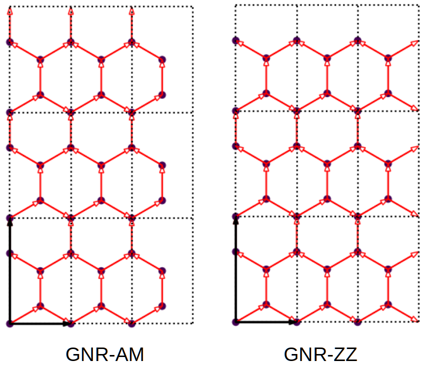
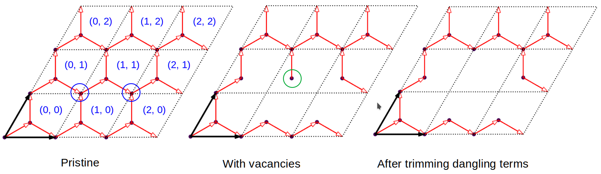

.. _sample_model:

Set up the sample
=================

In this tutorial we show how to build a sample using the Cython-based modeling tools. Cython tools
are orders of magnitudes faster than their Python counterparts, and are designed for constructing
large models with millions or billions of orbitals. We demonstrate the usages of these tools by
reproducing the models in :ref:`prim_complex`. The scripts can be found at ``examples/sample/model``.

Construct graphene nano-ribbon
------------------------------

Similar as :ref:`prim_complex`, we need the rectangular primitive cell to construct graphene nano-ribbons.
We import it from the repository by:

.. code-block:: python

    import tbplas as tb

    rect_cell = tb.make_graphene_rect()

A nano-ribbon with armchair edges can be formed by extending the rectangular cell and enforcing periodic
boundary conditions along :math:`b` direction only. We do this by:

.. code-block:: python

    sc_am = tb.SuperCell(rect_cell, dim=(3, 3, 1), pbc=(False, True, False))
    gnr_am = tb.Sample(sc_am)
    gnr_am.plot()

Firstly, we create a supercell ``sc_am`` from the :class:`.SuperCell` class. The ``dim`` argument specifies
how many times the primitive cell is replicated along :math:`a`, :math:`b` and :math:`c` directions, while
the ``pbc`` argument gives the boundary condition. Then we create a sample ``gnr_am`` from the :class:`.Sample`
class. The output is shown in the left panel of the figure:

    Graphene nano-ribbon with armchair edges (GNR-AM) or zigag edges (GNR-ZZ).

Similarly, we can make a nano-ribbon with zigzag edges, by extending the rectangular cell and enforcing
periodic boundary conditions along :math:`a` direction only:

.. code-block:: python

    sc_zz = tb.SuperCell(rect_cell, dim=(3, 3, 1), pbc=(True, False, False))
    gnr_zz = tb.Sample(sc_zz)
    gnr_zz.plot()

The output is shown in the right panel of the figure.

Graphene with vacancies
-----------------------

After demonstrating the basic usage of :class:`.SuperCell` and :class:`.Sample` classes, we then build
the graphene model with vacancies. We have a look at the model without vacancies first:

.. code-block:: python

    import tbplas as tb

    prim_cell = tb.make_graphene_diamond()
    sc = tb.SuperCell(prim_cell, dim=(3, 3, 1), pbc=(True, True, False))
    sample = tb.Sample(sc)
    sample.plot()

The output is shown in the left panel of the figure:

    Graphene samples without and with vacancies and after trimming dangling terms. Cells are labeled
    with blue texts. Removed and dangling orbitals are indicated with blue and green circles, respectively.

In :ref:`prim_complex` we introduce vacancies into the model by removing orbital #8 and #14. However,
in :class:`.SuperCell` class the orbitals are numbered in a different scheme. We identify orbital #8
as :math:`(1, 1, 0, 0)` and #14 as :math:`(2, 1, 0, 0)`, where the first 3 integers indicate the cell
index and the 4th integer is the orbital index. That's to say, orbital #8 is the 0th orbital in cell
:math:`(1, 1, 0)` and #14 is the 0th orbital in cell :math:`(2, 1, 0)`. We remove these orbitals by
calling the :func:`set_vacancies` method of :class:`.SuperCell` class:

.. code-block:: python

    sc.unlock()
    sc.set_vacancies(vacancies=[(1, 1, 0, 0), (2, 1, 0, 0)])
    sample = tb.Sample(sc)
    sample.plot()

The output is shown in the middle panel of the figure. Obviously, there is a dangling orbital, as
indicated by the green circle. We can remove it by calling the :func:`trim` method of :class:`.SuperCell`
class:

.. code-block:: python

    sc.unlock()
    sc.trim()
    sample = tb.Sample(sc)
    sample.plot()

The output is shown in the right panel of the figure.
