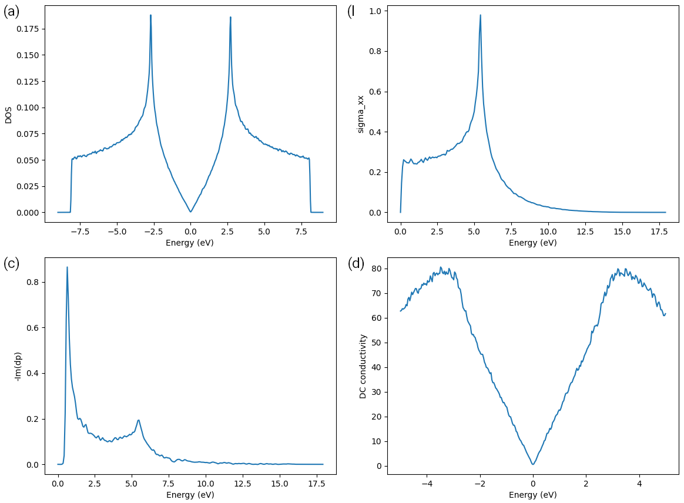

.. _sample_tbpm:

Properties from TBPM
====================

In this tutorial we demonstrate the usage of Tight-Binding Propagation Methods (TBPM) implemented
in TBPLaS. TBPM can solve a lot of electronic and response properties of large tight-binding models
in a much faster way than exact diagonalization. For the capabilities of TBPM, see :ref:`features`.
All TBPM calculations begin with setting up a sample from the :class:`.Sample` class, followed by
specifying the configurations controlling the calculation using the :class:`.Config` class. From
the sample and configurations a solver and an analyzer will be created from :class:`.Solver` and
:class:`.Analyzer` classes, respectively. The solver is utilized to evaluate correlation functions,
which are then analyzed by the analyzer to yield desired properties. Finally, the results are 
visualized by a visualizer of the :class:`.Visualizer` class or by ``matplotlib``.

DOS of graphene
---------------

We begin with calculating the density of states of monolayer graphene. The script can be found at
``examples/sample/tbpm/graphene.py``. Firstly, we create a graphene sample with 480*480*1 cells:

.. code-block:: python

    import matplotlib.pyplot as plt
    import tbplas as tb

    prim_cell = tb.make_graphene_diamond()
    super_cell = tb.SuperCell(prim_cell, dim=(480, 480, 1), pbc=(True, True, False))
    sample = tb.Sample(super_cell)
    sample.rescale_ham(9.0)

The propagation of wave function is simulated with the algorithm of Chebyshev decomposition of
Hamiltonian, which requires the eigenvalues of Hamiltonian to be on the range of :math:`[-1, 1]`.
So we need to rescale the Hamiltonian by calling the :func:`rescale_ham` method of :class:`.Sample`
class. A scaling factor, e.g. 9.0 in the example, can be supplied to the function. If not given,
the scaling factor will be estimated by inspecting the Hamiltonian automatically.

The parameters controlling TBPM calculations are stored in an instance of :class:`.Config` class:

.. code-block:: python

    config = tb.Config()
    config.generic['nr_random_samples'] = 4
    config.generic['nr_time_steps'] = 256

In the first line we create an instance of :class:`.Config` class. Then we specify that we are going
to use 4 initial conditions. For each initial condition, the wave function will propagate 256 steps.
From ``sample`` and ``config`` we can create the solver and analyzer, from :class:`.Solver` and
:class:`.Analyzer` classes, respectively:

.. code-block:: python

    solver = tb.Solver(sample, config)
    analyzer = tb.Analyzer(sample, config)

Then we can evaluate and analyze the correlation function:

.. code-block:: python

    corr_dos = solver.calc_corr_dos()
    energies_dos, dos = analyzer.calc_dos(corr_dos)

And visualize the results:

.. code-block:: python

    plt.plot(energies_dos, dos)
    plt.xlabel("Energy (eV)")
    plt.ylabel("DOS")
    plt.savefig("DOS.png")
    plt.close()

The output is shown in panel (a) of the figure:

    Density of states (a), optical (AC) conductivity (b), dynamic polarizability (c) and electronic (DC)
    conductivity (d) of graphene sample.

More properties from TBPM
-------------------------

We then demonstrate more capabilities of TBPM. Firstly, we add more settings to ``config``:

.. code-block:: python

    config.generic['correct_spin'] = True
    config.dyn_pol['q_points'] = [[1., 0., 0.]]
    config.DC_conductivity['energy_limits'] = (-5, 5)

And re-generate ``solver`` and ``analyzer`` since ``config`` changes:

.. code-block:: python

    solver = tb.Solver(sample, config)
    analyzer = tb.Analyzer(sample, config)

Other properties, i.e., optical (AC)/electronic (DC) conductivity, dynamic polarizability, can be obtained
in the same way as DOS:

.. code-block:: python

    # Get AC conductivity
    corr_ac = solver.calc_corr_ac_cond()
    omegas_ac, ac = analyzer.calc_ac_cond(corr_ac)
    plt.plot(omegas_ac, ac[0].real)
    plt.xlabel("Energy (eV)")
    plt.ylabel("sigma_xx")
    plt.savefig("ACxx.png")
    plt.close()

    # Get dyn pol
    corr_dyn_pol = solver.calc_corr_dyn_pol()
    q_val, omegas, dyn_pol = analyzer.calc_dyn_pol(corr_dyn_pol)
    plt.plot(omegas, -dyn_pol[0].imag)
    plt.xlabel("Energy (eV)")
    plt.ylabel("-Im(dp)")
    plt.savefig("dp_imag.png")
    plt.close()

    # Get DC conductivity
    corr_dos, corr_dc = solver.calc_corr_dc_cond()
    energies_dc, dc = analyzer.calc_dc_cond(corr_dos, corr_dc)
    plt.plot(energies_dc, dc[0])
    plt.xlabel("Energy (eV)")
    plt.ylabel("DC conductivity")
    plt.savefig("DC.png")
    plt.close()

The results are shown in panel (b)-(d) of the figure.

NOTE: We do not perform convergence tests in the examples for saving time. In actual calculations,
convergence should be checked with respect to sample size, number of initial conditions and propagation
steps, etc.
