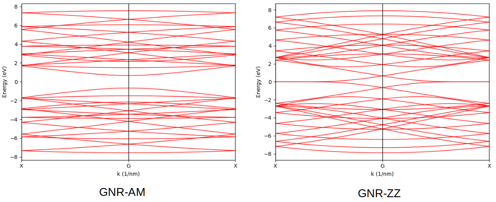
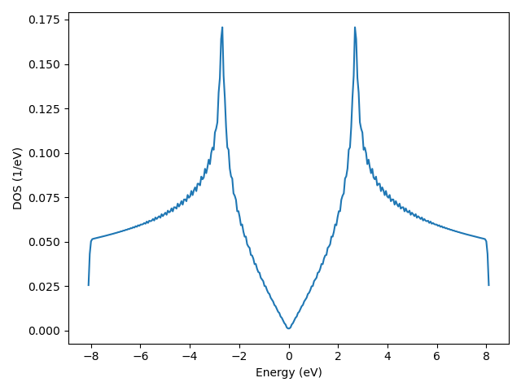

Bands and DOS of Sample
=======================

In this tutorial we show how to calculate the band structure and density of states of a sample via
exact diagonalization. The :class:`.Sample` class shares the same APIs for obtaining these properties
as :class:`.PrimitiveCell` class, so the procedure in :ref:`prim_bands` is directly applicable.

Band structure of graphene nano-ribbon
--------------------------------------

For convenience, we reuse the models in :ref:`sample_model`:

.. code-block:: python

    import numpy as np
    import tbplas as tb

    rect_cell = tb.make_graphene_rect()
    sc_am = tb.SuperCell(rect_cell, dim=(3, 3, 1), pbc=(False, True, False))
    gnr_am = tb.Sample(sc_am)
    sc_zz = tb.SuperCell(rect_cell, dim=(3, 3, 1), pbc=(True, False, False))
    gnr_zz = tb.Sample(sc_zz)

The band structure of armchair-edged nano-ribbon can be obtained as:

.. code-block:: python

    k_points = np.array([
        [0.0, -0.5, 0.0],
        [0.0, 0.0, 0.0],
        [0.0, 0.5, 0.0],
    ])
    k_label = ["X", "G", "X"]
    k_path, k_idx = tb.gen_kpath(k_points, [40, 40])
    k_len, bands = gnr_am.calc_bands(k_path)
    vis = tb.Visualizer()
    vis.plot_band(k_len, bands, k_idx, k_label)

For zigzag-edged nano-ribbon, ``k_points`` should be replaced with:

.. code-block:: python

    k_points = np.array([
        [-0.5, 0.0, 0.0],
        [0.0, 0.0, 0.0],
        [0.5, 0.0, 0.0],
    ])

The output is shown in the figure, consistent with :ref:`prim_complex`.

    Band structures of armchair and zigag-edged graphene nano-ribbons.

DOS of graphene
---------------

In :ref:`prim_bands` we have calculated the DOS of a graphene primitive cell with a kgrid of 120*120*1.
This is equivalent to evaluate the DOS of a graphene sample consisting of 20*20*1 cells with 6*6*1 kgrid:

.. code-block:: python

    import numpy as np
    import tbplas as tb

    prim_cell = tb.make_graphene_diamond()
    sc = tb.SuperCell(prim_cell, dim=(20, 20, 1), pbc=(True, True, False))
    sample = tb.Sample(sc)

    k_mesh = tb.gen_kmesh((6, 6, 1))
    energies, dos = sample.calc_dos(k_mesh)

    vis = tb.Visualizer()
    vis.plot_dos(energies, dos)

