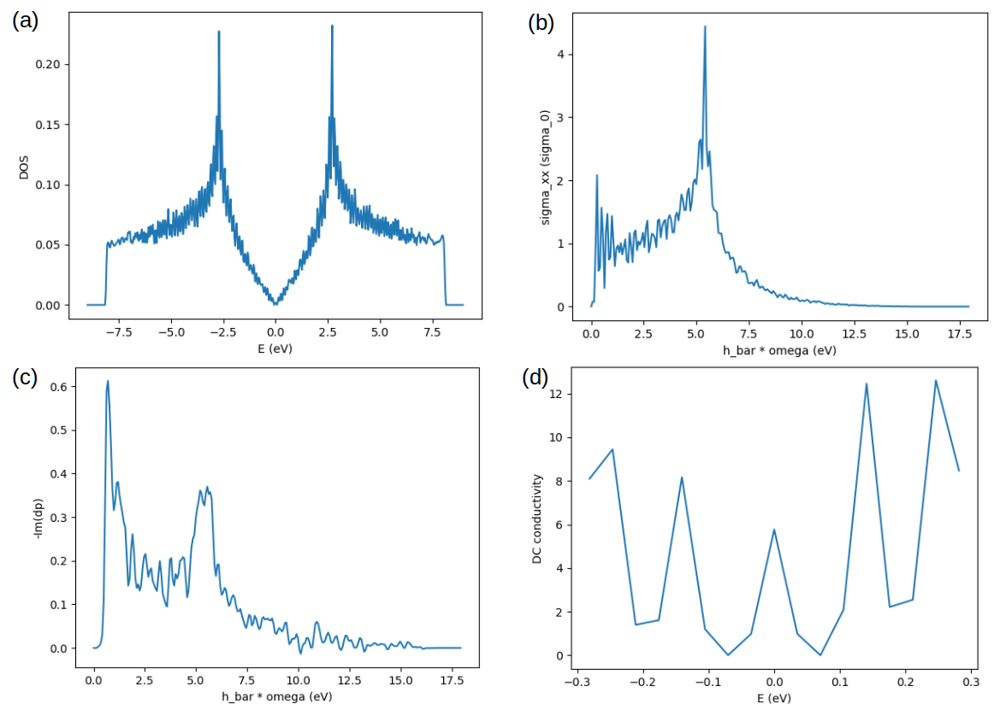

Properties from TBPM
====================

In this tutorial we demonstrate the usage of Tight-Binding Propagation Methods (TBPM) implemented
in TBPLaS. TBPM can solve a lot of electronic and response properties of large tight-binding models
in a much faster way than exact diagonalization. For the capabilities of TBPM, see :ref:`features`.
All TBPM calculations begin with setting up a sample, followed by specifying the configurations
controlling the calculation. From the sample and configurations a solver and an analyzer will be
created. The solver is utilized to evaluate correlation functions, which are then analyzed by the
analyzer to yield desired properties. Finally, the results are visualized by a visualizer or by
``matplotlib``.

Notes on parallelization
------------------------

TBPM calculations in TBPLaS are parallelized in a hybrid MPI+OpenMP approach. So we need to know
the parallelism better in order to make the best of our hardware. The most time-demanding part of
a TBPM calculation is evaluation of correlation function, which is obtained from the propagation
of a wave function driven by the Hamiltonian. Averaging over initial wave functions are required
for better accuracy. In TBPLaS, propagation of wave function from different initial conditions are
parallelized over MPI processes, with each process dealing a few initial conditions. The action of
Hamiltonian on the wave function, which is a matrix-vector multiplication mathemtically, is then
parallelized over OpenMP threads. This hybrid parallelism significantly reduces inter-process data
communication and makes better use of CPU cache.

There are two rules for setting the parallelization parameters:

* The number of MPI processes, multiplied by the number of OpenMP threads, should be equal to the
  number of physical cores on the computer, or the number of cores allocated to the job if you are
  using a queuing system like ``SLURM``, ``PBS`` or ``LSF``.

* The number of initial conditions should be a multiple of MPI processes.

For example, if you are going to use 4 initial conditions, and there are 8 cores on your computer.
Then the possible choices of parallelization parameters are:

* 1 MPI process(es) * 8 OpenMP thread(s)
* 2 MPI process(es) * 4 OpenMP thread(s)
* 4 MPI process(es) * 2 OpenMP thread(s)

For better performance, a rough rule is that the number of MPI processes equals to the number of CPU
sockets, while the number of OpenMP threads equals to the number of cores bind to each socket. Most
personal computers have only one socket. Workstations or computational nodes at High Performance
Computer Center may have 2 or 4 sockets. Keep in mind that the optimal setting is highly hardware
dependent, and can only be determined by extensive tests.

Note that if your computer has HyperThreading enabled in BIOS or UEFI, then the number of available
cores will be double of the physical cores. DO NOT use the virtual cores from HyperThreading since
there will be significant performance loss. Check the handbook of your CPU for the number of physical
cores.

DOS of graphene
---------------

We begin with calculating the density of states of monolayer graphene. For simplicity we will use
OpenMP parallelization only. Supposing that we have a computer with one CPU socket and 8 cores, we
can occupy all the cores by:

.. code-block:: bash

    export OMP_NUM_THREADS=8

If TBPLaS has been compiled with MKL, also set ``MKL_NUM_THREADS``:

.. code-block:: bash

    export MKL_NUM_THREADS=8

Then we create a graphene sample with 120*120*1 cells:

.. code-block:: python

    import matplotlib.pyplot as plt
    import tbplas as tb

    prim_cell = tb.make_graphene_diamond()
    super_cell = tb.SuperCell(prim_cell, dim=(120, 120, 1), pbc=(True, True, False))
    sample = tb.Sample(super_cell)
    sample.rescale_ham(9.0)

The propagation of wave function is simulated with the algorithm of Chebyshev decomposition of
Hamiltonian, which requires the eigenvalues of Hamiltonian to be on the range of :math:`[-1, 1]`.
So we need to rescale the Hamiltonian by calling the :func:`rescale_ham` method of :class:`.Sample`
class. A scaling factor, e.g. 9.0 in the example, can be supplied to the function. If not given,
the scaling factor will be determined by inspecting the Hamiltonian, automatically.

The parameters controlling TBPM calculations are stored in an instance of :class:`.Config` class:

.. code-block:: python

    config = tb.Config()
    config.generic['nr_random_samples'] = 4
    config.generic['nr_time_steps'] = 256
    config.generic['energy_range'] = 20.

In the first line we create an instance of :class:`.Config` class. Then we specify that we are going
to use 4 initial conditions. For each initial condition, the wave function will propagate 256 steps.
And we want the DOS to be evaluated on the range of :math:`[-10, 10]` eV. From ``sample`` and ``config``
we can create the solver and analyzer, from :class:`.Solver` and :class:`.Analyzer` classes, respectively:

.. code-block:: python

    solver = tb.Solver(sample, config)
    analyzer = tb.Analyzer(sample, config)

Then we can evaluate and analyze the correlation function:

.. code-block:: python

    corr_dos = solver.calc_corr_dos()
    energies_dos, dos = analyzer.calc_dos(corr_dos)

And visualize the results:

.. code-block:: python

    plt.plot(energies_dos, dos)
    plt.xlabel("E (eV)")
    plt.ylabel("DOS")
    plt.savefig("DOS.png")
    plt.close()

The output is shown in panel (a) of the figure:

    Density of states (a), AC conductivity (b), dynamic polarizability (c) and DC conductivity (d)
    of graphene sample.

More properties from TBPM
-------------------------

We then demonstrate more capabilities of TBPM. Firstly, we add more settings to ``config``:

.. code-block:: python

    config.generic['correct_spin'] = True
    config.dyn_pol['q_points'] = [[1., 0., 0.]]
    config.DC_conductivity['energy_limits'] = (-0.3, 0.3)
    config.LDOS['site_indices'] = [0]
    config.LDOS['delta'] = 0.1
    config.LDOS['recursion_depth'] = 2000

And re-generate ``solver`` and ``analyzer`` since ``config`` changes:

.. code-block:: python

    solver = tb.Solver(sample, config)
    analyzer = tb.Analyzer(sample, config)

Other properties, i.e., DC/AC conductivity, dynamic polarizability, can be obtained in the same way
as DOS:

.. code-block:: python

    # Get AC conductivity
    corr_ac = solver.calc_corr_ac_cond()
    omegas_ac, ac = analyzer.calc_ac_cond(corr_ac)
    plt.plot(omegas_ac, ac[0])
    plt.xlabel("h_bar * omega (eV)")
    plt.ylabel("sigma_xx (sigma_0)")
    plt.savefig("ACxx.png")
    plt.close()

    # Get dyn pol
    corr_dyn_pol = solver.calc_corr_dyn_pol()
    q_val, omegas, dyn_pol = analyzer.calc_dyn_pol(corr_dyn_pol)
    plt.plot(omegas, -1 * dyn_pol[0, :].imag)
    plt.xlabel("h_bar * omega (eV)")
    plt.ylabel("-Im(dp)")
    plt.savefig("dp_imag.png")
    plt.close()

    # Get DC conductivity
    corr_dos, corr_dc = solver.calc_corr_dc_cond()
    energies_dc, dc = analyzer.calc_dc_cond(corr_dos, corr_dc)
    plt.plot(energies_dc, dc[0, :])
    plt.xlabel("E (eV)")
    plt.ylabel("DC conductivity")
    plt.savefig("DC.png")
    plt.close()

The results are shown in panel (b)-(d) of the figure.

NOTE: We do not perform convergence tests in the examples for saving time. In actual calculations,
convergence should be checked with respect to sample size, number of initial conditions and propagation
steps, etc.

MPI+OpenMP parallelization
--------------------------

Finally, we show how to enable hybrid MPI+OpenMP parallelization. The setting up of ``sample`` and
``config`` is the same as pure OpenMP case. The difference is that we need to add the ``enable_mpi``
argument when creating the ``solver`` and ``analyzer``:

.. code-block:: python

    solver = tb.Solver(sample, config, enable_mpi=True)
    analyzer = tb.Analyzer(sample, config, enable_mpi=True)

Evaluation and analysis of correlation function is also the same as pure OpenMP case:

.. code-block:: python

    corr_dos = solver.calc_corr_dos()
    energies_dos, dos = analyzer.calc_dos(corr_dos)

However, we shall plot the results on master process only, in order to avoid conflicts:

.. code-block:: python

    if analyzer.is_master:
        plt.plot(energies_dos, dos)
        plt.xlabel("E (eV)")
        plt.ylabel("DOS")
        plt.savefig("DOS.png")
        plt.close()

We will use 4 MPI processes for the calculation. So ``OMP_NUM_THREADS`` should be set to 2:

.. code-block:: bash

    export OMP_NUM_THREADS=2

Supposing that the python script is saved to ``tbpm.py``, we can run the job as:

.. code-block:: bash

    mpirun -np 4 python ./tbpm.py

The results should be the same as pure OpenMP case. If you are using a super computer with queuing
system like ``SLURM``, ``PBS`` or ``LSF``, then you need another batch script for submitting the
job. Contact the administrator of the super computer for help on preparing the script.

Here we provide two batch scripts for the ``SLURM`` queing system as examples. ``SLURM`` has the
following options for specifying parallelization details:

* nodes: number of nodes for the job
* ntasks-per-node: number of MPI processes to spawn on each node
* cpus-per-task: number of OpenMP threads for each MPI process

Suppose that we are going to use 4 initial conditions and 1 node. The node has 2 sockets with 8 cores
per socket. The number of MPI processes should be either 1, 2, 4, and the number of OpenMP threads is
16, 8, 4, respectively. We will use 2 processes * 8 threads. The batch script is as following:

.. code-block:: bash

  #! /bin/bash
  #SBATCH --account=alice
  #SBATCH --partition=hpib
  #SBATCH --nodes=1
  #SBATCH --ntasks-per-node=2
  #SBATCH --cpus-per-task=8
  #SBATCH --job-name=test_mpi
  #SBATCH --time=24:00:00
  #SBATCH --output=slurm-%j.out
  #SBATCH --error=slurm-%j.err

  # Load modules
  module load mpi4py tbplas

  # Set number of threads
  export OMP_NUM_THREADS=$SLURM_CPUS_PER_TASK
  export MKL_NUM_THREADS=$SLURM_CPUS_PER_TASK

  # Change to working directory and run the job
  cd $SLURM_SUBMIT_DIR
  srun --mpi=pmi2 python ./test_mpi.py

Here we assume the user name to be ``alice``, and we are submitting to the ``hpib`` partition.
Since we are going to use 1 node, we set ``nodes`` to 1. For each node 2 MPI processes will be
spawned, so ``ntasks-per-node`` is set to 2. There are 16 physical cores on the node, so
``cpus-per-task`` is set to 8.

If you want pure OpenMP parallelization, here is another example:

.. code-block:: bash

  #! /bin/bash
  #SBATCH --account=alice
  #SBATCH --partition=hpib
  #SBATCH --nodes=1
  #SBATCH --ntasks-per-node=1
  #SBATCH --cpus-per-task=16
  #SBATCH --job-name=test_omp
  #SBATCH --time=24:00:00
  #SBATCH --output=slurm-%j.out
  #SBATCH --error=slurm-%j.err

  # Load modules
  module load tbplas

  # Set number of threads
  export OMP_NUM_THREADS=$SLURM_CPUS_PER_TASK
  export MKL_NUM_THREADS=$SLURM_CPUS_PER_TASK

  # Change to working directory and run the job
  cd $SLURM_SUBMIT_DIR
  srun python ./test_omp.py

In this script the number of processes is set to 1, and the number of threads per process is set to
the total number of physical cores. Don't forget to remove ``enable_mpi=True`` when creating the
solver and analyzer, in order to skip unnecessary MPI initialization.
