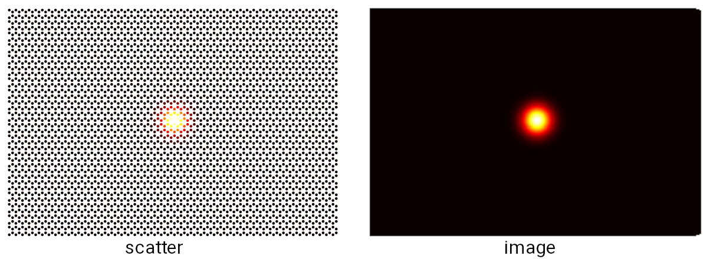
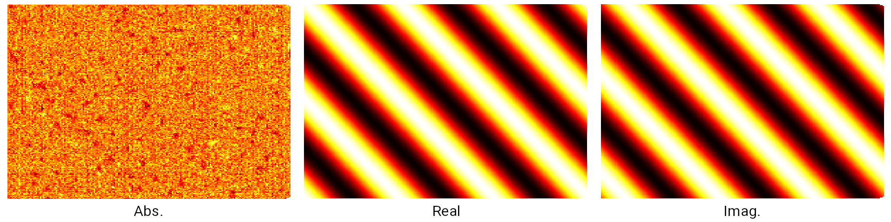

Wave function propagation
=========================

In this tutorial we show how to propagate the wave function from initial condition. We import all
necessary packages first:

.. code-block:: python

    from math import cos, sin, exp
    from typing import Tuple
    import numpy as np
    import tbplas as tb

Generation of initial wave function
-----------------------------------

.. rubric:: Gaussian wave

We need an initial wave function from which the time-dependent wave function will propagate. The
initial wave function should a complex vector whose length must equal to the number of orbials
within the sample. We consider two types of initial wave function. The first one is Gaussian wave,
which is defined as:

.. code-block:: python

    def init_wfc_gaussian(sample: tb.Sample, mu: Tuple[float, float], sigma: float,
                      scale: Tuple[float, float] = None):
        """
        Initialize wave function with Gaussian function.

        Parameters
        ----------
        sample: tb.Sample
            sample for which wave function will be initialized
        mu: (c_x, c_y)
            Cartesian coordinate of the center of the Gaussian function in nm
        sigma: float
            broadening of the Gaussian function in nm
        scale: (s_x, s_y)
            scaling factor controlling the extension of Gaussian function along
            x and y directions, works in together with sigma

        Returns
        -------
        wfc: np.ndarray
            Gaussian wave projected on each orbital of the sample
        """
        if scale is None:
            scale = [1.0, 1.0]
        sample.init_orb_pos()
        orb_pos = sample.orb_pos
        wfc = np.zeros(orb_pos.shape[0], dtype=np.complex128)
        for i, pos in enumerate(orb_pos):
            dx = (pos.item(0) - mu[0]) * scale[0]
            dy = (pos.item(1) - mu[1]) * scale[1]
            wfc[i] = exp(-(dx**2 + dy**2) / (2 * sigma**2))
        wfc /= np.linalg.norm(wfc)
        return wfc

Here ``sample`` is an instance of :class:`.Sample`, the sample for which initial wave function will be
generated. ``mu`` controlls the center of the Gaussian wave, while ``sigma`` and ``scale`` controlls
the spatial extension. By wisely choosing ``mu``, ``sigma`` and ``scale`` we can generate different
types of Gaussian waves. For example, a two-dimensional Gaussian wave can be generated and visualized
as:

.. code-block:: python
    # Build the sample
    prim_cell = tb.make_graphene_rect()
    sample = tb.Sample(tb.SuperCell(prim_cell, dim=(50, 20, 1),
                                    pbc=(True, True, False)))

    # Common quantities
    r_vectors = sample.sc_list[0].sc_lat_vec
    x_max, y_max = np.max(r_vectors[:, 0]), np.max(r_vectors[:, 1])

    # Initialize the wave function
    psi0 = init_wfc_gaussian(sample, mu=(x_max/2, y_max/2), sigma=0.5,
                             scale=(1.0, 0.0))

    # Visualize the initial wave function
    vis = tb.Visualizer()
    vis.plot_wfc(sample, np.abs(psi0)**2, cmap="hot", scatter=True)

The output is shown in the left panel of the figure. By default the initial wave function is shown
as scatter plot. You can also plot it as an image by setting ``scatter`` to ``False``, which is shown
in the right panel.

    Two-dimensional Gaussian-type initial wave function.

Meanwhile, one-dimensional Gaussian wave can be generate as:

.. code-block:: python

    # 1D Gaussian along x-direction
    psi0 = init_wfc_gaussian(sample, mu=(x_max/2, y_max/2), sigma=0.5,
                             scale=(0.0, 1.0))
    vis.plot_wfc(sample, np.abs(psi0)**2, cmap="hot", scatter=False)

    # 1D Gaussian along y-direction
    psi0 = init_wfc_gaussian(sample, mu=(x_max/2, y_max/2), sigma=0.5,
                             cale=(1.0, 0.0))
    vis.plot_wfc(sample, np.abs(psi0)**2, cmap="hot", scatter=False)

.. figure:: images/wfc_prop/gau_1d.png
    :align: center

    One-dimensional Gaussian-type initial wave function along x and y directions.

.. rubric:: Plane wave

The second type of wave function we take into consideration is plane wave, which is characterized
by the wave vector :math:`k` and defined as:

.. code-block:: python

    def init_wfc_pw(sample: tb.Sample, kpt: np.ndarray):
        """
        Initialize wave function with plane wave of given wave vector.

        Parameters
        ----------
        sample: tb.Sample
            sample for which wave function will be initialized
        kpt: np.ndarray
            Cartesian coordinate of wave vector in 1/nm

        Returns
        -------
        wfc: np.ndarray
            plane wave projected on each orbital of the sample
        """
        sample.init_orb_pos()
        orb_pos = sample.orb_pos
        wfc = np.zeros(orb_pos.shape[0], dtype=np.complex128)
        for i, pos in enumerate(orb_pos):
            phi = np.dot(pos, kpt).item()
            wfc[i] = cos(phi) + 1j * sin(phi)
        wfc /= np.linalg.norm(wfc)
        return wfc

We demonstrate the usage of this function by:

.. code-block:: python

    g_vectors = tb.gen_reciprocal_vectors(r_vectors)
    kpt = np.matmul((3, 2, 0), g_vectors)
    psi0 = init_wfc_pw(sample, kpt)

    vis.plot_wfc(sample, np.abs(psi0)**2, cmap="hot", scatter=False)
    vis.plot_wfc(sample, np.real(psi0), cmap="hot", scatter=False)
    vis.plot_wfc(sample, np.imag(psi0), cmap="hot", scatter=False)

Here we generate a plane wave with :math:`k=3b_1+2b_2`, with :math:`b_1` and :math:`b_2` being the basis
vectors of reciprocal lattice. We plot the absolute value, as well as the real and imaginary part of the
wave function in the following figure:

    Absolute value and real/imaginary parts of plane wave with :math:`k=3b_1+2b_2`.

Since plane wave has equal absolute value everywhere, so the left panel shows nothing but some numerical
noises. On the contrary, the real (middle panel) and imaginary (right panel) parts clearly show the wave
vector. Also, a phase difference of :math:`\frac{\pi}{2}` can also be observed from the real and imaginary
parts.

Wave function propagation
-------------------------

With the initial wave function ready, we can proceed with the calculation. Just as any TBPM calculation, we
need to create an ``config`` and a ``solver``. Meanwhile, we need to specify an array ``time_log``, which
specifies the time steps at which the snapshot of the wave function is saved. Then we propagate the wave function
by calling the :func:`calc_psi_t` method of :class:`.Solver`. The return value of this method is a matrix whose
rows being the snapshots of the wave function at ``time_log``.

.. code-block:: python

    # Propagate the wave function
    config = tb.Config()
    config.generic['nr_time_steps'] = 128
    solver = tb.Solver(sample, config)
    time_log = np.array([16, 32, 48, 64, 80, 96, 112, 127])
    sample.rescale_ham()
    psi_t = solver.calc_psi_t(psi0, time_log)

We visualize ``psi_t`` as:

.. code-block:: python

    # Plot the wave function
    for i in range(len(time_log)):
        vis.plot_wfc(sample, np.abs(psi_t[i])**2, cmap="hot", scatter=False)

.. rubric:: Propagation of 1D Gaussian wave

The propagation of an 1D Gaussian wave along y-direction is shown in the figure below:

.. figure:: images/wfc_prop/gau_0.png
    :align: center

    Propagation of an 1D Gaussian wave without scattering potential.

Since there is no scattering potential, the propagation of Gaussian wave shows a symmetric behavior
in the left and right parts. To demonstrate the effects of scatting on the propagation, we define a
Gaussian-type scatting potential:

.. code-block:: python

    def add_scatter_gaussian(sample: tb.Sample, mu: Tuple[float, float],  sigma: float,
                         scale: Tuple[float, float] = None, v_pot: float = 1.0):
        """
        Add Gaussian-type scattering potential to the on-site energies of the sample.

        Parameters
        ----------
        sample: tb.Sample
            sample for which scattering potential will be added
        mu: (c_x, c_y)
            Cartesian coordinate of the center of the Gaussian function in nm
        sigma: float
            broadening of the Gaussian function in nm
        scale: (s_x, s_y)
            scaling factor controlling the extension of Gaussian function along
            x and y directions, works in together with sigma
        v_pot: float
            maximum of the scattering potential in eV

        Returns
        -------
        None. sample.orb_eng is modified.
        """
        if scale is None:
            scale = [1.0, 1.0]
        sample.init_orb_pos()
        sample.init_orb_eng()
        orb_pos = sample.orb_pos
        orb_eng = sample.orb_eng
        for i, pos in enumerate(orb_pos):
            dx = (pos.item(0) - mu[0]) * scale[0]
            dy = (pos.item(1) - mu[1]) * scale[1]
            orb_eng[i] += v_pot * exp(-(dx**2 + dy**2) / (2 * sigma**2))

Most of the arguments of this function are similar to that of ``init_wfc_gaussian``. We introduce one
more argument ``v_pot`` to control the scattering potential. If ``v_pot`` is positive, then it is a
repulsive scattering center, which will drive the electron away. On the contrary, if ``v_pot`` is
negative, then it becomes an attractive scattering center, and electrons will accumulate around it.
We try with the repulsive scattering center first:

.. code-block:: python

    # Add scatting center
    add_scatter_gaussian(sample, mu=(x_max/4, y_max/2), sigma=0.5, v_pot=1.0)

    # Propagate the wave function
    config = tb.Config()
    config.generic['nr_time_steps'] = 128
    solver = tb.Solver(sample, config)
    time_log = np.array([16, 32, 48, 64, 80, 96, 112, 127])
    sample.rescale_ham()
    psi_t = solver.calc_psi_t(psi0, time_log)

    # Plot the wave function
    for i in range(len(time_log)):
        vis.plot_wfc(sample, np.abs(psi_t[i])**2, cmap="hot", scatter=False)

The argument ``mu=(x_max/4, y_max/2)`` specifies that the scattering center locates at the center of the
left part of the sample. The output is shown as below:

.. figure:: images/wfc_prop/gau_pos.png
    :align: center

    Propagation of an 1D Gaussian wave with repulsive scattering potential.

Obviously, the repulsive scattering center significantly reduces the probability of finding the electron in
the left part of the sample. Similarily, an attractive scattering center can be added to the sample by:

.. code-block:: python

    # Add scatting center
    add_scatter_gaussian(sample, mu=(x_max/4, y_max/2), sigma=0.5, v_pot=-1.0)

And the output is shown as below:

.. figure:: images/wfc_prop/gau_neg.png
    :align: center

    Propagation of an 1D Gaussian wave with attractive scattering potential.

In this case, accumulation of electron in the left part of the sample can be clearly observed.

.. rubric:: Propagation of plane wave

The propagation of plane wave in presence of repulsive and attractive scattering centers are shown as below:

.. figure:: images/wfc_prop/pw_pos.png
    :align: center

    Propagation of plane wave with repulsive scattering potential.

.. figure:: images/wfc_prop/pw_neg.png
    :align: center

    Propagation of plane wave with attractive scattering potential.

Similar conclusions can be drawn as in the 1D Gaussian wave case.
