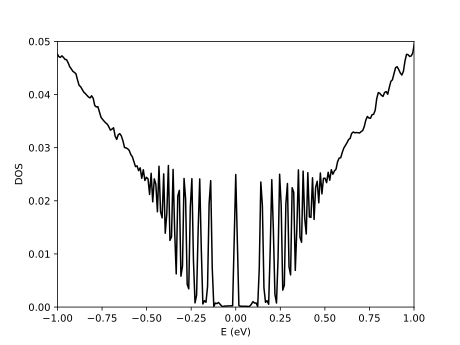

=========
First run
=========

Import
------

When installed correctly, tipsi can be included in all python3 scripts using::

    import tipsi

Making a simple sample
----------------------

We can make a graphene sample by importing the graphene material library::

    from tipsi.materials import graphene

Now, making a tight-binding sample of 1000 by 1000 unit cells is done with::

    sample = graphene.sample_rectangle(1000, 1000, nr_processes = 8)

This sample object contains the locations of all the sites, as well as all the hopping information.

We can add a magnetic field by::

    sample.set_magnetic_field(20.)

Simulation parameters
---------------------

All the parameters for our calculation are defined in a Config object::

    config = tipsi.Config(sample)

We can set, for example, the number of random initial wave functions to 4.
Also we can tell tipsi to correct for spin, as currently our model is single-spin::

    config.generic['correct_spin'] = True
    config.generic['nr_random_samples'] = 4

Then, we save the configuration parameters to file, in case we want to use them later::

    config.save()

Running the simulation
----------------------

Now we are ready to calculate the DOS correlation function::

    corr_DOS = tipsi.corr_DOS(sample, config)

To analyze the correlation function, use::

    energies_DOS, DOS = tipsi.analyze_corr_DOS(config, corr_DOS)

We can plot the results with::

    import matplotlib.pyplot as plt

    plt.plot(energies_DOS, DOS, color = 'k')
    plt.xlim((-1., 1.))
    plt.ylim((0., 0.05))
    plt.xlabel("E (eV)")
    plt.ylabel("DOS")
    plt.show()

If everything went well, you should be able to see Landau levels near the Fermi energy.

Full code
---------

The full code of this example is::

    # DOS of graphene with magnetic field

    # imports
    import tipsi
    from tipsi.materials import graphene
    import matplotlib.pyplot as plt

    # make 1000*1000 unit cell sample
    sample = graphene.sample_rectangle(1000, 1000, nr_processes = 8)

    # add magnetic field of 20 T
    sample.set_magnetic_field(20.)

    # set configuration parameters
    config = tipsi.Config(sample)
    config.generic['correct_spin'] = True
    config.generic['nr_random_samples'] = 4
    config.save()

    # get DOS
    corr_DOS = tipsi.corr_DOS(sample, config)
    energies_DOS, DOS = tipsi.analyze_corr_DOS(config, corr_DOS)

    # plot
    plt.plot(energies_DOS, DOS, color = 'k')
    plt.xlim((-1., 1.))
    plt.ylim((0., 0.05))
    plt.xlabel("E (eV)")
    plt.ylabel("DOS")
    plt.show()
